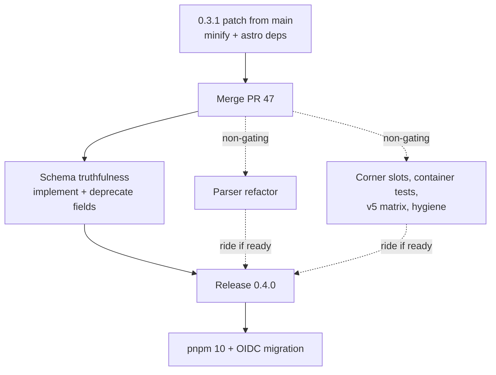

# Quality & Adoption Roadmap Addendum — Requirements

## Summary

A quality-and-adoption addendum to the meta-plan, shaped as a release train around PR 47: a 0.3.1 patch from `main` now (minified CDN bundle, astro dependency fix), then merge PR 47 and hold the changesets version PR while schema-truthfulness work lands, releasing one coherent 0.4.0. Adoption and hardening commitments slot into existing tracks (playground into Phase 3, data-layer fixes into the perf plan, OIDC after 0.4.0).

---

## Problem Frame

The library serves the maintainer's team plus roughly 600 weekly npm installs, with a DX-first mission: YAML configs that people and agents can write more easily than imperative MapLibre JS. A full codebase-and-plans review found the phases 1–2 work solid but surfaced gaps that hit exactly that audience: schema fields that validate but do nothing at runtime (now amplified by autocomplete and LLM generation shipping in Phase 2), a 491 KB unminified CDN bundle on the headline zero-build path, an astro package that breaks under strict installs, deployed docs describing unpublished features, untested flagship components, and no story for users who outgrow the YAML.

---

## Key Decisions

- **Hold 0.4.0 for the schema-truthfulness work; soften the wait with a 0.3.1 patch.** One coherent release beats quickly closing the docs-vs-npm skew. The skew persists until 0.4.0; the patch gets the worst packaging defects to users within days.
- **Release mechanics ride changesets, not a held PR.** Cut 0.3.1 from `main` before PR 47 merges (once PR 47's minor changesets land on `main`, any release from there becomes 0.4.0). Then merge PR 47 promptly and hold the changesets version PR — not the feature PR — until the 0.4.0 gate items land.
- **The schema stays closed; the growth path is eject-to-JS.** The curated, validated contract is the product — it is what makes JSON Schema autocomplete and LLM generation work. No registry or plugin API. Users who outgrow YAML get guaranteed, documented access to the underlying map instance.
- **Refactor the parser now rather than when it breaks.** The union-error mining in the parser is coupled to Zod's internal error shapes. Chosen for robustness ahead of a future Zod upgrade, accepting refactor effort on working, well-tested code. Sequenced after PR 47 merges, since Phase 2 rewrote much of that file.
- **Playground over VS Code extension as the adoption lever.** The yaml-language-server modeline already delivers editor validation; a hosted playground doubles as the runnable-examples surface Phase 3 needs. The extension roadmap stays parked.
- **Custom map UI lands as corner slots on the web component, not schema config.** Named slots for the four MapLibre control positions, implemented as control wrappers so slotted panels stack with native controls; the built-in legend renders as replaceable default slot content. This is host markup, so the YAML contract stays closed, and it is the refactor target for map-party's separately-appended legend and title panels. Non-corner UI (modals, sheets) stays eject-to-JS.

---

## Requirements

**Release train**

- R1. Publish core and astro 0.3.1 patches from `main` containing only the CDN bundle minification and the astro runtime-dependency fix (`zod`, `yaml` declared as real dependencies), before PR 47 merges.
- R2. Merge PR 47 to `main` promptly after 0.3.1 ships; hold the changesets version PR until the 0.4.0 gate items (R4–R6) land.
- R3. Only schema-truthfulness work gates 0.4.0. Parser refactor, corner slots, tests, and hygiene ride the release if ready but do not delay it.

**Schema truthfulness**

- R4. Implement the declared-but-inert schema surface: `click.flyTo`, `hover.highlight`, the `attribution` control, a `raster-dem` source type, and live refresh for named/`$ref` sources (including data updates for shared sources).
- R5. Fields judged not worth implementing (candidates: `click.action`, `mouseenter`/`mouseleave` actions) emit deprecation warnings through the Phase 2 warning channel and are scheduled for removal in the v2 schema bump per the accepted versioning RFC.
- R6. The published JSON Schemas, docs, and `llms.txt` reflect every implemented and deprecated field in the same release that changes them.

**Safety and clarity**

- R7. Popup content enforces the same tag allowlist as content blocks, escapes interpolated values, and all HTML escaping goes through one shared utility.
- R8. Refactor the core YAML parser: split the oversized module and decouple union-error mining from Zod internal error shapes, behavior-preserving against the existing test corpus.

**Testing**

- R9. Container-API render tests cover the four Astro components (Map, FullPageMap, Scrollytelling, Chapter): config serialization, script injection, props-to-attributes, and error states.
- R10. CI tests core against maplibre-gl v5 in addition to the current version (todo 036).

**Hygiene**

- R11. One hygiene pass: remove the committed CLI coverage report from git and reconcile git tags with what is actually published on npm.
- R12. Migrate publishing to pnpm ≥ 10.13 and npm OIDC trusted publishing as its own change after 0.4.0 ships (todo 038); the long-lived token stays until then.

**Track assignments**

- R13. The Phase 3 plan absorbs the hosted playground as its runnable-examples surface, plus the docs backlog: a scrollytelling example, surfacing the orphaned patterns page, labeling or extracting the `otf` example, copy-runnable example variants, and the stale CDN example comment.
- R14. The perf plan absorbs astro's `feature_ref` file-cache eviction (todo 025) alongside its existing data-layer lifecycle fixes; none of it pulls forward into 0.4.0.
- R15. A "beyond YAML" docs page documents guaranteed access to the underlying MapLibre map instance and renderer lifecycle events, with worked examples of adding custom controls and layers imperatively. Ships with or after 0.4.0.

**Custom UI slots**

- R16. The web component exposes named slots for the four MapLibre control positions; slotted content is wrapped as a native control at that position, stacking correctly with built-in controls and attribution.
- R17. The built-in legend renders into its corner slot as default content, so consumer-provided slot content replaces it. This becomes the consolidation path for the duplicated legend implementations in core and astro.

---

## Success Criteria

- Every key accepted by the published JSON Schema either affects the rendered map or produces a visible warning — no silent fields.
- The CDN register bundle ships minified; its measured size becomes the baseline for the perf plan's CI size budget.
- The astro package installs and runs under isolated installs (pnpm strict, Yarn PnP).
- After 0.4.0, the deployed docs and `llms.txt` describe only capabilities the published packages actually have.

---

## Scope Boundaries

**Deferred for later**

- A free-form overlay slot for non-corner UI (centered modals, bottom sheets); those cases stay eject-to-JS until real demand appears.
- The map-party refactor itself — this doc delivers the slot mechanism it will target, not the migration.
- VS Code extension (modelines carry editor DX for now; roadmap doc stays parked).
- Data-layer lifecycle hardening and bundle lazy-loading (perf plan track, unchanged).
- Feature-refs V2, GeoJSON alignment scope (D6), and all v2 field removals (Phase 5).

**Outside this product's identity**

- A registry or plugin API for custom layer/source/control types. The closed, curated schema is the product; extensibility happens through eject-to-JS.

---

## Dependencies / Assumptions

- PR 47 is open and mergeable against `main`; the changesets version-PR hold is the mechanism that separates merging from releasing.
- The v2 removal path for deprecated fields depends on the accepted schema-versioning RFC (Phase 4) being implemented by the time removals ship.
- Audience assumption: the team plus ~600 weekly npm installers, prioritized as DX for the MapLibre community; internal-only concerns rank below anything a stranger's first hour touches.

---

## Outstanding Questions

**Deferred to planning**

- Final per-field disposition within R4/R5 — which interaction fields have a clear declarative shape worth implementing versus deprecating (the split rule is decided; the field-by-field call happens with the code open).
- Whether `raster-dem` support includes terrain configuration or only hillshade sourcing.
- Playground hosting and architecture — belongs to the Phase 3 plan, not this doc.
- Slot implementation approach — shadow DOM versus manual projection, and how slots coexist with the light-DOM inline YAML config script the component already reads.
