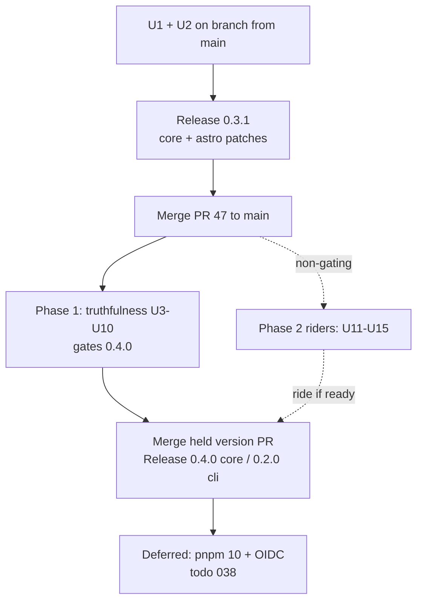
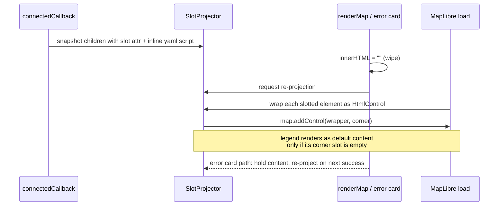
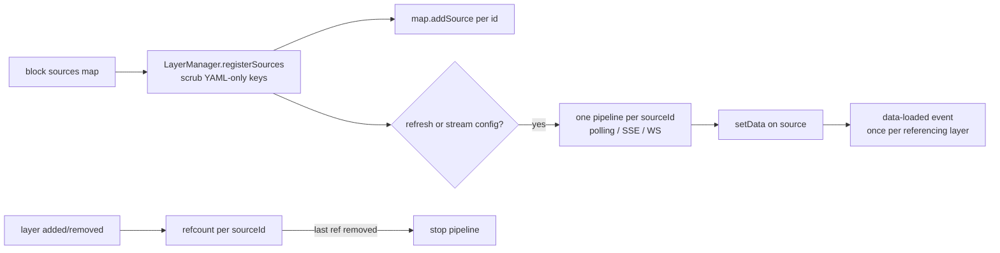

# feat: Quality & adoption release train — 0.3.1 patch, 0.4.0 schema truthfulness, corner slots

## Summary

Execute the ratified release train: a core/astro 0.3.1 patch from `main` (minified CDN bundle, astro runtime deps) before PR #47 merges, then implement the schema-truthfulness work that gates 0.4.0 (dead interaction fields, attribution control, raster-dem, named-source refresh, deprecation warnings), with the popup-safety fix, parser refactor, `<ml-map>` corner slots, Astro Container tests, and CI/tag hygiene riding the release non-gating.

---

## Problem Frame

Phase 2 (PR #47) shipped JSON Schema publishing and validation ergonomics, which amplifies an existing defect class: schema fields that validate cleanly but do nothing at runtime. Autocomplete and LLM generation now actively steer the ~600 weekly installers toward those dead fields. Meanwhile the headline zero-build CDN path serves a 491 KB unminified bundle, the astro package breaks under strict installs, and the flagship Astro components have no behavioral tests. The origin document (see `docs/brainstorms/2026-07-07-quality-adoption-roadmap-requirements.md`) ratified the fixes and their sequencing; this plan makes them executable.

Research corrected two origin premises: `packages/cli/coverage/` was never tracked in git (gitignored — no action needed), and git tags are *missing*, not stale — no core tag has ever been pushed; astro@0.3.0 and cli@0.1.13 tags are absent. The hygiene work is tag backfill plus verifying the release action pushes tags.

---

## Requirements

Carried from origin. R1–R4, R6, R8–R10, R12, and R16–R17 match the origin verbatim; R5 resolves the origin's deferred per-field disposition; R7 states the popup-allowlist refinement made during planning (see Key Technical Decisions); R11 reflects the research corrections in Problem Frame.

**Release train**

- R1. Publish core and astro 0.3.1 patches from `main` containing only the CDN bundle minification and the astro runtime-dependency fix, before PR #47 merges.
- R2. Merge PR #47 promptly after 0.3.1 ships; hold the changesets version PR until R4–R6 land.
- R3. Only schema-truthfulness work gates 0.4.0; parser refactor, corner slots, tests, and hygiene ride if ready.

**Schema truthfulness**

- R4. Implement `click.flyTo`, `hover.highlight`, the `attribution` control, a `raster-dem` source type, and live refresh for named/`$ref` sources (including data updates for shared sources).
- R5. `click.action`, `mouseenter.action`, and `mouseleave.action` emit deprecation warnings and are scheduled for v2 removal.
- R6. Published JSON Schemas, docs, and `llms.txt` reflect every implemented and deprecated field in the same release.

**Safety and clarity**

- R7. Popup content enforces a tag allowlist — narrower than content blocks (ValidTagNames minus `iframe`, since popups render through `Popup.setHTML`, the largest embedding surface) — escapes interpolated values, and all HTML escaping goes through one shared utility.
- R8. Refactor the core YAML parser into focused modules, decoupling union-error mining from Zod internals, behavior-preserving.

**Testing**

- R9. Container-API render tests cover Map, FullPageMap, Scrollytelling, and Chapter.
- R10. CI tests core against maplibre-gl v5 in addition to the pinned version.

**Hygiene**

- R11. Reconcile git tags with npm (research correction: backfill missing tags; the coverage directory is untracked and needs no action).
- R12. pnpm ≥ 10.13 + npm OIDC migration happens after 0.4.0 as its own change (deferred — see Scope Boundaries).

**Custom UI slots**

- R16. `<ml-map>` exposes named slots for the four MapLibre control positions; slotted content is wrapped as a native control at that position.
- R17. The built-in legend renders into its corner slot as replaceable default content.

Origin R13–R15 (playground into Phase 3, perf-plan absorption, beyond-YAML docs page) are handoffs to other plan documents; R15's docs page is deferred to ship with or after 0.4.0 (see Scope Boundaries).

---

## Key Technical Decisions

- **Deprecation warnings are a distinct warning class, exempt from CI strict promotion for one minor.** `mlym validate` promotes warnings to errors when `CI=true` (decision D9); without an exemption, 0.4.0 would hard-fail every existing user of `click.action`. New `kind: "deprecation"` on `ValidationWarning`; strict promotion skips it; a `--strict-deprecations` flag opts in. Matches the versioning RFC's one-minor deprecation window.
- **`hover.highlight` styles via feature-state with a literal-paint rewrite and auto-generated ids.** Highlight uses the `mousemove` + tracked-feature-id pattern (MapLibre `mouseenter` fires per feature-set, not per feature). The renderer wraps the layer's primary color paint property in a feature-state `case` expression only when the authored value is a plain literal; if the paint is already an expression, it warns and requires user-authored feature-state paint. When the geojson source lacks feature ids and no `promoteId` is set, the renderer enables id generation and warns. Rationale: any weaker contract leaves the boolean dead for most users — the exact defect class R4 exists to fix.
- **Corner slots use light-DOM manual projection, not shadow DOM.** `<ml-map>` renders in light DOM and wipes children via `innerHTML = ""` in three paths (render, error card, missing-mapStyle). Shadow DOM would require MapLibre CSS injection into the shadow root and a rework of the CSS-canary probe. Instead: snapshot children carrying `slot` attributes (and the inline YAML `<script>`) at `connectedCallback`, hold them outside the DOM during wipes, re-project after each render. Side effect: fixes the pre-existing bug where `reload()` can't find the inline YAML script after first render.
- **Popup tag enforcement is warn-first; popups get a narrower allowlist than content blocks.** Unknown tags are skipped at render time with a warning (schema stays accepting until v2 hard-strict, matching the D4 warn-first rollout). The popup allowlist is `ValidTagNames` minus `iframe` — popups render through `Popup.setHTML` and embedding is the largest injection surface. The shared escape utility is regex-based and attribute-safe (quotes escaped); `href`/`src` values are scheme-guarded (http, https, mailto, tel, relative).
- **Named-source ownership moves to `LayerManager`; refresh is keyed by source id with reference counting.** Today `MapRenderer` calls `map.addSource` raw for named sources, leaking YAML-only keys and bypassing all refresh machinery. `LayerManager` gains a source-registration path: one polling/stream pipeline per source id regardless of referencing-layer count; layer-keyed public APIs (`pauseRefresh`, `updateData`) resolve through the existing `layerToSource` map; `data-loaded`/`data-error` events fire once per referencing layer for back-compat. Polling stops when the last referencing layer is removed. `updateData` on a shared source updates all sibling layers — documented behavior, not an accident.
- **`attribution` control precedence.** When `controls.attribution` is configured, the map is constructed with `attributionControl: false` to prevent MapLibre's default from double-rendering; `controls.attribution` wins over a conflicting `config.attributionControl` with a console warning.
- **`raster-dem` covers hillshade sourcing only.** Schema mirrors the raster source (url/tiles/tileSize) plus `encoding` (terrarium/mapbox/custom). Map-level `terrain:` configuration is deferred (origin open question, resolved: out).
- **All new maplibre-gl symbols route through `packages/core/src/renderer/maplibre-interop.ts`.** `AttributionControl` and any control-wrapper needs are added to the shim's exports. Direct named imports from maplibre-gl regressed in 0.2.2 (Node cjs-module-lexer); the shim is the durable fix.
- **Minification applies to the browser pass only.** The Node/bundler pass stays unminified (consumers bundle it; readable stack traces). The `verify-alpha-publish.sh` bare-specifier grep must be validated against real minified single-line output before 0.3.1 ships.
- **Truthfulness work lands before the parser refactor rebases.** The deprecation hook and raster-dem union changes modify `validation-utils.ts`/`yaml-parser.ts`; the refactor (U13) starts only after those merge, so the hook isn't implemented twice. All of Phase 1 starts only after PR #47 merges.

---

## High-Level Technical Design

### Release train

The changesets action opens/refreshes a "Version Packages" PR on every push to `main`; publishing happens only when that PR merges. Holding 0.4.0 means leaving that PR open — nothing else. The 0.3.1 branch must cut from `main` *before* #47 merges, or the patch sweeps up #47's minor changesets.

### Slot projection lifecycle

Ownership rule: the renderer owns the `HtmlControl` wrappers (created/removed on render/destroy); the consumer owns the slotted elements — destroy detaches them intact so they survive re-render and reconnect.

### Named-source refresh data flow

---

## Implementation Units

### Phase 0 — 0.3.1 patch (branch from `main`, before PR #47 merges)

### U1. Minify the CDN browser bundle

- **Goal:** `register.browser.js` ships minified; the publish-verification gate still passes.
- **Requirements:** R1.
- **Dependencies:** none.
- **Files:** `packages/core/tsup.config.ts`, `scripts/verify-alpha-publish.sh` (validation only), `.changeset/` (core patch).
- **Approach:** Add `minify: true` to the second (browser) tsup pass only. Run the bare-specifier grep in `scripts/verify-alpha-publish.sh` against the actual minified output — esbuild emits single-line `import{x}from"maplibre-gl"` and the existing regex has never seen that shape; adjust the pattern if needed. Record the measured minified size as the baseline the perf plan's future size budget seeds from.
- **Test scenarios:**
  - Build output: `dist/register.browser.js` contains no newline-formatted source and imports only `maplibre-gl` as a bare specifier.
  - The verify script's specifier check passes against the minified file and still fails when a synthetic bare `import from "yaml"` is injected.
  - Existing core test suite green (minification must not change behavior).
- **Verification:** Fresh build produces a minified bundle measurably smaller than 491 KB raw; CDN verification fixture `examples/verification/01-cdn-map.html` renders against a locally served build.

### U2. Astro package runtime dependencies

- **Goal:** `@maplibre-yaml/astro` installs and runs under strict/isolated installs.
- **Requirements:** R1.
- **Dependencies:** none (same 0.3.1 branch as U1).
- **Files:** `packages/astro/package.json`, `.changeset/` (astro patch).
- **Approach:** Move `zod` and `yaml` from devDependencies to `dependencies`, with ranges matching core's (`zod ^3.23.0`, `yaml ^2.4.0`) so strict installs don't resolve two zod instances (schema `instanceof` identity would break across the package boundary).
- **Test scenarios:**
  - Test expectation: none beyond existing suite — dependency-manifest change; behavior covered by verification.
- **Verification:** `pnpm install` with hoisting disabled (or a Yarn PnP smoke) resolves `zod`/`yaml` for the astro package; `scripts/check-publish.sh` passes (no `workspace:` leakage — the issue #28 guard).

### U16. Release workflow creates and pushes tags

- **Goal:** The release workflow tags every publish; the 0.3.1 release is the live test.
- **Requirements:** R11.
- **Dependencies:** none — lands on the 0.3.1 branch alongside U1/U2, before the publish.
- **Files:** `.github/workflows/release.yml`.
- **Approach:** Append `pnpm changeset tag` to the changesets action publish command (`pnpm publish -r --access public && pnpm changeset tag`), so tags are created after pnpm's workspace-protocol rewriting and then pushed by the action's post-publish `git push`. Do **not** switch to `changeset publish` — it bypasses pnpm's `workspace:` rewriting and reintroduces the issue #28 class of bug that `scripts/check-publish.sh` guards against. This is why every prior publish shipped untagged (all core tags, astro@0.3.0, cli@0.1.13 are missing from the remote).
- **Test scenarios:**
  - Test expectation: none — CI workflow change; validated by the 0.3.1 publish producing pushed tags.
- **Verification:** The 0.3.1 release pushes `@maplibre-yaml/core@0.3.1` and `@maplibre-yaml/astro@0.3.1` tags to the remote automatically, with no manual tag step.

### Phase 1 — Schema truthfulness (after PR #47 merges; gates 0.4.0)

### U3. Attribution control

- **Goal:** `controls.attribution` renders exactly one attribution control at the configured position.
- **Requirements:** R4.
- **Dependencies:** PR #47 merged.
- **Files:** `packages/core/src/renderer/maplibre-interop.ts`, `packages/core/src/renderer/controls-manager.ts`, `packages/core/src/renderer/map-renderer.ts`, `packages/core/tests/renderer/controls-manager.test.ts`, `packages/core/tests/integration/map-render.test.ts`.
- **Approach:** Export `AttributionControl` from the interop shim. Add the fifth branch in `ControlsManager.addControls` (default position `bottom-right`, passthrough for `compact`/`customAttribution`). In `MapRenderer`, when `controls.attribution` is present, construct the map with `attributionControl: false`; on conflict with an explicit `config.attributionControl`, `controls.attribution` wins with a console warning.
- **Patterns to follow:** the four existing control branches in `controls-manager.ts`; DOM-asserting acceptance style from the Phase 1 controls/legend fix.
- **Test scenarios:**
  - `controls: { attribution: true }` adds one control at `bottom-right`.
  - Position override `{ attribution: { position: top-left } }` respected.
  - No double attribution: constructor receives `attributionControl: false` when the control is configured; default MapLibre attribution still appears when `controls.attribution` is absent.
  - Conflict: `attributionControl: true` + `controls.attribution` → controls wins, warning logged.
  - `compact` and `customAttribution` options reach the constructed control.
- **Verification:** `examples/verification/02-controls-legend.html` extended with attribution renders one control in headless Chromium.

### U4. click.flyTo

- **Goal:** Clicking an interactive layer with `click.flyTo` animates the camera.
- **Requirements:** R4.
- **Dependencies:** PR #47 merged.
- **Files:** `packages/core/src/renderer/event-handler.ts`, `packages/core/tests/renderer/event-handler.test.ts`.
- **Approach:** In the click handler after the popup branch: `map.flyTo` with `center` defaulting to the clicked `lngLat`, honoring configured `zoom`/`duration`. Popup (when both configured) opens before the animation and travels with the map — pinned, documented behavior. Multi-feature clicks use the first feature, matching the existing popup behavior.
- **Test scenarios:**
  - `click.flyTo: { zoom: 12 }` → `flyTo` called with clicked lngLat and zoom 12.
  - Explicit `center` overrides clicked point.
  - `flyTo` + `popup` on one click: both fire, popup first.
  - Layer without `flyTo`: `flyTo` never called (regression guard).
  - Duration passthrough.
- **Verification:** Renderer unit tests green; manual check in the preview server on a story config.

### U5. hover.highlight

- **Goal:** `hover.highlight: true` visibly highlights the hovered feature.
- **Requirements:** R4.
- **Dependencies:** PR #47 merged.
- **Files:** `packages/core/src/renderer/event-handler.ts`, `packages/core/src/renderer/layer-manager.ts`, `packages/core/src/schemas/source.schema.ts`, `packages/core/tests/renderer/event-handler.test.ts`, `packages/core/tests/schemas/source.schema.test.ts`.
- **Approach:** Per the KTD: `mousemove` + tracked feature id + `setFeatureState`; clear on `mouseleave`, `detachEvents`, `removeLayer`, `destroy`, and on refresh `setData` (stale ids re-highlight wrong features after data replacement). EventHandler derives the source id the same way LayerManager records `layerToSource`. Literal paint values get wrapped in a feature-state `case`; expression paints warn and skip the rewrite. Sources lacking ids: enable id generation with a warning; ensure `promoteId`/`generateId` exist on the geojson source schema (add whichever is missing). Shared-source caveat documented: feature-state is per-source, so highlight on layer A can restyle layer B if B also uses feature-state paint.
- **Execution note:** Start with a failing test that asserts `hover.highlight: true` produces a `setFeatureState` call — the field is a silent no-op today.
- **Test scenarios:**
  - Hover over feature with id → `setFeatureState({hover: true})`; move to adjacent feature → previous cleared, new set.
  - `mouseleave` clears state; `destroy` clears state.
  - Literal `circle-color` gets wrapped; expression paint leaves paint untouched and warns once.
  - Source without ids: id generation enabled + warning emitted.
  - Refresh `setData` clears tracked highlight id.
  - Cursor behavior (`hover.cursor`) unchanged when highlight also configured (regression).
- **Verification:** Playwright/headless check on a fixture: hovered feature changes color; existing hover-cursor E2E still passes.

### U6. raster-dem source type

- **Goal:** Hillshade layers can declare a valid DEM source; the shipped docs example validates.
- **Requirements:** R4, R6.
- **Dependencies:** PR #47 merged.
- **Files:** `packages/core/src/schemas/source.schema.ts`, `packages/core/src/parser/validation-utils.ts`, `packages/core/src/renderer/layer-manager.ts`, `packages/core/tests/schemas/source.schema.test.ts`, `packages/core/tests/schemas/json-schema-snapshot.test.ts`, docs schema pages.
- **Approach:** `RasterDEMSourceSchema` modeled on the raster source (url-or-tiles refine, tileSize) plus `encoding: terrarium | mapbox | custom` (custom factors ride passthrough). Register everywhere the union fans out: `LayerSourceSchema`, `markOpenSchema`, `SOURCE_TYPES` (snapshot-tested error strings — update snapshots deliberately), `typeKindForOptions` set matching, and a `raster-dem` branch in `LayerManager.addSource`. The hillshade docs example (currently invalid) becomes a snippet-validator regression case.
- **Test scenarios:**
  - Valid terrarium/mapbox sources parse; missing both `url` and `tiles` fails with the refine message.
  - Unknown source type `raster-dme` did-you-mean suggests `raster-dem`.
  - Union-error mining still resolves the real failure for a bad raster-dem (not the generic fallback) — guards the `typeKindForOptions` set-size update.
  - JSON schema snapshot includes raster-dem; ajv round-trip passes.
  - `LayerManager.addSource` maps the spec onto MapLibre's raster-dem source.
  - Hillshade layer + raster-dem source integration: layer added without error.
- **Verification:** `pnpm docs:validate-snippets` passes with the corrected hillshade example; `mlym validate` accepts a raster-dem fixture with line/column intact on errors.

### U7. Named-source refresh, shared updateData, standalone-block $ref (todo 039)

- **Goal:** Live refresh works for named/`$ref` sources; `updateData` works for all source shapes.
- **Requirements:** R4.
- **Dependencies:** U6 (touches the same `layer-manager.ts` source paths).
- **Files:** `packages/core/src/renderer/map-renderer.ts`, `packages/core/src/renderer/layer-manager.ts`, `packages/core/src/parser/yaml-parser.ts` (039), `packages/core/tests/renderer/layer-manager.test.ts`, `packages/core/tests/integration/data-flow.test.ts`, `packages/core/tests/parser/yaml-parser.test.ts`.
- **Approach:** Per the KTD: move named-source registration from `MapRenderer` raw `addSource` into a `LayerManager` path that scrubs YAML-only keys (`refresh`, `cache`, `prefetchedData`) and sets up one refresh/stream pipeline per source id with reference counting. Fix `updateData` to resolve through `layerToSource` (today it hardcodes `${layerId}-source` and silently no-ops for named sources). Resolve todo 039 by running `resolveReferences` for standalone map blocks' root-level `sources`, making `{$ref: "#/sources/x"}` work in the flagship path. Nested-`$ref` recursion (todo 040 item 1) stays out of scope.
- **Test scenarios:**
  - Named geojson source with `refresh` referenced by two layers polls once; both layers receive `data-loaded`.
  - Removing one referencing layer keeps polling; removing the last stops it.
  - `updateLayerData` on a named-source layer updates the shared source (both sibling layers reflect it) — fails on today's code.
  - `pauseRefresh`/`resumeRefresh`/`refreshNow` by layerId resolve to the shared pipeline.
  - YAML-only keys never reach `map.addSource` spec.
  - Standalone `type: map` block with `source: {$ref: "#/sources/x"}` resolves (todo 039 regression, fails today).
  - Inline-source refresh behavior unchanged (regression).
- **Verification:** Live-data integration suite green; a two-layer shared-source fixture in the preview server shows synchronized updates.

### U8. Deprecation warning channel

- **Goal:** `click.action`, `mouseenter.action`, `mouseleave.action` warn with positions and suggestions, without breaking CI.
- **Requirements:** R5, R6.
- **Dependencies:** PR #47 merged; before U13 (refactor rebases on this).
- **Files:** `packages/core/src/parser/validation-utils.ts`, `packages/cli/src/commands/validate.ts`, `packages/core/tests/parser/validation-ergonomics.test.ts`, `packages/cli/test/integration/validation-warnings.test.ts`, affected docs snippets.
- **Approach:** Replace the hardcoded `checkLegacyRefresh` special case with a small deprecation table (`match`, `field`, `message`, `suggestion`) iterated in the walk — register the three interaction fields and fold the existing legacy-refresh entries into it. Add `kind: "deprecation"` to `ValidationWarning`; CLI strict promotion skips that kind unless `--strict-deprecations`. Update any docs snippets using the deprecated fields in the same change (the snippet gate enforces this).
- **Test scenarios:**
  - `click.action` warns with line/column and v2-removal message; config still parses successfully.
  - Legacy refresh fields still warn identically after the table refactor (regression).
  - `CI=true mlym validate` on a config with only deprecation warnings exits 0.
  - `--strict-deprecations` promotes them to errors, exit 1.
  - Unknown-key warnings still promote under CI strict (regression — the exemption is deprecation-only).
  - `x-*` keys remain exempt from everything.
- **Verification:** SARIF/json formatter output carries the deprecation kind; snippet validator green.

### U9. Validate the JSON-attribute and programmatic config paths

- **Goal:** No config entry path bypasses validation — closes the silent-field hole for non-YAML flows.
- **Requirements:** R5 (success criterion: every accepted key works or warns).
- **Dependencies:** U8 (warnings carry the deprecation kind).
- **Files:** `packages/core/src/components/ml-map.ts`, `packages/core/tests/components/ml-map.test.ts`.
- **Approach:** Route `loadFromJSONAttribute` and the programmatic `config` setter through `safeParseMapBlock`-equivalent validation so schema errors render the error card and warnings (including deprecations) log to console, matching the YAML paths.
- **Test scenarios:**
  - Well-formed JSON that fails schema validation → error card (today: passed unvalidated into `renderMap`).
  - Malformed JSON attribute → error card (already works today; keep as a regression guard).
  - Valid JSON with a typo'd key → console warning with suggestion.
  - Programmatic `.config` with `click.action` → deprecation warning logged.
  - Valid configs on both paths render unchanged (regression).
- **Verification:** Component test suite green; error-card behavior confirmed in the diagnostics fixtures.

### U10. Schema, docs, and llms.txt regeneration sweep

- **Goal:** Published contract artifacts reflect every field this train implemented or deprecated.
- **Requirements:** R6.
- **Dependencies:** U3–U9 landed.
- **Files:** `packages/core/scripts/emit-schema` outputs, `docs/src/content/docs/` (interactivity, sources, controls pages), `docs/public/llms.txt` generation inputs, `docs/public/configs/` (raster-dem/hillshade example), `.changeset/` (core minor, cli minor already staged from #47).
- **Approach:** Rebuild emitted JSON Schemas (raster-dem in the union, deprecated fields annotated with `deprecated: true`), update the schema docs pages for flyTo/highlight/attribution/raster-dem/named-source refresh, add a hillshade example config, and confirm the docs-site agent-assets integration regenerates `llms.txt` with the new surface. Docs deploy should land with the 0.4.0 publish, not before (avoid re-opening the docs-vs-npm skew).
- **Test scenarios:**
  - Test expectation: none — generated artifacts; covered by snapshot tests in U6/U8 and the snippet validator.
- **Verification:** `mlym schema map` from the built workspace includes raster-dem and deprecation annotations; snippet validator green across docs.

### Phase 2 — Non-gating riders

### U11. Popup safety and shared escapeHtml

- **Goal:** Popup HTML generation is allowlisted and consistently escaped, and the Astro components reuse the same escaping for their remote-config error cards.
- **Requirements:** R7.
- **Dependencies:** PR #47 merged (independent of Phase 1 units).
- **Files:** `packages/core/src/utils/escape-html.ts` (new), `packages/core/src/utils/index.ts` and `packages/core/src/index.ts` (export the util), `packages/core/src/renderer/popup-builder.ts`, `packages/core/src/renderer/legend-builder.ts`, `packages/core/src/components/ml-map.ts`, `packages/core/src/schemas/layer.schema.ts` (doc comment truth-up), `packages/astro/src/components/Map.astro`, `packages/astro/src/components/FullPageMap.astro`, `packages/astro/src/components/Scrollytelling.astro`, `packages/core/tests/renderer/popup-builder.test.ts`.
- **Approach:** Per the KTD: one attribute-safe regex `escapeHtml` in `src/utils/`, adopted by all three core call sites. Popup rendering skips tags outside the popup allowlist (ValidTagNames minus `iframe`) with a runtime warning; schema stays accepting until v2. Escape interpolated values and the `target` attribute; scheme-guard `href`/`src`; add `rel="noopener noreferrer"` unconditionally to generated `_blank` anchors (reverse-tabnabbing). Export `escapeHtml` from core's barrel and adopt it in the Astro components' remote-config error cards, which today interpolate validation-error strings (`err.path`/`err.message`) straight into `innerHTML` — the same defect this unit closes in core, currently left open in the package users touch.
- **Test scenarios:**
  - Disallowed tag (`table`, `iframe`) skipped with warning; allowed tags render.
  - Property interpolation with `<script>` in the data renders escaped.
  - `target` and `href` values escaped in attribute position (quote injection).
  - `javascript:` href dropped; https/relative pass.
  - Generated `_blank` popup anchor carries `rel="noopener noreferrer"`.
  - Astro error card renders a validation-error string containing `<script>` inert (escaped) — exercised via U14's container tests.
  - Legend and error-card escaping behavior unchanged after util adoption (regression).
- **Verification:** A hostile-config fixture renders inert text, no DOM injection, in the component test environment.

### U12. Corner slots on ml-map

- **Goal:** Consumers project panels into the four control corners; the built-in legend becomes replaceable default content.
- **Requirements:** R16, R17.
- **Dependencies:** U3 (controls precedence settled); U11 (touches `ml-map.ts` together — coordinate merges).
- **Files:** `packages/core/src/components/ml-map.ts`, `packages/core/src/renderer/html-control.ts` (new), `packages/core/src/renderer/map-renderer.ts`, `packages/core/src/renderer/legend-builder.ts`, `packages/core/tests/components/ml-map.test.ts`, `packages/core/tests/renderer/map-renderer.test.ts`, docs (web-components page).
- **Approach:** Per the KTD and the projection-lifecycle diagram: snapshot slotted children + inline YAML script at `connectedCallback`; re-project after every wipe (render success, error card, missing-mapStyle); wrap slotted elements as `HtmlControl` IControls added at their corner. Legend converts from an absolutely-positioned appended div to an `HtmlControl` rendered only when its corner slot has no consumer content; YAML `legend.position` colliding with consumer slot content resolves in favor of the consumer with a warning. Renderer owns wrappers; consumer owns elements — destroy detaches without destroying.
- **Test scenarios:**
  - Child with `slot="top-left"` appears wrapped in a control container at top-left, stacking below the navigation control.
  - Slot content survives: config-change re-render, error → fixed-config → success transition, disconnect/reconnect.
  - Legend renders as default when `legend:` configured and `bottom-left` slot empty; consumer content in that corner suppresses the built-in legend with a warning.
  - `reload()` on an inline-YAML map re-parses successfully (regression for the pre-existing wipe bug).
  - `destroy()` leaves consumer elements intact and re-attachable.
  - Map with no slotted children behaves identically to today (regression).
- **Verification:** A verification fixture (extend `examples/verification/`) with a custom legend panel and title card renders both in correct corners in headless Chromium; map-party's panel pattern reproducible from the docs example.

### U13. Parser refactor

- **Goal:** `yaml-parser.ts` splits into focused modules with union-error mining decoupled from Zod internals.
- **Requirements:** R8.
- **Dependencies:** U6, U7, U8 (they modify the files being split; refactor rebases on them).
- **Files:** `packages/core/src/parser/yaml-parser.ts`, `packages/core/src/parser/error-formatting.ts` (new), `packages/core/src/parser/ref-resolver.ts` (new), `packages/core/src/parser/index.ts`, existing parser test files (imports only).
- **Approach:** Extract the error-formatting cluster (`formatZodErrors`, `formatUnionError`, `unknownTypeOrFallback`, five module-level helpers — the recursive call means they move together or take a formatter callback) and `resolveReferences` into their own modules. Public API (`YAMLParser`, `safeParse*`, types) unchanged; the union-mining helpers get an internal interface over the Zod issue shapes they consume so a future Zod major localizes breakage to one adapter.
- **Execution note:** Characterization-first — the error-corpus fixtures and 890-test suite are the behavior contract; no snapshot may change.
- **Test scenarios:**
  - Test expectation: none new — behavior-preserving; the full existing parser corpus (error-corpus fixtures, ergonomics suite, snapshot tests) must pass unmodified except import paths.
- **Verification:** Test suite green with zero snapshot updates; `packages/core/src/index.ts` exports unchanged (public API diff empty).

### U14. Astro Container-API component tests

- **Goal:** The four Astro components have behavioral render tests.
- **Requirements:** R9.
- **Dependencies:** none (parallel to Phase 1).
- **Files:** `packages/astro/vitest.config.ts`, `packages/astro/tests/components/Map.test.ts`, `FullPageMap.test.ts`, `Scrollytelling.test.ts`, `Chapter.test.ts`, `packages/astro/package.json` (devDeps if needed).
- **Approach:** Switch the vitest config from vitest's `defineConfig` to `getViteConfig` from `astro/config` (required for `.astro` imports to compile). Tests use `experimental_AstroContainer.renderToString` with props and slots; assert on rendered markup, serialized config attributes, and the presence of the register `<script>` reference. Client-side map behavior is explicitly out of scope (script contents aren't inlined by the container) — E2E covers it. Current astro 4.16.19 devDep is a valid pairing with vitest 1.6; an astro-5 lane needs vitest ≥ 3 and astro ≥ 5.16.1 (container regression fixed there) — fold that lane into U15's matrix or defer with a note.
- **Test scenarios:**
  - Map: YAML config prop serializes into the component output; register script reference present; error state (invalid config) renders the documented fallback markup.
  - FullPageMap: full-viewport wrapper markup, controls/legend props reflected in output.
  - Scrollytelling: chapters render in order; each Chapter's slot content appears; map config serialized once.
  - Chapter: props → attributes, default + named slot content rendered.
  - Existing type-stub assertions retired.
- **Verification:** `pnpm --filter @maplibre-yaml/astro test` runs real render assertions; deleting a component's config-serialization line makes a test fail (mutation sanity check).

### U15. CI maplibre v5 matrix, tag backfill

- **Goal:** CI exercises the maplibre-gl v5 peer range; git tags match npm.
- **Requirements:** R10, R11.
- **Dependencies:** none.
- **Files:** `.github/workflows/ci.yml`; tag operations (no source files).
- **Approach:** Add a CI lane that overrides workspace `maplibre-gl` to `^5` and runs core + astro test/typecheck (maplibre is external in all builds, so tests and typecheck are what exercise the version — todo 036). Backfill annotated tags for already-published versions (`@maplibre-yaml/core@0.3.0`, `@maplibre-yaml/astro@0.3.0`, `@maplibre-yaml/cli@0.1.13`, plus earlier core releases as far as worthwhile) — the ongoing tag-push fix is U16, landing in Phase 0 so the 0.3.1 release validates it. Local untracked `packages/cli/coverage/` needs no repo change (gitignored).
- **Test scenarios:**
  - Test expectation: none — CI configuration and git metadata.
- **Verification:** v5 lane green in CI on a PR; `git tag --list` matches `npm view` versions for all three packages.

---

## Scope Boundaries

**Deferred to Follow-Up Work**

- pnpm ≥ 10.13 upgrade + npm OIDC trusted publishing (origin R12, todo 038) — its own change after 0.4.0 ships; release tooling doesn't move during a release train.
- Beyond-YAML docs page (origin R15) — ships with or after 0.4.0; depends on U12's slot surface being final.
- FullPageMap.astro hand-rolled controls/legend consolidation onto core slots — R17 delivers the consolidation *path*; the astro-side migration is follow-up. Until then 0.4.0 ships two coexisting legend systems; the docs must say which one Astro users get.
- Chapter/Scrollytelling `description`/`footer` render author HTML via `set:html` with no allowlist. Whether that needs sanitizing depends on whether scrollytelling configs can originate from lower-trust sources (CMS, remote `src`) — resolve that trust question alongside the FullPageMap consolidation follow-up. (U11 covers the error-card injection path now; this is the separate content-field path.)
- Subresource-integrity (SRI) hash for the published CDN bundle — optional supply-chain hardening to publish alongside U1's size baseline; not gating.
- Nested `$ref` recursive resolution (todo 040 item 1) and the remaining 040 findings.
- Astro-5 test lane (vitest ≥ 3 pairing) if not folded into U15.

**Deferred for later (origin)**

- Free-form overlay slot; the map-party migration itself; VS Code extension; data-layer lifecycle hardening and bundle lazy-loading (perf plan); map-level `terrain:` config; hosted playground (Phase 3 plan).

**Outside this product's identity (origin)**

- Registry/plugin API for custom layer/source/control types — extensibility remains eject-to-JS plus slots.

---

## Risks & Dependencies

- **Version-PR discipline.** Anyone merging the changesets "Version Packages" PR early releases an incomplete 0.4.0. Mitigation: label the PR do-not-merge while Phase 1 is open (Operational Notes).
- **0.3.1/#47 merge overlap.** U1 touches `packages/core/tsup.config.ts` on `main` while #47 waits; #47 doesn't modify that file, so conflict risk is low but the merge order (0.3.1 first) is load-bearing either way.
- **Snapshot churn.** U6 and U8 deliberately change snapshot-tested validator strings and JSON-schema snapshots; each unit updates snapshots in the same commit as the behavior change, never in bulk afterward.
- **Feature-state on shared sources.** U5's highlight can restyle sibling layers sharing a source if both use feature-state paint; documented caveat, revisit if map-party hits it.
- **`hover.highlight` event-volume change.** The mousemove pattern fires `ml-map:layer-hover` more often than the current mouseenter pattern for layers that also configure `onHover`; noted in the changelog as a behavior refinement.
- **Astro container API is experimental.** Pinned import path is stable across 4/5 in practice, but a future astro minor can break it (it did in 5.16.0, fixed 5.16.1); the test lane pins known-good versions.

---

## Operational Notes — release sequencing checklist

1. Branch from `main` (pre-#47), land U16 (release-workflow tag fix) + U1 + U2 with patch changesets, merge, merge the resulting Version Packages PR → 0.3.1 publishes (core, astro) and pushes its tags automatically, validating U16.
2. Merge PR #47. The changesets action opens the Version Packages PR carrying the two staged minors (core 0.4.0, cli 0.2.0) — mark it do-not-merge.
3. Land Phase 1 units (U3–U10) with their changesets; riders (U11–U15) merge as ready.
4. Remove the hold, merge the Version Packages PR → 0.4.0/0.2.0 publish; verify tags pushed; deploy docs.
5. Post-release: pnpm 10 + OIDC migration (todo 038) as its own PR.
