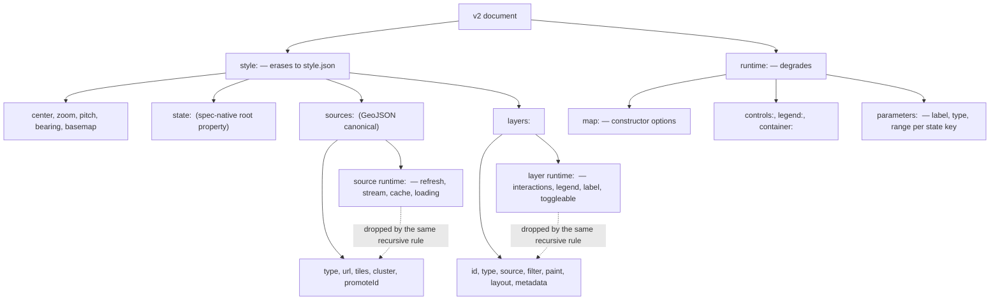
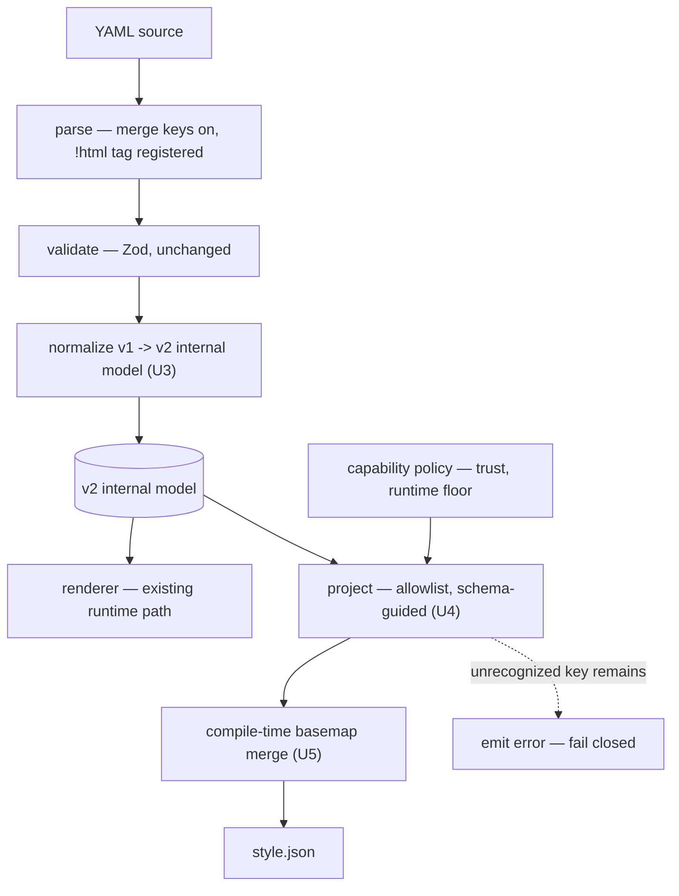

# Format v2 Definition - Plan

## Goal Capsule

- **Objective:** Settle the decisions that define format v2 (V2-D1–V2-D6), and fix the v0.5.0 arc's parallel tracks (V2-D7–V2-D9), so the emitter and extension registry are built against a known shape.
- **Product authority:** Mario. Nine decisions resolved 2026-08-07; a review the same day reopened seven items, all since resolved and folded in.
- **Open blockers:** None gating planning. Ratifying the meta-plan's decision D8 on JSON Schema strictness (`ml-a50`) should land before the emitter regenerates published contract artifacts.

---

## Product Contract

### Summary

Define format v2 in full now, and ship it in stages. v2 is a `style:`/`runtime:` split with per-layer colocation, GeoJSON as the canonical source form with today's shorthands retained as sugar, three naming corrections, and an expression grammar that is reserved rather than shipped. v0.5.0 delivers the emitter and extension registry against that definition while still reading v1, with the docs/positioning epic and Astro behavioral coverage running alongside.

### Problem Frame

The library's identity is the YAML authoring layer for MapLibre: an erasable core that compiles to spec-valid `style.json`, plus optional runtime packages for the experience layer. Nothing in the published format makes that boundary visible. A reader of a v1 document cannot tell which keys survive compilation and which exist only because a runtime is present, so the eject guarantee is something users discover at compile time rather than read in the file.

The boundary is already real in the code, just undeclared. The 0.4.0 named-source work had to scrub `refresh`, `cache`, `prefetchedData` and the legacy refresh fields out of source objects before handing them to MapLibre, because they leaked into the spec object MapLibre validates. That scrub list is the erasability boundary, discovered under pressure instead of stated.

The pressure to state it now comes from two directions. The emitter cannot be written without knowing what it projects, so v2's shape is a prerequisite rather than a future concern. And a consumer has shown what the authoring ergonomics want: map-party carries both a root and a per-layer `x-map-party` block, and stores data-driven styling twice — a resolved `step`/`match` expression in the layer's `paint`, plus an authoring block beside it serving as "the editor's hydration contract and the on-map legend's source of truth."

That evidence is corroboration, not independent confirmation. map-party's own source records why the blocks take that shape: "maplibre-yaml's Zod schemas use `.passthrough()` so the keys survive parsing intact." A consumer using the only affordance offered has not independently arrived at the same answer — it has demonstrated that colocated per-layer metadata is what a GUI round-trip reaches for. That is worth something, and it is less than convergent evidence.

### Key Decisions

**V2-D1. The split is visible at the top level, and colocation is preserved inside it.** A document has `style:` and `runtime:` sections, and each layer may carry its own `runtime:` key holding its interactions, legend, label, and toggle state. The emitter drops any `runtime:` key at any depth — one recursive rule rather than a flat projection. The alternative, addressing a layer's interactions from a separate `runtime:` block by layer id, splits a layer across two subtrees and makes every layer mutation a two-place edit, which penalizes both round-trip editing and GUI authoring. A layer is one thing to a cartographer; its interactions and legend are properties of it. The same recursive-strip rule is what the extension registry needs for `x-*` strip-on-emit, so one mechanism serves both.

**V2-D2. GeoJSON is canonical; `location`, `locations`, `region`, and `route` remain documented sugar.** They normalize to `Feature`/`FeatureCollection` immediately after parse, and the GeoJSON form is what docs, JSON Schema, and `llms.txt` present. Removing the sugar outright would be a cleaner contract but a flag-day break for existing content collections. Accepting sugar means two ways to author everything; that cost is taken deliberately. map-party's `filterableProperties` already accepts a bare-string shorthand normalized at read time, so the pattern is load-bearing in production rather than theoretical.

**V2-D3. `config:` is cut, not moved.** `config:` is declared as a single MapLibre `MapOptions` passthrough, but it holds two kinds of thing, and the split runs through the middle of it. Any proposal that keeps it whole on one side of the line contradicts the style spec.

| `config:` key | Destination | Why |
|---|---|---|
| `center`, `zoom`, `pitch`, `bearing` | `style:` root | Style-spec root properties; they land in `style.json` verbatim |
| `mapStyle` (renamed `basemap`) | `style:` root | Resolved by compile-time basemap merge |
| `minZoom`, `maxZoom`, `maxBounds`, `minPitch`, `maxPitch` | `runtime.map:` | Map constructor options with no style-spec equivalent |
| `bounds` | `runtime.map:` | Camera intent expressed as a `fitBounds` call; no style-spec root equivalent |
| `interactive`, `scrollZoom`, `boxZoom`, `dragRotate`, `dragPan`, `keyboard`, `doubleClickZoom`, `touchZoomRotate`, `touchPitch` | `runtime.map:` | Constructor-only interaction gating |
| `hash`, `attributionControl`, `logoPosition`, `trackResize` | `runtime.map:` | Chrome and browser integration |
| `fadeDuration`, `crossSourceCollisions`, `antialias`, `refreshExpiredTiles`, `renderWorldCopies`, `maxTileCacheSize`, `localIdeographFontFamily`, `preserveDrawingBuffer`, `failIfMajorPerformanceCaveat`, `locale` | `runtime.map:` | Renderer and performance tuning |

There is a **second** `config:` block, which an earlier draft missed entirely: `RootSchema.config` (`GlobalConfigSchema`) on the pages document, carrying document-level defaults with a precedence chain in `config-resolver.ts`. It is shipped and exercised, so it needs routing too.

| Root `config:` key | Destination | Why |
|---|---|---|
| `defaultCenter`, `defaultZoom` | `style:` root defaults | Same class as the camera keys they supply |
| `defaultMapStyle` | `style:` root default | Follows `mapStyle` into the `basemap` rename |
| `theme`, `dataFetching` | `runtime:` | Presentation and fetch policy; no style-spec equivalent |
| `title`, `description` | `style.metadata` | Document metadata; the style spec has a root `metadata` slot |

**V2-D4. `state:` erases; parameter metadata does not.** MapLibre has a spec-native `state` root property and a `global-state` expression, settable at runtime via `setGlobalStateProperty`, so `state:` values belong in `style:` and compile through. The spec's `state` carries defaults only — no label, type, or range — so the metadata a control UI needs lives in `runtime.parameters:`, keyed by state name. The by-name indirection is forced rather than chosen: `state` is a flat style-spec root object with no per-key nesting slot to hang metadata from.

This is *not* the shape map-party arrived at — its `style`/`heightStyle` blocks sit inside the layer, and it has no `state:` parameters at all. map-party corroborates the general principle (resolved expression in the erasable half, authoring metadata beside it) and is silent on the by-key indirection. That indirection reintroduces the two-place edit V2-D1 rejected for layers, and the trade is accepted here only because the style spec leaves no alternative.

**V2-D5. One prefix is reserved for expressions; the grammar inside it is not decided.** v2 reserves a leading `=` in string-value position — the formula-bar model the parameterization note's own examples already use (`"=built > cap ? ..."`). Any future DSL lives entirely inside `=`-prefixed strings, so `@`, `$`, and `{}` need no reservation of their own and carry meaning only within that prefix.

An earlier draft reserved those three characters directly. That was wrong on the facts: `{}` is already claimed by the style spec's own token syntax — `text-field` and `icon-image` are `tokens: true`, and this repo ships `text-field: "{point_count_abbreviated}"` in two published configs — and by tile URL templates. Reserving it would have warned on the library's own examples, and would have made `{property}` ambiguous between a spec token and a DSL reference inside the half of the format whose whole claim is that it *is* the spec. A leading `=` collides with nothing shipped.

The asymmetry still holds and is now cheap: un-reserving `=` later costs nothing, while adding a reservation later is the break v2 exists to prevent. One character buys the guarantee; the grammar waits for the demand that validates it, which is gated on a performance spike that has not run.

**V2-D6. `extends:` is reserved as a key name; none of the Tangram-heritage sugar is defined in v2.** An earlier draft admitted layer inheritance to the defined set on the ground that it "changes document shape, so it must be settled before the schema freezes." That reasoning does not survive: an optional key added in a later minor is purely additive, which is the same asymmetry argument V2-D5 uses. Nothing in the document specified its syntax, its `paint`/`layout` merge semantics, its interaction with the existing `$ref`, or a consumer asking for it.

So `extends:` is reserved at the layer level — the name is claimed, the semantics are not — and joins compound layers and real-world units as expansions a later minor can define additively. Whenever it lands it must reconcile with the document-level inheritance core already ships (`config-resolver.ts`, the `GlobalConfigSchema` precedence chain), which the earlier draft never referenced.

Note the two senses of "reserve" now in play: V2-D5 reserves a *character prefix* in string-value position; V2-D6 reserves a *key name*. Different mechanisms, different enforcement.

**YAML merge keys probably make `extends:` unnecessary.** `<<: *base` is standard YAML, gives shallow key merge with override, resolves at parse — so it costs no schema surface, no JSON Schema representation, no migrate support, and no emitter awareness, and it erases perfectly. It is off in our parser today, which is also a live footgun: a document using `<<:` right now produces a literal `"<<"` key rather than a merge. R28 turns it on.

The reservation stays anyway, because it costs nothing and covers the case merge keys handle badly: a GUI round-trip editing a merged value cannot tell whether the edit belongs on the base or the override. That is map-party's problem specifically, and `extends:` remains available as an explicit answer if it turns out to matter.

**V2-D7. v0.5.0 carries no format change.** The emitter and registry ship against the defined v2 shape while parsing v1. v2 parsing lands in v0.6.0 with the write seam and the interactions package. This keeps v0.5.0 shippable and gives the definition a release cycle of soak time before users must act on it.

**V2-D8. Adoption work runs alongside the capability arc, not after it.** The docs and positioning epic (`ml-alp`) needs no code and has been unblocked since Phase 1 finished. Running it beside v0.5.0 puts the "Why maplibre-yaml" page in the same window as the eject guarantee that gives it its strongest argument.

**V2-D9. Astro behavioral coverage is a prerequisite of the runnable examples, not a follow-up.** No test in `packages/astro` renders any component — the suite validates props and schemas, and its own header states that `.astro` components cannot be imported in vitest. No example uses `Scrollytelling` or `FullPageMap`. Writing the examples first means discovering breakage through a broken example page.

#### v2 document shape



### Requirements

**Document shape**

- R1. A v2 document separates `style:` from `runtime:` at the top level, so a reader can tell what reaches the compiled output without consulting documentation. The guarantee is a contribution claim, not an identity claim: everything under `style:` contributes to `style.json`, possibly by transformation (`basemap` merges, `$ref` resolves, `before` becomes ordering, `visible` becomes `layout.visibility`, the GeoJSON sugar expands); nothing under `runtime:` contributes at all.
- R2. A layer may carry a `runtime:` key holding its interactions, legend, label, and toggle state, keeping those properties beside the layer they describe.
- R3. A source may carry a `runtime:` key holding its live-data configuration — `refresh`, `stream`, `cache`, `loading`, and the legacy top-level refresh fields — keeping them beside the source they act on rather than addressed by id from elsewhere.
- R4. The emitter drops every `runtime:` key at every schema-known document node — document root, layer objects, source objects — by a single recursive rule, and never descends into opaque data payloads (`source.data`, `prefetchedData`, GeoJSON `properties`, `clusterProperties`), where a key named `runtime` is author data rather than document structure.
- R5. The emitter strips keys in registered `x-*` extension namespaces by the same rule that drops `runtime:`.
- R6. The keys of both of today's `config:` blocks — the map-block `MapConfig` and the pages-document `GlobalConfig` — are distributed per the V2-D3 tables, rather than moved wholesale to either side.

**Sources and geometry**

- R7. GeoJSON `Feature` and `FeatureCollection` are the canonical source and content form across docs, JSON Schema, and `llms.txt`.
- R8. `location`, `locations`, `region`, and `route` remain valid and normalize to the canonical form immediately after parse, recording the authored shape as provenance so the round-trip write seam serializes back what the author wrote rather than its expansion.
- R9. Inline `source.data` is validated as real RFC 7946 rather than accepted shallowly.

**Naming**

- R10. `mapStyle` becomes `basemap`, naming the style being merged into and avoiding collision with the `style:` section.
- R11. The container's inline CSS moves to `runtime.container.style`, vacating the top-level `style:` name.
- R12. `center`, `zoom`, `pitch`, and `bearing` sit at the `style:` root, matching their position in the style spec.

**Parameters and expressions**

- R13. `state:` lives in `style:` and compiles through to the emitted `style.json` on runtimes that support it. Emit checks the document's declared runtime: at maplibre-gl 5.6.0 or later `state:` compiles through; below it, `--with-fallbacks` inlines each state key's default into the expressions that read it, with a warning. The package's peer range is unchanged — only documents using `state:` carry the floor.
- R14. Parameter metadata — label, type, range, step — lives in `runtime.parameters:`, keyed by state name.
- R15. v2 reserves a leading `=` in string-value position and assigns it no meaning, so a later expression DSL can define semantics inside that prefix without a second format break.
- R16. A literal leading `=` is escaped by doubling it (`==`), and an unrecognized `=`-prefixed string emits a warning naming the prefix as reserved. The warning cannot fire on style-spec-native values, since no spec property takes a leading `=`.

**Inheritance**

- R17. v2 reserves `extends:` as a layer-level key name without defining its semantics, so a later minor can specify layer inheritance additively. Whatever it becomes must reconcile with the document-level inheritance core already ships.

**Extensions and trust**

- R18. Every v2 section declares the minimum trust context in which its keys may be authored. `style:` keys are authorable in any context; `runtime:` keys that select host behavior, open network connections, or reach a rendering surface are gated by a host-supplied capability policy, denied by default in zero-trust contexts.
- R19. An `x-*` block whose namespace has no registered schema is a validation warning and is stripped — never forwarded to a consumer, never emitted.
- R20. A registered `x-*` schema is a trust boundary: the registry validates the block before any consumer receives it, and a block failing validation is dropped rather than partially delivered.
- R21. Emit fails closed — if any `runtime:` or `x-*` key remains in the projected output, emit errors rather than shipping it.
- R22. Every authored string that reaches a rendering surface is rendered as text, escaped at the sink; URL-valued fields are restricted to a scheme allowlist. Structured content is the default shape for rich text. Raw markup is available only through an explicit `!html` YAML tag, which is a capability under R18 — denied by default in zero-trust contexts, available in trusted build-time ones. A parser without the tag handler resolves `!html` to its plain string and warns, so an older reader degrades to escaped text rather than failing.

**Versioning and staging**

- R23. A document declares its version through an optional `version:` field and a versioned `$schema` URL, per the accepted versioning RFC. An absent `version:` means version 1 permanently, never "whatever is current" — no shipped document can declare a version, so treating absence as current would break every existing file the moment v2 becomes current. The RFC states both readings; this resolves it.
- R24. The parser reads the current and previous format version, with shims covering the difference.
- R25. `mlym migrate` mechanically converts the split and the renames; it does not rewrite GeoJSON sugar, which stays legal.
- R26. Deprecations and removals ride the version machinery, with no flag-day break for users of the published line.

**YAML-native conventions**

- R27. Anchors and aliases (`&name` / `*name`) are documented as the sanctioned mechanism for reusing values and blocks. They already work, resolve before validation, and therefore erase completely — the emitter never sees them.
- R28. Merge keys (`<<: *base`) are enabled in the parser and documented as the layer-inheritance mechanism. They resolve at parse, so inheritance costs no schema surface, no JSON Schema representation, no migrate support, and no emitter awareness.
- R29. The parser's alias-expansion limit stays on, so an anchor-expansion attack is rejected rather than expanded.

**Arc sequencing**

- R30. v0.5.0's parser normalizes v1 documents into the v2-shaped internal model behind v1's surface syntax, and the emitter is written only against that model. What waits for v0.6.0 is accepting v2 surface syntax, not the v2 model — this is what makes "the emitter is built once" true rather than aspirational.
- R31. The docs and positioning epic runs alongside v0.5.0 rather than after the capability arc.
- R32. The Astro components have behavioral test coverage before a runnable example depends on them.

### Acceptance Examples

- AE1. Recursive strip over the internal model
  - **Covers R2, R3, R4.**
  - **Given:** a document whose layer carries `paint` plus layer-level runtime content, and whose source carries `url` plus live-data content — authored in v1 surface syntax and normalized into the v2 model.
  - **When:** the emitter projects the model.
  - **Then:** the emitted `style.json` carries the layer's `paint` and the source's `url` intact, with no trace of either `runtime:` subtree, by one rule applied at both nodes.

- AE2. Author data is not document structure
  - **Covers R4, R7.**
  - **Given:** an inline `FeatureCollection` whose features carry `properties.runtime` and `properties.x-notes`.
  - **When:** the document is compiled.
  - **Then:** both properties survive unmodified in the emitted source data — the strip rule reaches document nodes, never data payloads.

- AE3. Degradation, not failure
  - **Covers R1, R6.**
  - **Given:** a document whose source declares live-data content and whose map declares `scrollZoom: false`.
  - **When:** the document is compiled with `--with-fallbacks`.
  - **Then:** the source appears without its liveness declaration, the interaction gating is absent, and compilation succeeds.

- AE4. Sugar survives, and round-trips
  - **Covers R7, R8.**
  - **Given:** an existing content collection authored with `location:`.
  - **When:** it is parsed, normalized, and serialized back by the write seam.
  - **Then:** it validates, produces the same map it did under v1, and serializes back as `location:` rather than its expanded `Feature`.

- AE5. Unregistered extensions fail closed
  - **Covers R5, R19, R21.**
  - **Given:** a document carrying an `x-unknown` block in a namespace no consumer has registered.
  - **When:** the document is validated and compiled.
  - **Then:** validation warns, the block is stripped, no consumer receives it, and emit succeeds with the block absent — and had the strip missed it, emit would have errored rather than shipped it.

- AE6. `state:` on an older runtime
  - **Covers R13.**
  - **Given:** a document declaring `state:` and a target runtime below maplibre-gl 5.6.0.
  - **When:** it is compiled with `--with-fallbacks`.
  - **Then:** each state key's default is inlined into the expressions that read it, the `state` root key is absent, a warning names the runtime floor, and the output validates against the pinned style spec.

### Scope Boundaries

**Deferred for later**

- The expression DSL itself — the `=` prefix reserved under R15, grammar and desugarer gated on the parameterization demo's performance spike.
- Layer inheritance semantics — `extends:` reserved as a key name under R17, definable additively in a later minor.
- Compound layers and real-world units — reachable without a format change.
- Level-3 GeoJSON conformance, meaning removal of the sugar shapes — reachable later as a deprecation riding the same version machinery.
- The write seam and the interactions package — v0.6.0, landing with v2 parsing.
- Effects validation, the deck backend, and the broader effects catalog.
- Early extraction of the live-data layer or the renderer.

**Outside this product's identity**

- Executable JavaScript, `eval`-class mechanisms, and DOM selectors in documents, in any trust context.
- A registry or plugin mechanism for the erasable schema — the closed, spec-bound half is the product.
- Scrollytelling and the `pages` document under the eject claim; they sit outside it by design rather than degrading.

### Success Criteria

- v0.5.0: a real client-project document compiles to a `style.json` that opens correctly in Maputnik and renders in vanilla `maplibre-gl`.
- v0.5.0: map-party's `x-map-party` surface validates through the extension registry with its normalization rules declared.
- v0.6.0: map-party's two hand-rolled serializers collapse onto the library's write seam.
- Given a v2 document, an author can predict what a `--with-fallbacks` emit loses before running it, scored against actual emitter output on the client project and one map-party room. This is the outcome the split is for; naming which keys are dropped is not the same as knowing what ejecting costs.
- A v1 document continues to parse and render across the deprecation window, with warnings rather than errors.

### Dependencies / Assumptions

- The versioning RFC is accepted. R27 pulls the v1→v2 normalizer into v0.5.0, so the relevant part of `ml-axa` moves into that window and rises from P3.
- `@maplibre/maplibre-gl-style-spec` is pinned at `^20.4.0`, which predates `state`/`global-state`. R13 requires bumping it to a `>= 23` line so `maplibre-spec-conformance.test.ts` can validate state-bearing output. The `maplibre-gl` peer range (`^3 || ^4 || ^5`) is deliberately unchanged.
- MapLibre has not shipped style `imports`, so the emitter performs a compile-time basemap merge. This is revisited if `imports` lands.
- `state`/`global-state` require maplibre-gl 5.6.0 or later. The parameterization note verified them against the current upstream spec, not against this project's supported range — R13 carries the gate that closes the gap.
- map-party pins `@maplibre-yaml/core@0.2.0` across its core, ui, and api packages. The registry and write-seam success criteria assume it upgrades to the 0.5.0 line first (direction doc R10, still outstanding). Until it does, the second-consumer proof is unverified.
- Whether a `global-state` change re-runs paint transitions on a data-driven property, or snaps, is untested. It affects the parameterization demo, not v2's shape.
- The effects reference implementations are written but unrun. Any effects sequencing assumes a validation pass first.
- The meta-plan's decision D8 on JSON Schema strictness (`ml-a50`) is ratified before the emitter regenerates published contract artifacts.
- New capabilities are checked against both real consumers — a trusted build-time Astro client project, and map-party. A capability serving only one is flagged before it lands.

### Outstanding Questions

**Deferred to planning**

- Which v2 stage lands in which minor after v0.6.0, and what the v1→v2 shim covers at each step. Decided when v0.6.0 scope is set; it does not gate the v0.5.0 arc.
- The expression grammar inside the `=` prefix, including whether `@`/`$`/`{}` namespacing and `let:`-style local scoping are part of it. Reserved space exists; nothing about its contents is decided.
- `extends:` semantics, and how they reconcile with the `GlobalConfigSchema` precedence chain core already ships.
- The scheme allowlist and structured-content shape R22 calls for, and which rendering surfaces they cover.
- Emitter architecture, registry API shape, and the boundary between `--strict` and `--with-fallbacks` modes.
- Per-feature degradation semantics for each experience-layer capability.
- Whether the perf epic's measurement work is pulled into the v0.5.0 window, which the docs epic's bundle-size correction depends on.

### Sources / Research

- `docs/brainstorms/2026-07-24-library-direction-requirements.md` — the reconciled direction; that document's R4–R9 (emitter, registry, write seam, interactions package, v2 scoping session, deprecation machinery) are the requirements this plan resolves or defers. Its R-ID namespace is distinct from this plan's.
- `plans/define-format-v2-scoping-brief.md` — the erasability audit of the shipped 0.4.0 surface and the option sets these decisions chose from.
- `plans/rfc-schema-versioning.md` — the accepted versioning mechanism carrying v2's migration.
- `docs/brainstorms/2026-07-24-style-parameterization.md` — verification that `state` and `global-state` exist in the style spec, and that `state` carries no metadata.
- `docs/brainstorms/2026-07-15-tangram-style-replication.md` — the erasability test as the governing classification.
- `packages/core/src/schemas/map.schema.ts`, `source.schema.ts`, `layer.schema.ts` — the shipped surface the D3 table was read from.
- `packages/core/src/renderer/layer-manager.ts` — the 0.4.0 named-source scrub, which is the erasability boundary as discovered in code.
- map-party repo, `packages/core/src/types/x-map-party.ts` — the root and per-layer extension blocks, and the styling-metadata duplication that D4 formalizes.
- Beads: `ml-16x` (this epic), `ml-lc5.1` (the decision gate), `ml-0u9` (emitter), `ml-dnu` (registry), `ml-0fg` (write seam), `ml-cbm` (interactions), `ml-alp` (docs), `ml-qxt` (Astro behavioral coverage), `ml-axa` (versioning implementation).

---

## Planning Contract

**Product Contract preservation:** unchanged. No R-ID text, decision, or scope boundary was altered during planning; every planning choice below sits under the contract as written.

**Scope of this plan.** The v0.5.0 arc only: the `style.json` emitter (`ml-0u9`), the `x-*` extension registry (`ml-dnu`), their prerequisites (`ml-lic`, `ml-s3c`), and the trust and capability work that closes on top of them (`ml-ixi`). Accepting v2 *surface* syntax is v0.6.0 and out of scope — R30 puts the v2 *model* in this window, not the syntax. The write seam (`ml-0fg`) and interactions package (`ml-cbm`) are out of scope.

**Requirements not carried by any unit here.** R9 (RFC 7946 validation of inline `source.data`) defers to v0.6.0 with v2 source parsing. R8's provenance-recording half defers with the write seam; its normalize-at-parse half is in U3. R11, R12, R14–R17, and R23–R26 are v2 surface syntax and defer to v0.6.0. R31 (`ml-alp`) and R32 (`ml-qxt`) run as parallel tracks in their own beads and are not gated by this plan's Definition of Done. Naming them here is the difference between deferred and forgotten.

**Branch dependency.** U9 builds on `escapeHtml` and `safeUrl` in `packages/core/src/utils/html.ts`, which exist only in the open PR #68 (`fix/0.4.1-source-urls-and-html-hardening`), not on this branch. U9 cannot start until that merges, or must create those helpers itself.

### Key Technical Decisions

**KTD1. The emitter is an allowlist projection, not a recursive strip.** R4 states the rule from the author's side ("`runtime:` is dropped"); the implementation inverts it and copies only what it recognizes. Inverting matters for three requirements at once: R21's fail-closed guarantee becomes structural rather than a post-check (you cannot leak a key you never copied), AE2's data-loss case disappears because the projection never recurses into `source.data` at all, and an unregistered `x-*` block is dropped by default rather than by rule.

**What "recognizes" means, precisely.** R1 promises everything under `style:` *contributes* to the output, and the layer and source schemas are `.passthrough()` — so a spec-valid key the Zod shape does not name is legal today and must survive. The allowlist is therefore the union of two sets: keys the Zod schema names, and keys the pinned style-spec validator accepts. A key in neither is omitted and reported. `runtime:` and `x-*` are in neither, so R21 is unaffected. Defining the allowlist as Zod-known only would satisfy R4 while silently violating R1.

**The precedent in the codebase is mixed, and only half of it is the model.** The inline geojson, vector, and raster paths in `packages/core/src/renderer/layer-manager.ts` do build `sourceSpec` by explicit assignment — that is the shape to follow. But the named-source path (`toMapLibreSourceSpec`) rest-destructures nine YAML-only keys and spreads the remainder: a denylist, and precisely the scrub the Problem Frame calls the boundary-discovered-in-code. It is the shape the emitter must **not** copy, because a YAML-only key added later silently escapes a fixed nine-key destructure. The 0.4.0 scrub is the motivating defect, not the pattern.

**KTD2. Projection is schema-guided, over a visitor extracted from the existing walk.** `walk(value, schema, path, ctx)` in `packages/core/src/parser/validation-utils.ts` already descends only through positions the Zod schema names, which is exactly R4's "schema-known document node" boundary. Descent stops where the schema names no field, and at leaf schemas — `source.data` is `z.any()`, so it falls through to the leaf case untraversed. That, not any explicit marking, is R4's opaque-payload boundary.

Two corrections to an earlier draft of this decision. `markOpenSchema` is **orthogonal**: it only suppresses unknown-key warnings on passthrough objects, and its marked set is `MapConfigSchema` plus all six source schemas — the very nodes the projection must traverse key-by-key. Treating them as stop points would copy each source wholesale and carry its `runtime:` into the output, failing AE1. And `walk` is module-private, returns `void`, and carries a `ctx` requiring a live `yaml` Document — so it cannot be reused as-is. U4 extracts the descent into an exported generic visitor with `collectWarnings` and the projection as two consumers. `walk` also `continue`s past every `x-` key, which U8 needs changed for extension collection.

**KTD3. The internal model is the emitter's only input.** Per R30 the parser normalizes v1 into the v2-shaped model, and the emitter never sees v1 shapes. This is the decision that makes "built once" true; without it the emitter learns `config:`, layer-level `interactive:`, and top-level `controls:`, then unlearns them in v0.6.0.

**KTD4. Runtime capability is checked at projection time, not in the schema.** `state:` support (R13), trust contexts (R18), and `!html` (R22) are all properties of *where a document is being compiled*, not of whether it is valid. Keeping them out of Zod means one document validates identically everywhere and only its projection differs — which is also what lets `--with-fallbacks` degrade rather than fail.

**KTD5. `!html` is resolved at parse into a tagged node, not sniffed later.** The `yaml` package's `customTags` gives a real resolution hook. A parser without the handler resolves `!html` to its plain string and warns, so an older reader degrades to escaped text — verified on `yaml` 2.8.2.

### High-Level Technical Design



The renderer and the emitter become two consumers of one model. That is the structural payoff of R30, and it is why U3 sequences before every emitter unit.

### Assumptions

- The renderer keeps consuming the internal model without behavior change. U3 is a refactor with characterization coverage, not a rewrite — if it changes rendering, the normalizer is wrong.
- `mlym emit` is the CLI surface, following the existing `packages/cli/src/commands/schema.ts` shape.
- Basemap merge fetches the base style at compile time. Offline and unreachable-base behavior is a U5 decision, not a format question.
- The registry ships with `x-map-party` as its first registered namespace, but map-party's own upgrade off core 0.2.0 is not in this plan.

---

## Implementation Units

### Phase A — Prerequisites

### U1. Raise the style-spec floor so state-bearing output can validate

- **Goal:** `maplibre-spec-conformance.test.ts` can accept a style carrying a `state` root key.
- **Requirements:** R13. Bead `ml-lic`.
- **Dependencies:** none.
- **Files:** `packages/core/package.json`, `packages/core/tests/renderer/maplibre-spec-conformance.test.ts`, `packages/core/tests/renderer/raster-dem-spec-conformance.test.ts`.
- **Approach:** Bump `@maplibre/maplibre-gl-style-spec` from `^20.4.0` to `^23`. 23 is the first line carrying `state`/`global-state`; latest is 26.x, so pinning 23 lands three majors behind deliberately — it is the smallest bump that unblocks R13, and widening further is its own change with its own validator delta to absorb. Leave the `maplibre-gl` peer range at `^3 || ^4 || ^5` — only documents using `state:` carry the 5.6.0 floor, and that is enforced at projection time (U6), not by the package. Re-run the existing conformance suites first to catch validator behavior changes between v20 and v23 before any new code depends on it.
- **Execution note:** Land this alone and confirm the existing suites still pass before building on it. A validator bump that silently changes what counts as spec-valid would otherwise surface as a mysterious emitter failure three units later.
- **Test scenarios:**
  - A style with a `state` root key validates under the bumped spec package (previously rejected).
  - Every existing generated spec in the conformance suites still validates — no regression from the v20 → v23 behavior delta.
  - A style with a genuinely invalid layer still fails validation, proving the bump did not loosen the gate.
- **Verification:** `pnpm presubmit` green with no changes to existing conformance expectations.

### U2. Enable YAML merge keys and document anchors

- **Goal:** `<<: *base` works, and the reuse mechanisms are documented rather than accidental.
- **Requirements:** R27, R28, R29. Bead `ml-s3c`.
- **Dependencies:** none.
- **Files:** `packages/core/src/parser/yaml-parser.ts`, `packages/astro/src/utils/loader.ts`, `packages/core/tests/parser/yaml-parser.test.ts`, `docs/src/content/docs/guides/`.
- **Approach:** Pass `{ merge: true }` at every map-document parse site — three across two packages: core's parser, and the Astro loader, which calls `yaml`'s `parse` directly rather than delegating to core. Missing the loader would leave the footgun alive in one of the two shipped consumer entry points. The CLI's project-config loader parses config files rather than map documents and is not affected. Today a document using `<<:` produces a literal `"<<"` key that then trips unknown-key validation — a live footgun, so this is a fix as much as a feature. Anchors and aliases already work and need documentation only. Confirm the alias-expansion limit stays on; it is the guard against anchor-expansion attacks and must not be disabled while widening merge support.
- **Test scenarios:**
  - `<<: *base` merges the anchored mapping and later sibling keys override it.
  - A merged layer validates against the layer schema — merge resolves before validation, so the schema never sees `<<`.
  - An anchored scalar reused by alias produces the same value at both sites.
  - An anchor-expansion bomb is rejected rather than expanded.
  - Merge is shallow: a nested `paint` in the override replaces rather than deep-merges the base's `paint`, and the docs say so.
  - A merge-key document loads identically through the Astro loader and through `YAMLParser`.
- **Verification:** `pnpm presubmit` green; a merge-key example validates through `mlym validate`.

### U3. The v2 internal model and the v1 normalizer

- **Goal:** One internal shape both the renderer and the emitter consume, produced from v1 surface syntax.
- **Requirements:** R30, R1, R2, R3, R6, R8 (normalize-at-parse half), R10 (the `mapStyle` → `basemap` rename happens here, not in U5). Pulls part of bead `ml-axa` forward.
- **Dependencies:** none. Merge keys resolve inside `yaml`'s parse, upstream of normalization, so U2 is not actually load-bearing here — U2 and U3 can run in parallel if U3 becomes the critical path.
- **Files:** `packages/core/src/model/` (new), `packages/core/src/parser/yaml-parser.ts`, `packages/core/src/renderer/map-renderer.ts`, `packages/core/src/renderer/layer-manager.ts`, `packages/core/src/components/ml-map.ts`, `packages/core/tests/model/normalize.test.ts` (new).
- **Approach:** Define the v2 model types — `style` and `runtime` halves, per-layer and per-source `runtime` groupings, `runtime.map` — then a normalizer mapping v1 into it: `config:` splits per the two V2-D3 tables, layer `interactive`/`legend`/`label`/`toggleable` group under the layer's `runtime`, source live-data keys group under the source's `runtime`, block-level `controls:`/`legend:` move to top-level `runtime`. The renderer switches to reading the model. `$ref` resolution stays where it is and runs before normalization. The v1 GeoJSON sugar (`location`, `locations`, `region`, `route`) normalizes to `Feature`/`FeatureCollection` here, which is what keeps it reaching the emitter as canonical geometry rather than as unrecognized keys the allowlist would drop.

**`MapRenderer`'s constructor is public API.** It is exported from core's root and its only production caller is `packages/core/src/components/ml-map.ts`. Moving its signature to the model would be a breaking change inside a minor, so v0.5.0 keeps the existing v1 constructor as a deprecated overload that normalizes internally, and adds a model-taking factory alongside it.

**`state:` is accepted early, as a narrow exception.** R13 and AE6 are in this plan's Definition of Done, but v1 has no `state:` key — so without this, no authored document can exercise them and U7's CLI test has no input. `state` is a style-spec root property, so accepting it ahead of the rest of v2 surface syntax is additive and breaks nothing. `runtime.parameters:` comes with it. This is the only v2 surface key v0.5.0 accepts, and it is deliberate rather than the beginning of v2 parsing.
- **Execution note:** Characterization-first. Capture the renderer's current behavior against the existing fixtures before touching it, then normalize underneath — the renderer's output must not move. This is the highest-risk unit in the plan precisely because nothing user-visible should change.
- **Test scenarios:**
  - A v1 document with `config:` normalizes so camera keys land in the style half and constructor options in `runtime.map`.
  - A v1 layer with `interactive` and `legend` normalizes with both under the layer's `runtime`, and `paint`/`filter`/`source` untouched.
  - A v1 source with `refresh`/`cache` normalizes with both under the source's `runtime`, and `url`/`promoteId` untouched.
  - A root `config:` (GlobalConfigSchema) normalizes per the second V2-D3 table, with the existing precedence chain preserved.
  - Renderer output is unchanged for every existing renderer fixture — same layers, same paint, same source specs.
  - A document with no optional blocks normalizes without inventing empty `runtime` containers.
  - Round-tripping a v1 `config:` through normalize-then-reassemble yields a MapLibre options object with exactly the keys the author set — asserted with `Object.keys`, and specifically that `attributionControl` is absent rather than present-and-undefined. The renderer spreads config into MapLibre's constructor, where a key present with an undefined value is not the same as an omitted one; the existing code comment calls the attribution case a licensing problem, not a cosmetic one.
  - A v1 document authored with `location:` normalizes to a `Feature` in the model (R8, and AE4's parse half).
  - A v1 document carrying `state:` normalizes with it on the style side and `runtime.parameters:` on the runtime side.
  - `MapRenderer`'s existing v1 constructor still accepts v1 arguments and produces the same map.
- **Verification:** existing renderer and conformance suites pass unmodified; normalization is covered independently of rendering.

### Phase B — The emitter

### U4. Projection core

- **Goal:** Project the model's style half into a spec-valid style object, dropping everything else structurally.
- **Requirements:** R1, R4, R5, R21. Bead `ml-0u9`.
- **Dependencies:** U1, U3. U1 because this unit's verification runs `validateStyleMin` from the bumped spec package.
- **Files:** `packages/core/src/emitter/project.ts` (new), `packages/core/src/emitter/index.ts` (new), `packages/core/src/parser/validation-utils.ts` (extract the exported visitor), `packages/core/src/index.ts` (export the emitter's public surface), `packages/core/tests/emitter/project.test.ts` (new).
- **Approach:** First extract the schema descent from `validation-utils.walk` into an exported generic visitor, leaving `collectWarnings` and the projection as two consumers of one traversal — otherwise KTD2's "reuse" becomes a second traversal in practice. Then walk the model, copying keys that are either Zod-known or accepted by the pinned spec validator (KTD1). Descent stops where the schema names no field and at leaf schemas, so `source.data` (`z.any()`) and GeoJSON `properties` are copied wholesale and never traversed. Transforming keys resolve here: `visible` → `layout.visibility`, `before` → array ordering. A key the projection does not recognize is not copied; a post-projection assertion then confirms no `runtime` or `x-` key survived, which under an allowlist should be unreachable and is therefore a real invariant check rather than a cleanup pass.
- **Test scenarios:**
  - Covers AE1. A layer with `paint` plus layer-level runtime content projects with `paint` intact and no runtime trace; the same holds for a source.
  - Covers AE2. An inline `FeatureCollection` whose features carry `properties.runtime` and `properties.x-notes` projects with both properties intact.
  - `visible: false` projects to `layout.visibility: "none"`; `before` projects to layer ordering, not a key.
  - A layer carrying a spec-valid key the Zod shape does not name still projects with it — the `.passthrough()` case R1 requires.
  - A layer carrying a key that is neither Zod-known nor spec-valid projects without it, and the projection reports the omission rather than silently discarding it.
  - The post-projection invariant fires if a `runtime` key is injected into the projected object directly.
  - Projected output validates against the style spec for each layer type the schemas support.
- **Verification:** projected output passes `validateStyleMin` from the bumped spec package.

### U5. Compile-time basemap merge

- **Goal:** `basemap` resolves into the emitted style rather than remaining a reference.
- **Requirements:** R1, R10 (the merge half; the rename itself is U3).
- **Dependencies:** U4.
- **Files:** `packages/core/src/emitter/basemap.ts` (new), `packages/core/tests/emitter/basemap.test.ts` (new).
- **Approach:** Fetch or read the base style, then merge the projected document over it — base sources and layers first, document sources and layers appended, with document keys winning on conflict. Layer ordering across the seam is the substantive decision: document layers append after base layers unless `before` names a base layer. Assumes MapLibre has not shipped style `imports`; if it does, this is the unit that changes.
- **Test scenarios:**
  - A document with `basemap` emits a style containing the base's sources and layers plus its own.
  - A document layer with `before` naming a base layer inserts at that position.
  - An id colliding between base and document resolves in the document's favor, with a warning.
  - An unreachable or malformed base style fails with an actionable error naming the URL, rather than emitting a partial style.
  - A document with no `basemap` emits only its own content and still validates.
- **Verification:** merged output validates against the style spec and opens in Maputnik (manual check against a real client document).

### U6. Compilation modes and capability gating

- **Goal:** `--strict` and `--with-fallbacks`, and the runtime-floor gate on `state:`.
- **Requirements:** R13, R18. Covers AE3, AE6.
- **Dependencies:** U4.
- **Files:** `packages/core/src/emitter/modes.ts` (new), `packages/core/src/capabilities.ts` (new — shared, not emitter-local: the same policy gates parse, render, and emit, and U9's rendering sinks consult it in the browser), `packages/core/tests/emitter/modes.test.ts` (new).
- **Approach:** A capability policy object carries the target runtime version and the trust context (KTD4). It lives at `packages/core/src/capabilities.ts` rather than inside the emitter, because U9's `!html` and scheme gates fire at *render* time in the browser — the policy has to cross that boundary, and two copies would let default-deny hold on one path and not the other.

  **The mode boundary, which the Product Contract deferred to planning.** `--strict` means *no lossy degradation was required*, not *the document declares no runtime content*. The literal second reading would reject essentially every shipped document — including this plan's own appendix, which carries `runtime.map`, `runtime.controls`, and `runtime.container` — and would make the flag useless. So: a document whose runtime content is simply absent from the emitted style compiles clean under `--strict`, because dropping `runtime:` is the contract rather than a loss. What errors under `--strict` is content that cannot be represented *and* whose omission changes what the map shows: a `state:` key that must be inlined for the target runtime, live data whose current snapshot is empty, a basemap that could not be fetched. Under `--with-fallbacks`, it degrades and warns: live-data declarations drop to whatever data is present, chrome and interactions vanish, and `state:` below maplibre-gl 5.6.0 has each key's default inlined into the expressions that read it with the `state` root key omitted. Degradation is per-capability, so each one is a named, testable rule rather than a mode-wide behavior.
- **Test scenarios:**
  - Covers AE3. A source with live-data content and a map with `scrollZoom: false` compiles under `--with-fallbacks` with the liveness and gating absent, and succeeds.
  - Covers AE6. A document with `state:` targeting a runtime below 5.6.0 inlines each default into the reading expressions, omits the `state` root key, warns naming the floor, and validates.
  - The same document targeting 5.6.0 or later emits `state` and the `global-state` expressions untouched.
  - Under `--strict`, a document with live-data content errors rather than degrading.
  - A `case` expression reading `global-state` collapses correctly when its state key is inlined.
  - Degradation warnings name the capability and the specific keys affected.
- **Verification:** both modes emit spec-valid output for a **v1-surface** document equivalent to the appendix example, normalized through U3. The appendix listing is the v2-syntax rendering of the same model and is not parseable in v0.5.0.

### U7. `mlym emit`

- **Goal:** The emitter is reachable from the CLI.
- **Requirements:** R1. Bead `ml-0u9`.
- **Dependencies:** U5, U6.
- **Files:** `packages/cli/src/commands/emit.ts` (new), `packages/cli/src/cli.ts` (the real entry point — `src/index.ts` is an unused stub whose body is a placeholder log), `packages/cli/test/integration/emit-command.test.ts` (new).
- **Approach:** Follow `packages/cli/src/commands/schema.ts` for command shape and output handling. Flags: `--strict`, `--with-fallbacks`, `--target <version>`, `--out <file>`. Register `emit` in the `subCommands` lazy-import map in `cli.ts`, following the existing entries. Import the emitter directly from `@maplibre-yaml/core`, which the CLI already declares as a runtime dependency — `mlym schema`'s `require.resolve` pattern resolves a generated JSON *artifact*, not a module, and does not transfer.
- **Test scenarios:**
  - Emitting a valid document writes spec-valid JSON to `--out`, creating parent directories.
  - `--strict` on a document with runtime content exits non-zero with a message naming the offending capability.
  - `--with-fallbacks` on the same document exits zero and warns.
  - A document that fails validation exits non-zero without writing a partial file.
  - `--target` below 5.6.0 with `state:` produces the inlined output.
- **Verification:** `pnpm presubmit` green including the CLI integration suite.

### Phase C — The extension registry

### U8. Registry: registration, validation, strip

- **Goal:** `x-*` namespaces are registered, validated, and never leak.
- **Requirements:** R5, R19, R20, R21. Bead `ml-dnu`.
- **Dependencies:** U4.
- **Files:** `packages/core/src/extensions/registry.ts` (new), `packages/core/src/extensions/index.ts` (new), `packages/core/src/index.ts`, `packages/core/src/parser/validation-utils.ts` (the walk currently `continue`s past every `x-` key; extension collection needs it to visit them), `packages/core/tests/extensions/registry.test.ts` (new).
- **Approach:** A registry mapping an `x-*` namespace to a Zod schema plus declared normalization rules. Parse collects `x-*` blocks at every schema-known node; the registry validates each against its registered schema before any consumer receives it. An unregistered namespace warns and is dropped. Because projection is an allowlist (KTD1), extension keys are already absent from emitted output — the registry adds the validation and delivery contract, not a second strip.
- **Test scenarios:**
  - A registered namespace validating cleanly is delivered to the consumer with normalization applied.
  - A registered namespace failing its schema is dropped entirely, not partially delivered, and warns.
  - An unregistered namespace warns and is dropped, and the consumer never sees it.
  - Covers AE5. A document with an unregistered `x-unknown` block validates with a warning, compiles successfully, and emits without the block.
  - A per-layer and a root-level extension block are both collected and addressed to the right node.
  - Registering two schemas for one namespace is an error rather than a silent last-wins.
- **Verification:** `x-map-party`'s documented shape validates through the registry.

### U9. Trust contexts and the `!html` tag

- **Goal:** Capability policy gates authored content by trust context, and raw markup rides an explicit tag.
- **Requirements:** R18, R22. Bead `ml-ixi`.
- **Dependencies:** U6, U8.
- **Files:** `packages/core/src/parser/yaml-parser.ts`, `packages/core/src/capabilities.ts` (modify — created in U6), `packages/core/src/utils/html.ts`, `packages/core/src/renderer/popup-builder.ts`, `packages/core/src/renderer/legend-builder.ts`, `packages/core/tests/parser/html-tag.test.ts` (new).
- **Approach:** Register an `!html` custom tag so the parser resolves it into a marked node rather than a bare string (KTD5). Rendering surfaces escape by default; only a marked node bypasses escaping, and only when the capability policy permits it. Zero-trust denies by default.

  **Prerequisite:** this depends on `escapeHtml` and `safeUrl` in `packages/core/src/utils/html.ts`, which exist only in the open PR #68 and are not on this branch. If #68 has merged, consume them; if not, U9 creates them and migrates the three duplicated private `escapeHtml` methods (in `popup-builder.ts`, `legend-builder.ts`, and `ml-map.ts`) onto the shared helper first. The sinks the capability policy actually gates are `popup-builder.ts` and `legend-builder.ts`, which is why they are in the Files list. This resolves `ml-2l7.2` as "both shapes, gated by context."
- **Test scenarios:**
  - An `!html` node with the capability enabled renders as markup; the same document with it disabled renders escaped text and warns.
  - A plain string in the same field always renders escaped, tag or no tag.
  - A parser without the tag handler resolves `!html` to its plain string and warns — the forward-compatibility path.
  - Zero-trust context denies `!html` without explicit permission.
  - A URL field with a `javascript:` scheme is rejected under every trust context.
  - Capability denial warns naming the capability rather than failing silently.
- **Verification:** `pnpm presubmit` green; the popup-builder and legend-builder suites pass, and `html.test.ts` passes unchanged if PR #68 supplied it.

---

## Risks & Dependencies

**U3 is the unit that can quietly break everything.** It moves the renderer onto a new internal model while promising no behavior change, which is the shape of refactor that passes its own tests and breaks something nobody wrote a test for. Two mitigations: the existing renderer suites must pass *unmodified* (a changed expectation is the signal that the normalizer is wrong, not that the test was stale), and the unit is characterization-first so current behavior is captured before anything moves. If U3 slips, everything downstream slips — it has no parallel path.

**The style-spec bump can move the goalposts underneath U4–U6.** Going from v20 to v23 is three majors of validator behavior. U1 lands alone and re-runs the existing conformance suites specifically so a validator delta surfaces as its own failure rather than as an inexplicable emitter bug later.

**Basemap merge is the one unit with a network dependency.** Compile-time fetch means emit can fail for reasons unrelated to the document. U5 handles the unreachable case explicitly, but offline emit and base-style caching are open — if that becomes friction, a vendored-base escape hatch is the likely answer and it is not designed here.

**The registry ships before its first real consumer validates it.** `x-map-party` is the design target, but map-party pins core 0.2.0 and its upgrade is not in this plan. Until it upgrades, U8's contract is proven against a documented shape rather than a running consumer — the second-consumer proof in Success Criteria stays unverified through v0.5.0.

**U9 depends on an unmerged branch.** Its helpers live in PR #68, not on this branch. If that PR stalls, U9 either waits or absorbs the helper work — the plan names the fork but does not remove it.

**The registry's delivery API is still undefined.** U8 says the registry validates a block before any consumer receives it, but how a consumer subscribes, what it receives, and whether delivery is synchronous with parse are unspecified. The Product Contract deferred "registry API shape" to planning and this plan does not close it — it is the largest genuinely open design question left in the arc.

**MapLibre style `imports` would obsolete U5.** The compile-time merge exists because the spec has no import mechanism. If one ships mid-arc, U5's approach changes rather than its goal.

**Capability policy is new public API with no migration story.** R18's default-deny is correct for zero-trust hosts and invisible to trusted build-time ones, but any host that renders untrusted documents today gets stricter behavior on upgrade. That is the intent; it still needs release-note treatment U9 does not currently plan.

---

## Verification Contract

| Gate | Command | Applies to |
|---|---|---|
| Full gate | `pnpm presubmit` | Every unit — build, typecheck, lint, test, doc snippets |
| Spec conformance | `pnpm --filter @maplibre-yaml/core test -- tests/renderer/maplibre-spec-conformance.test.ts` | U1, U4, U5, U6 |
| Renderer characterization | `pnpm --filter @maplibre-yaml/core test -- tests/renderer/ tests/integration/ tests/components/` | U3 — must pass unmodified |
| Emitter suites | `pnpm --filter @maplibre-yaml/core test -- tests/emitter/` | U4–U6 |
| CLI integration | `pnpm --filter @maplibre-yaml/cli test` | U7 |

`pnpm presubmit` routes through the box-wide test lane, so only one runs at a time. A load-guard abort is an environment condition, not a failure — wait rather than retrying in a loop.

`tests/renderer/` alone is not the characterization gate: `tests/integration/map-render.test.ts` holds the largest concentration of full config-to-map exercises, and the component suites drive `MapRenderer` through `<ml-map>`. A path filter that excludes them under-delivers the proof U3 rests on.

The longevity proof is manual and belongs to U5: a real client document compiles to a `style.json` that opens correctly in Maputnik and renders in vanilla `maplibre-gl`. **The document is not yet named** — it lives in a client project outside this repo, so U5 cannot be verified by anyone but the author until it is identified.

---

## Definition of Done

- All nine units land with `pnpm presubmit` green.
- A real client-project document compiles to a `style.json` that opens in Maputnik and renders in vanilla `maplibre-gl`.
- `x-map-party`'s documented shape validates through the registry with its normalization rules declared.
- The renderer's behavior is unchanged — every pre-existing renderer test passes without modification, which is what proves U3 was a refactor.
- AE1–AE3, AE5, and AE6 have passing tests. AE6 is reachable because U3 accepts `state:` early; without that exception it would defer to v0.6.0. AE4's round-trip half needs the write seam and stays out of scope; its parse-and-render half is covered by U3's `location:` normalization scenario.
- No emitted style contains a `runtime` or `x-` key, enforced structurally by the allowlist and asserted by the U4 invariant.
- Beads `ml-lic`, `ml-s3c`, `ml-ixi`, `ml-0u9`, `ml-dnu`, and `ml-2l7.2` close. `ml-alp` and `ml-qxt` run in parallel and are not gated by this plan.

---

## Appendix — a v2 document and what it emits

Concrete shape for the decisions above: the split, per-layer and per-source `runtime:`, `basemap`, `state:` driving a data-driven property, `runtime.parameters:`, an extension block, and YAML-native reuse.

```yaml
version: 2
type: map
id: underbuilt

style:
  basemap: https://demotiles.maplibre.org/style.json
  center: [-73.98, 40.75]
  zoom: 12
  pitch: 45
  metadata:
    title: NYC underbuilt potential

  state:
    scenario: built

  sources:
    parcels:
      type: geojson
      url: /data/parcels.geojson
      promoteId: bbl
      runtime:
        refresh:
          refreshInterval: 300000
          updateStrategy: merge
          updateKey: bbl

  layers:
    - id: massing
      type: fill-extrusion
      source: parcels
      paint:
        fill-extrusion-color: "#8899aa"
        fill-extrusion-height:
          - case
          - ["==", ["global-state", "scenario"], "built"]
          - ["get", "built_ffa"]
          - ["get", "zoned_ffa"]
      runtime:
        label: Massing
        toggleable: true
        legend:
          color: "#8899aa"
          label: Floor area
        interactive:
          hover: { highlight: true }
          click:
            popup:
              - h3: [{ property: address }]
              - p:
                  - str: "Built: "
                  - { property: built_ffa, format: ",.0f" }

runtime:
  map:
    minZoom: 10
    scrollZoom: true
  parameters:
    scenario:
      label: Massing scenario
      type: enum
      values: [built, potential]
      default: built
  controls:
    navigation: true
  container:
    style: "height: 100vh;"

x-map-party:
  allowLocalFilters: true
```

Emitted `style.json`, after the basemap merge:

```json
{
  "version": 8,
  "center": [-73.98, 40.75],
  "zoom": 12,
  "pitch": 45,
  "metadata": { "title": "NYC underbuilt potential" },
  "state": { "scenario": "built" },
  "sources": {
    "parcels": {
      "type": "geojson",
      "data": "/data/parcels.geojson",
      "promoteId": "bbl"
    }
  },
  "layers": [
    {
      "id": "massing",
      "type": "fill-extrusion",
      "source": "parcels",
      "paint": {
        "fill-extrusion-color": "#8899aa",
        "fill-extrusion-height": ["case", ["==", ["global-state", "scenario"], "built"], ["get", "built_ffa"], ["get", "zoned_ffa"]]
      }
    }
  ]
}
```

Gone: both `runtime:` subtrees, `x-map-party`, the container CSS. `source.runtime.refresh` disappears and the data is whatever it was at compile time — the snapshot-on-load degradation. On a runtime below maplibre-gl 5.6.0, `--with-fallbacks` additionally inlines `scenario: built`, collapsing that `case` to `["get", "built_ffa"]` and dropping the `state` root key (R13, AE6).

Two things the abstraction does not show. The `case` expression is the parameterization demo's actual mechanism, so `state:` is doing real work rather than being a placeholder. And V2-D4's accepted cost is visible: `scenario`'s value sits in `style.state` while its label and range sit in `runtime.parameters` — the two-place edit V2-D1 rejects for layers, taken here because the style spec's `state` is flat and offers no per-key slot to hang metadata from.

### YAML-native reuse (R27, R28)

The same document with anchors and merge keys, which resolve at parse and never reach the emitter:

```yaml
style:
  layers:
    - &base-parcel
      id: massing
      type: fill-extrusion
      source: parcels
      paint: { fill-extrusion-color: "#8899aa" }

    - <<: *base-parcel
      id: massing-proposed
      paint: { fill-extrusion-color: "#cc7744" }
```

Merge is shallow, so `paint` is replaced rather than deep-merged; merging inside it is explicit (`paint: { <<: *base-paint, fill-extrusion-color: "#cc7744" }`). That explicitness is the trade for costing nothing anywhere else in the toolchain.
