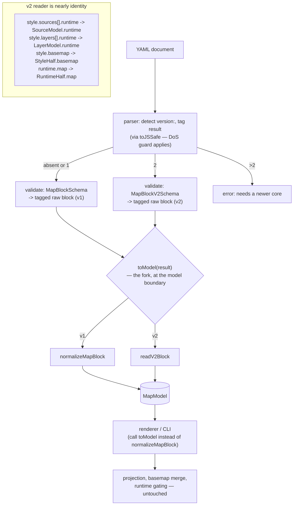

# Parse v2 Surface Syntax Into the Model - Plan

## Goal Capsule

- **Objective:** Add a second parser front end that reads format v2 documents into the existing `MapModel` — the internal milestone that makes v2 *parseable, renderable, and ejectable*, with everything behind the model untouched. (User-facing adoption of v2 also needs editor autocomplete and a migrate command, both deferred to the `ml-axa` arc — see Scope Boundaries; this plan does not by itself put v2 in front of users.) Also lands the v0.5.0-deferred RFC 7946 validation of inline `source.data`.
- **Product authority:** Mario. Format v2 is defined in `docs/plans/2026-08-07-001-feat-format-v2-definition-plan.md` (merged). This plan is the HOW for the parsing half of it; bead `ml-dsu`.
- **Open blockers:** None. Depends on v0.5.0 (shipped, core 0.5.0): the model, the emitter, and the v1 normalizer all exist.

---

## Product Contract

### Summary

v0.5.0 built the internal model and wrote the emitter and renderer against it, while the parser still reads only v1 surface syntax. This plan adds a v2 front end: version detection selects it, a v2 schema validates the `style:`/`runtime:` shape, and a thin reader maps a v2 document into the same `MapModel` the v1 normalizer produces. v1 keeps working through the deprecation window. Inline `source.data` gains real RFC 7946 validation, deferred here from v0.5.0.

### Problem Frame

The whole point of building the model first (v0.5.0, R30) was that adding v2 would touch only the front of the pipeline. This is where that bet pays off — but the seam is more precise than "the parser." Today the parser (`safeParseMapBlock`) validates a document to a **raw block** (`ParseResult<MapBlock>`); the *consumers* turn that block into a `MapModel` by calling `normalizeMapBlock` themselves — the renderer at `ml-map.ts:373` and the CLI at `emit.ts:51`. So the v1/v2 fork lives at the **normalization call site**, not inside the parser: version detection tags the parse result, and a single `toModel(result)` dispatcher picks `normalizeMapBlock` or `readV2Block`. The consumers swap their direct `normalizeMapBlock(block)` call for `toModel(result)` — a one-line change at the model boundary, not a change to rendering or emitting logic. Everything genuinely *behind* the model (projection, basemap merge, runtime gating, spec output) is untouched.

The reader is thinner than the v1 normalizer, and that is not a coincidence. `MapModel`'s `StyleHalf`/`RuntimeHalf` were deliberately shaped as the v2 document's own `style:`/`runtime:` halves. The v1 normalizer does real semantic work — it cuts `config:` in half, hoists `mapStyle`, pulls live-data keys out of sources. A v2 document already *is* that shape, so the v2 reader is structural rearrangement, not splitting. That asymmetry is the evidence the model was designed for this moment.

Three constraints frame the work. v1 must keep parsing unchanged — the versioning RFC promises no flag-day break, so both front ends coexist behind version detection. Version detection has to be unambiguous from the document alone, because it decides which schema validates and which reader runs before anything else can look at the content. And the DoS guard the parser already carries (`rejectMergeFanOut`, inside `toJSSafe`) must apply to the v2 materialization path too — the v2 reader must not re-parse with bare `parseYAML`/`doc.toJS()` and reopen the alias-expansion vector v0.5.0 closed.

### Key Decisions

**KTD1. The `version:` field is authoritative; absent means version 1, permanently.** Detection reads the optional top-level `version:` field. Absent or `version: 1` routes to the v1 front end; `version: 2` routes to v2; a higher version is an error ("this document needs a newer @maplibre-yaml/core"). This was settled in the v2 plan (R16/R23) and this plan implements it. The `$schema` modeline (`# yaml-language-server: $schema=…`) is an editor-tooling comment, not a runtime signal — it is not visible to the parser as a document field, so it plays no part in dispatch. The structural presence of a top-level `style:` block corroborates but is never the authority: the version field is the contract, and relying on structure would make a typo'd v1 document silently parse as v2.

**KTD2. Two front ends, one model, converging at a `toModel` dispatcher.** The v1 normalizer (`normalizeMapBlock`) and a new v2 reader (`readV2Block`) both produce `MapModel`. They do not share a parsing path — their inputs are structurally different documents — but they converge at a single `toModel(result)` dispatcher that selects the reader from the version tag on the parse result. This dispatcher, not the parser, is the fork: the renderer and CLI call it in place of their current direct `normalizeMapBlock` call. Selecting the reader at the model boundary is *not* "editing behind the model" — the projection, basemap merge, and runtime gating stay untouched. The model is the single convergence point, and it is the only thing the two front ends share.

**KTD3. `extends:` stays reserved; it is not defined here.** v2 reserved `extends:` as a key name without semantics (V2-D6), and YAML merge keys — shipped in v0.5.0 — already give layer inheritance today. Merge keys cover the inheritance need *except* the one case the v2 definition deliberately kept the reservation for: a GUI round-trip editing a merged value cannot tell whether the edit belongs on the base or the override — which is map-party's problem specifically (map-party is this library's primary consumer). Defining `extends:` semantics is a separate design effort not yet demanded, so this plan keeps the reservation the definition intended: the v2 schema accepts the key name so a future minor can define it additively, and nothing reads it.

**KTD4. Inline `source.data` validates against a Zod RFC 7946 schema — hard-error under v2, warn-only under v1.** `source.data` is `z.any()` today (R9, the deferred half of the GeoJSON alignment). A Zod schema modeling RFC 7946 — `FeatureCollection`/`Feature`/`Geometry` with per-type coordinate arity — replaces it, consistent with how every other schema in the repo is expressed. Under v2 (a new format, no back-compat debt) a geometry-type or coordinate-arity mismatch is a hard validation error. Under **v1 it degrades to a warning, not an error**: R2/R10 promise v1 is byte-for-byte unchanged, and MapLibre tolerates loosely-conformant geometry that `z.any()` admits today, so hard-failing an existing v1 document on the same core version would break the compat guarantee and violate the versioning RFC's bump policy (a change that invalidates previously-valid files needs a version increment). The recursive geometry schema also introduces a validation-cost surface on untrusted input (see U4 and Risks): it must be a `discriminatedUnion` on the geometry `type` and carry a `GeometryCollection` nesting-depth cap, so a deeply-nested payload is rejected fast rather than driving Zod into a stack/time blowup — the same resource-exhaustion class the merge guard exists to stop.

### v2 → model mapping

The parser validates each document to a version-tagged raw block; `toModel` is the fork, selecting `normalizeMapBlock` (semantic splitting) or `readV2Block` (structural rearrangement). Both end at the same `MapModel`, and everything behind the model is untouched. The renderer and CLI change only where they cross the model boundary — swapping a direct `normalizeMapBlock` call for `toModel`.

### Requirements

**Version dispatch**

- R1. An optional top-level `version:` field selects the parser front end: absent or `1` → v1, `2` → v2, higher → an actionable error naming the version gap.
- R2. A document with no `version:` field parses exactly as it does today — v1 behavior is byte-for-byte unchanged.
- R3. Dispatch happens before schema validation, so a v2 document is validated against the v2 schema and a v1 document against the v1 schema.

**v2 shape**

- R4. A v2 schema validates the document shape: top-level `version`/`type`/`id`, a `style:` half (basemap, root camera, state, sources, layers with per-layer `runtime:`), and a `runtime:` half (map, controls, legend, parameters, container).
- R5. Per-source `runtime:` (refresh/stream/cache/loading) and per-layer `runtime:` (interactive/legend/label/toggleable) are read into the model's runtime halves.
- R6. The v2 renames are read in their v2 positions: `basemap` (not `mapStyle`), `runtime.container.style` (not top-level container CSS), camera keys at the `style:` root (not under `config:`).
- R7. A v2 document and its v1 equivalent normalize to identical `MapModel` values.

**Reserved surface**

- R8. The v2 schema accepts `extends:` as a layer-level key name without assigning it meaning, so a later minor can define inheritance additively.

**GeoJSON validation**

- R9. Inline `source.data` is validated as RFC 7946 — geometry type and coordinate arity — replacing the current `z.any()`. A mismatch is a hard error under v2 and a warning (not an error) under v1, so v1's byte-for-byte guarantee (R2/R10) holds while v2 gets strict validation.
- R11. The RFC 7946 geometry schema is a `discriminatedUnion` on `type` and caps `GeometryCollection` nesting depth, so a deeply-nested inline payload is rejected fast rather than exhausting time or stack — inline `source.data` is untrusted input.

**Compatibility**

- R10. v1 and v2 documents both parse for the duration of the deprecation window; neither front end regresses the other. The v2 materialization path runs through `toJSSafe`, so the merge-fan-out DoS guard covers it exactly as it covers v1.

### Acceptance Examples

- AE1. Version dispatch
  - **Covers R1, R3.**
  - **Given:** three documents — no `version:`, `version: 2`, and `version: 99`.
  - **When:** each is parsed.
  - **Then:** the first validates against the v1 schema, the second against the v2 schema, and the third fails with an error naming the version and advising a core upgrade.

- AE2. v1/v2 model equivalence
  - **Covers R7.**
  - **Given:** a v1 document and a v2 document that express the same map (same basemap, camera, one source with a refresh, one interactive layer).
  - **When:** both are parsed to the model.
  - **Then:** the two `MapModel` values are deep-equal.

- AE3. A v2 document renders and emits
  - **Covers R4, R5, R6.**
  - **Given:** a v2 document with the full `style:`/`runtime:` split, per-node runtime keys, and `basemap`.
  - **When:** it is rendered through `<ml-map>` and separately compiled with `mlym emit`.
  - **Then:** the map renders, and the emitted `style.json` validates against MapLibre's own validator.

- AE4. RFC 7946 rejection
  - **Covers R9.**
  - **Given:** an inline `source.data` whose Point geometry is nested wrong — coordinates `[[0, 0]]` instead of `[0, 0]` — and a well-formed FeatureCollection. (A three-element coordinate is *valid* RFC 7946 altitude and must pass, so the failing case is wrong nesting, not arity.)
  - **When:** each is validated **in a v2 document**.
  - **Then:** the malformed one fails with a geometry/coordinate error; the well-formed one passes. In a v1 document the same malformed input produces a warning rather than an error (R9).

### Scope Boundaries

**Deferred to Follow-Up Work**

- v2 JSON Schema emission and versioned `$schema` URLs for editor autocomplete — this plan makes v2 *parse*; publishing v2's contract artifacts for editors is `ml-axa.2` (versioned schema URLs) and rides the same `emit-json-schema.ts` pipeline.
- `mlym migrate <file>` v1→v2 tooling — `ml-axa.3`, a separate command.
- Defining `extends:` semantics — reserved only (KTD3); a later minor when a consumer needs more than merge keys.
- The `=`-prefix expression DSL — `ml-3e9`, gated on the parameterization performance spike.

**Outside this work**

- Any change to logic *behind* the model — projection, basemap merge, runtime gating, spec output in the emitter (`emitter/`), the extension registry (`extensions/`), or the renderer's MapLibre wiring. The renderer (`ml-map.ts`) and CLI (`emit.ts`) do change at exactly one point: where they cross the model boundary, they call `toModel(result)` instead of `normalizeMapBlock(block)` directly (and `ml-map.ts:338`'s raw `config?.mapStyle` guard gains a v2 equivalent). That call-site swap is the fork (KTD2), not editing behind the model. If this plan finds itself changing how a model is *rendered* or *emitted*, the decision has been violated.

### Dependencies / Assumptions

- v0.5.0 is shipped (core 0.5.0): `MapModel`, `normalizeMapBlock`, the emitter, and the registry all exist and are unchanged by this work.
- `ml-dsu.4` (this plan's R9) duplicates `ml-lc5.2`. Consolidate on pickup — do one, close the other.
- RFC 7946 is validated structurally (geometry type + coordinate arity), not semantically (e.g. not polygon ring-winding or self-intersection); those are out of scope and MapLibre tolerates them.
- The repo already depends on `@types/geojson`, so the shapes are known; the Zod schema is authored, not generated.

### Outstanding Questions

**Deferred to planning-time resolution during implementation**

- Whether the v2 schema is authored fresh or composed from the existing v1 sub-schemas (paint, layout, source specs are identical between versions — only the *arrangement* differs). Compose where the sub-shape is identical; author fresh only the `style:`/`runtime:` envelope. Confirm during U2 against the actual v1 schema modularity.
- Whether `readV2Block` reuses `normalizeSource`/`normalizeLayer`'s partition (a v2 source already carries its own `runtime:` key, so the partition may be a no-op or a light validation rather than a split). Settle during U3 by writing the equivalence test (AE2) first.
- **Does the extension registry collect v2 `x-*` blocks?** The registry walks schema-known nodes to find `x-*` blocks; those nodes sit at different raw positions under v2 (`style.layers[].`) than under v1. If the walk is bound to v1 structure, v2 `x-*` blocks go uncollected. Confirm during U3 whether collection binds to the model (format-agnostic, no change needed) or to the validating schema (a v2 wiring step is needed) — and file it as follow-up work if the latter.
- **Where does GeoJSON sugar normalization run for v2?** The merged v2 definition keeps `location`/`locations`/`region`/`route` sugar valid format-wide, expanding to `Feature`/`FeatureCollection` right after parse. If `readV2Block` only rearranges structure, v2 sugar never expands (and would be double-rejected by the new strict `data` schema). Decide during U3 whether sugar normalization is a shared pre-model step both front ends call, or an explicit step in `readV2Block`; add a v2-sugar case to the AE2 corpus.
- **AE2 default drift.** The v1 config schema materializes defaults on parse (`interactive: true`, `pitch: 0`, `bearing: 0`) that land in the model. For AE2 to hold, the v2 path must reproduce the *identical* defaults in the identical model positions — compose the v2 `runtime.map`/camera fields from the same `MapConfigSchema` field definitions, or run both models through a shared default-application step before comparing. Resolve in U3, not by test discovery alone (the test surfaces the failure but does not decide the fix).

### Sources / Research

- `docs/plans/2026-08-07-001-feat-format-v2-definition-plan.md` — the format v2 definition; its appendix has the canonical v2 document shape. The requirements this plan draws on are R1–R12, R16, R23 (surface shape, renames, sugar), and R18/R26 (the versioning/no-flag-day promise the Problem Frame cites).
- `packages/core/src/parser/yaml-parser.ts` — `safeParseWithSchema`, `safeParseMapBlock`, `safeParseAny`; the dispatch seam.
- `packages/core/src/model/types.ts` — `MapModel`, `StyleHalf`, `RuntimeHalf`; the convergence type the v2 reader produces.
- `packages/core/src/model/normalize.ts` — `normalizeMapBlock` and the partition helpers; the v1 front end and the reference for what the v2 reader must match.
- `packages/core/src/schemas/map.schema.ts`, `source.schema.ts`, `layer.schema.ts` — the v1 schemas to compose from; `source.data: z.any()` is R9's target.
- `examples/verification/emitter/eject.html` — the v0.5.0 browser-demo pattern the v2 demo (U5) mirrors.

---

## Planning Contract

### Key Technical Decisions

Carried from the Product Contract's Key Decisions (KTD1–KTD4). No additional planning-level decisions; the four product decisions fully determine the approach.

**Product Contract preservation:** N/A — direct planning, no upstream brainstorm to preserve.

---

## Implementation Units

### U1. Version detection, result tagging, and the `toModel` dispatcher

- **Goal:** The `version:` field is detected at parse, tags the parse result, and a single `toModel` dispatcher selects the v1 or v2 reader — so consumers stop calling `normalizeMapBlock` directly.
- **Requirements:** R1, R2, R3, R10.
- **Dependencies:** none (but the v2 branch stays stubbed until U2/U3 land).
- **Files:** `packages/core/src/parser/yaml-parser.ts`, `packages/core/src/model/to-model.ts` (new — the dispatcher), `packages/core/src/model/index.ts`, `packages/core/src/components/ml-map.ts` (call-site swap at `:373`, plus the v2 `basemap` equivalent of the `:338` `config?.mapStyle` guard), `packages/cli/src/commands/emit.ts` (call-site swap at `:51`), `packages/core/tests/parser/version-dispatch.test.ts` (new).
- **Approach:** Two moves. **(a) Detection + tagging in the parser.** A detection step reads the parsed document's top-level `version:` (absent → 1) *before* schema validation, so a v2 document validates against the v2 schema and never the v1 schema; a version above the supported ceiling returns a parse error naming the version and advising a core upgrade. The parse result carries the detected version. Detection materializes through `toJSSafe` — the merge-fan-out DoS guard must cover the v2 path (R10); the v2 reader must never re-parse with bare `parseYAML`/`doc.toJS()`. **(b) The `toModel` dispatcher.** Today `ml-map.ts:373` and `emit.ts:51` call `normalizeMapBlock(block)` directly — the parser returns a *raw* `MapBlock`, not a model, so these consumer call sites are where the fork must live. Introduce `toModel(result): MapModel` that reads the version tag and calls `normalizeMapBlock` (v1) or `readV2Block` (v2, U3). Swap both consumer call sites to `toModel`. This is the only edit at the model boundary; nothing behind it changes (KTD2).
- **Execution note:** Start from a failing test that a `version: 2` document reaches the v2 branch of `toModel` and a version-less one is byte-identical to today. Stub the v2 branch to a "not yet implemented" throw until U2/U3 land, so U1 is landable and green on its own.
- **Patterns to follow:** the existing `safeParseAny` type-dispatch on the `type:` field is the shape to mirror for version detection; `toJSSafe`/`rejectMergeFanOut` (yaml-parser.ts) is the guard the v2 path must route through.
- **Test scenarios:**
  - Covers AE1. A `version: 2` document routes to the v2 branch; a version-less document routes to v1; a `version: 99` document errors with the version named.
  - `version: 1` explicit routes to v1 identically to absent.
  - A non-integer `version:` (`"2"`, `2.0`, `two`) is **rejected, not coerced** — a coercing discriminator could route a hostile document to the wrong front end (KTD1's whole point is an unambiguous signal). Pin reject-not-coerce with a test.
  - A merge-fan-out document under `version: 2` is rejected the same way the v1 path rejects it, within a wall-clock bound — the DoS guard covers the v2 path (R10).
  - v1 regression: a corpus of existing v1 documents produces byte-identical models through `toModel` as through the old direct `normalizeMapBlock` call.
- **Verification:** the existing v1 parser and renderer tests pass unmodified; `ml-map.ts`/`emit.ts` produce identical output for v1 documents through `toModel`; new dispatch + DoS-carryover tests green.

### U2. The v2 block schema

- **Goal:** A Zod schema validates the v2 `style:`/`runtime:` document shape.
- **Requirements:** R4, R5, R6, R8.
- **Dependencies:** U1.
- **Files:** `packages/core/src/schemas/map-v2.schema.ts` (new), `packages/core/src/schemas/index.ts`, `packages/core/tests/schemas/map-v2.schema.test.ts` (new).
- **Approach:** Author the `style:`/`runtime:` envelope fresh; compose the interior from existing v1 sub-schemas where the shape is identical (paint, layout, source specs, control/legend configs do not change between versions — only their *position* does). `style:` carries `basemap`, root camera (center/zoom/pitch/bearing), `state`, `sources` (each with an optional `runtime:` for live-data keys), and `layers` (each with an optional `runtime:` for interactive/legend/label/toggleable, and an accepted-but-unread `extends:`). `runtime:` carries `map`, `controls`, `legend`, `parameters`, `container.style`. The schema is `additionalProperties`-strict with the `x-*` escape, matching v1's D8 posture.
- **Technical design:** directional — the envelope is new, the interior is `...LayerPaintSchema`-style reuse from the v1 schemas. Confirm the v1 schemas are modular enough to import the sub-shapes; if a sub-shape is entangled with v1 positioning, extract it rather than duplicate.
- **Patterns to follow:** `packages/core/src/schemas/map.schema.ts` for block-schema structure and the `markOpenSchema`/`x-*` handling.
- **Test scenarios:**
  - A full v2 document (basemap, camera, state, a source with `runtime.refresh`, a layer with `runtime.interactive`) validates clean.
  - Per-layer `runtime:` and per-source `runtime:` are accepted in their v2 positions; the same keys at a v1 position (e.g. a top-level `refresh` on a source) are unknown-key warnings under v2.
  - `extends:` on a layer validates (reserved, unread).
  - A typo'd `stlye:` is an unknown-key warning, not a silent pass.
  - The `basemap` key is accepted; `mapStyle` at the v2 `style:` root is an unknown key (it is the v1 spelling).
- **Verification:** the v2 schema validates the appendix document from the format-v2 plan; unknown-key detection fires on v1-spelling mistakes.

### U3. The v2 → model reader

- **Goal:** A validated v2 document reads into `MapModel`, deep-equal to the v1 normalizer's output for an equivalent document.
- **Requirements:** R4, R5, R6, R7.
- **Dependencies:** U2.
- **Files:** `packages/core/src/model/read-v2.ts` (new), `packages/core/src/model/index.ts`, `packages/core/tests/model/read-v2.test.ts` (new).
- **Approach:** `readV2Block(doc): MapModel`. Because the model's `StyleHalf`/`RuntimeHalf` mirror the v2 halves, this is structural rearrangement: `style.sources[].runtime` → `SourceModel.runtime`, `style.layers[].runtime` → `LayerModel.runtime`, `style.basemap` → `StyleHalf.basemap`, camera keys → `CameraModel`, `runtime.map` → `RuntimeHalf.map`, `runtime.parameters` → `RuntimeHalf.parameters`, `runtime.container` → `RuntimeHalf.container`. A v2 source already carries its `runtime:` split, so `normalizeSource`'s partition is either reused as a light validation or skipped — settle by writing the equivalence test first (it will fail loudly if the two paths diverge). **Two things the rearrangement must not miss:** (1) the v1 normalizer materializes config defaults (`interactive: true`, `pitch: 0`, `bearing: 0`) into the model — the v2 path must reproduce the identical defaults in the identical positions, or AE2 deep-equality fails on a minimal document (compose the v2 camera/`runtime.map` fields from the same `MapConfigSchema` field definitions, or apply a shared default step); (2) GeoJSON sugar (`location`/`locations`/`region`/`route`) is valid under v2 and must expand to `Feature`/`FeatureCollection` — route it through the same normalization the v1 path uses, as a shared pre-model step, not a v1-only one.
- **Execution note:** Write AE2 (v1/v2 model equivalence) first. It is the strongest possible test — it pins that both front ends converge on byte-identical models — and it drives the reader's shape rather than the reader driving the test.
- **Patterns to follow:** `packages/core/src/model/normalize.ts` — the v1 reader is the reference for the target model shape; the v2 reader produces the same output from different input.
- **Test scenarios:**
  - Covers AE2. A v1 document and its v2 equivalent produce deep-equal `MapModel` values.
  - A *minimal* v1 document and its v2 equivalent are deep-equal — the config-default reconciliation case (`interactive`/`pitch`/`bearing`): both carry the identical materialized defaults, not one with and one without.
  - A v2 document using GeoJSON sugar (`location:`/`region:`) and its v1 sugar equivalent are deep-equal — sugar expands on the v2 path too.
  - Per-source `runtime:` lands in `SourceModel.runtime`, per-layer `runtime:` in `LayerModel.runtime`, with `spec` halves carrying only style-spec keys.
  - `basemap` reads into `StyleHalf.basemap`; camera keys into `CameraModel`; `runtime.container.style` into `RuntimeHalf.container`.
  - `extends:` on a layer is carried or dropped consistently (decide with KTD3 — reserved-unread means it need not reach the model).
  - A v2 document with no `runtime:` half reads into a model with empty runtime containers, not absent ones — matching the v1 normalizer's presence discipline.
- **Verification:** AE2 green; a v2 document read → model → emitter produces the same `style.json` as the equivalent v1 document.

### U4. RFC 7946 validation of inline source.data

- **Goal:** Inline `source.data` is validated as real RFC 7946, replacing `z.any()` — hard-error under v2, warn under v1.
- **Requirements:** R9, R11.
- **Dependencies:** none (independent of the v2 front-end work; applies to both versions). *May land as its own PR ahead of or after the v2 units* — it is the v0.5.0-deferred GeoJSON debt, not v2 parsing, and its TS7056 risk should not be able to block v2 delivery.
- **Files:** `packages/core/src/schemas/geojson.schema.ts` (new), `packages/core/src/schemas/source.schema.ts`, `packages/core/tests/schemas/geojson.schema.test.ts` (new).
- **Approach:** A Zod schema modeling RFC 7946 — `Position` (2 or 3 numbers), the seven `Geometry` types with their coordinate arities, `Feature`, `FeatureCollection` — replaces `data: z.any()`. The geometry schema is a **`discriminatedUnion` on `type`** (bounds per-node cost to one branch, not seven-way backtracking) and caps `GeometryCollection` nesting depth (R11), because inline data is untrusted and a recursive schema over unbounded input is a validation-cost DoS surface — the same class the merge guard exists to stop. Under v2 a mismatch is a hard error; under v1 it degrades to a warning (R9/KTD4), so `z.any()`'s current permissiveness is not retroactively tightened on existing v1 files. Authored, not generated (`@types/geojson` gives the reference shapes). Validation is structural only — no ring winding, no self-intersection (MapLibre tolerates those; out of scope). Watch the TS7056 trap the source-URL and popup-str fields hit: if the GeoJSON union inflates the layer discriminated union past the serialization buffer, annotate the field's type to collapse it, exactly as `ResourceURLSchema` and `PopupContentItemSchema` did — measure this early, the recursive schema is more surface than those were. Apply the same schema to `prefetchedData` (the second `z.any()` inline-GeoJSON field on the source), or state explicitly that it stays `z.any()` and why.
- **Test scenarios:**
  - Covers AE4. A well-formed `FeatureCollection` passes; a nested-wrong Point (`[[0,0]]` instead of `[0,0]`) fails under v2 and warns under v1.
  - Each geometry type validates its own coordinate nesting: Point `[x,y]`, LineString `[[x,y],…]`, Polygon `[[[x,y],…]]`, and the Multi* variants one level deeper.
  - A `GeometryCollection` with mixed member geometries validates; a `GeometryCollection` nested past the depth cap is rejected fast (wall-clock-bounded), not a stack overflow or superlinear hang (R11).
  - A missing or unknown `type` on a geometry fails.
  - Altitude: a 3-element `Position` is accepted (RFC 7946 allows it) — this is the `ml-lc5.3` altitude-policy edge; accept-and-preserve, do not strip here.
  - Under v1, a malformed inline `data` produces a warning and the document still parses (R2/R10 byte-for-byte guarantee holds); under v2 the same input is a hard error.
  - The existing round-relative and remote `url:` source cases still pass (the change is to `data:`/`prefetchedData`, not `url:`).
- **Verification:** `mlym validate` on a v2 document rejects a malformed inline FeatureCollection with a geometry-level message and on a v1 document warns; the docs' inline-data examples still validate.

### U5. Browser demo: a v2 document renders and emits

- **Goal:** A runnable page that renders a v2 document and compiles it, doubling as the end-to-end regression test.
- **Requirements:** R4, R5, R6 (end to end).
- **Dependencies:** U2, U3.
- **Files:** `examples/verification/v2/v2-document.html` (new), `e2e/v2-parser.spec.ts` (new).
- **Approach:** Mirror the v0.5.0 emitter demo pattern. The page authors a full v2 document (version: 2, style/runtime split, per-node runtime, basemap, state), renders it through `<ml-map>`, and separately compiles it with the emitter shown in a panel. The Playwright spec asserts the map paints and the emitted style validates — and, as the strongest cross-check, that the same document authored in v1 produces the same rendered result. Wired into `verify:browser`, hermetic per the existing e2e conventions (no off-origin requests).
- **Execution note:** This is the user-facing proof that v2 works, per the standing preference that changes ship with a browser test that is also a demo. It is the AE3 acceptance surface.
- **Patterns to follow:** `examples/verification/emitter/eject.html` and `e2e/v050-emitter.spec.ts` — the demo-as-test pattern, the hermetic guard, the `index.browser` import.
- **Test scenarios:**
  - Covers AE3. The v2 document renders a visible map; the emitted `style.json` is spec-valid.
  - A v1 and a v2 document expressing the same map render indistinguishably — framed specifically as the guard that the renderer is a pure function of the model (if it ever read the raw document, this is where v1/v2 would diverge visually despite AE2's model-equality). This is the value beyond AE2, not a restatement of it.
  - Console stays clean (no parse warnings on a well-formed v2 document); the hermetic guard passes.
- **Verification:** `pnpm verify:browser` green including the new spec; the page is openable and shows a rendered v2 map beside its compiled style.

---

## Risks & Dependencies

**The equivalence test (AE2) is the linchpin, and it is also the mitigation.** The one thing that can quietly go wrong is the v2 reader and the v1 normalizer diverging — producing subtly different models for the same map, which would surface far downstream as a rendering or emit difference nobody traces back here. AE2 (v1/v2 model deep-equality) makes that divergence a loud, local failure. Write it first (U3 execution note); it is worth more than any other test in this plan.

**Schema composition may reveal v1 entanglement.** U2 assumes the v1 sub-schemas (paint, source specs) are modular enough to reuse in the v2 envelope. If a sub-shape turns out entangled with v1 positioning, the honest move is to extract it into a shared schema both versions import — not to duplicate it, which would let the two versions drift. Budget for a small extraction refactor inside U2.

**RFC 7946 scope creep.** U4 is structural validation only. The temptation is to add semantic checks (ring winding, self-intersection); resist it — MapLibre tolerates those, they are genuinely out of scope, and they would balloon a bounded unit. The altitude case (`ml-lc5.3`) is the one edge to get right: accept 3-element positions, do not strip.

**The `$schema`/editor story is deferred, so v2 ships without autocomplete first.** Users can author v2 by hand but get no editor validation until `ml-axa.2` emits versioned v2 schemas, and no `mlym migrate` until `ml-axa.3`. So this plan does *not* by itself make v2 the better-to-author format — at completion v2 is parseable and renderable, but harder to hand-author than v1. That is an acceptable internal milestone, but the v1 deprecation clock should not start on this plan's merge: hold v2's user-facing announcement until autocomplete and migrate land, or announce it explicitly as experimental. A conscious rollout sequence, not a surprise.

**A recursive schema over untrusted inline data is a DoS surface (U4/R11).** Replacing `z.any()` (O(1)) with a recursive RFC 7946 schema means every coordinate of every feature is walked on every parse, and `GeometryCollection` is self-recursive. The mitigations are non-optional: `discriminatedUnion` on `type` and a nesting-depth cap, both tested with a wall-clock bound. This is the same resource-exhaustion class as the v0.5.0 merge-fan-out DoS, arriving through a different door — treat it with the same seriousness.

**The two front ends can silently diverge on config defaults (U3).** The v1 normalizer injects `interactive`/`pitch`/`bearing` defaults into the model; if the v2 path does not reproduce them identically, AE2 fails on minimal documents. This is the concrete form of the "reuse the partition?" question — resolve it in U3 by composing the v2 fields from the same `MapConfigSchema` definitions, not by hoping the equivalence test happens to be written with defaults present.

---

## Verification Contract

| Gate | Command | Applies to |
|---|---|---|
| Full gate | `pnpm presubmit` | Every unit |
| v1 regression (parser + renderer) | `pnpm --filter @maplibre-yaml/core test -- tests/parser/ tests/components/` | U1 — must pass unmodified through `toModel` |
| DoS carryover (wall-clock bounded) | `pnpm --filter @maplibre-yaml/core test -- tests/parser/version-dispatch.test.ts` | U1 — merge-fan-out under `version: 2`; U4 — deep `GeometryCollection` |
| Model equivalence | `pnpm --filter @maplibre-yaml/core test -- tests/model/read-v2.test.ts` | U3 — AE2 is here (incl. defaults + sugar cases) |
| Schema validation | `pnpm --filter @maplibre-yaml/core test -- tests/schemas/` | U2, U4 |
| Browser (demo = test) | `pnpm verify:browser` | U5 |

`pnpm presubmit` routes through the box-wide test lane — one at a time; a load-guard abort is an environment condition, wait rather than retry.

---

## Definition of Done

- All five units land with `pnpm presubmit` green.
- A `version: 2` document parses, renders through `<ml-map>`, and compiles with `mlym emit` to a spec-valid style — proven by the U5 browser test.
- A v1 document and its v2 equivalent produce deep-equal `MapModel` values, including the config-default and GeoJSON-sugar cases (AE2).
- Every existing v1 parser and renderer test passes unmodified — v1 is byte-for-byte unregressed through the new `toModel` dispatcher (R2, R10).
- A merge-fan-out document under `version: 2` is rejected within a wall-clock bound — the DoS guard covers the v2 path (R10).
- Inline `source.data` is RFC 7946 validated: a malformed FeatureCollection is a hard error under v2 and a warning under v1 (R9, AE4); a past-depth `GeometryCollection` is rejected fast (R11).
- The only edits at or behind the model boundary are the `toModel` call-site swaps in `ml-map.ts`/`emit.ts` (KTD2); no change to projection, basemap merge, runtime gating, the emitter's spec output, or the extension registry.
- Beads close: `ml-dsu.1`, `ml-dsu.2`, `ml-dsu.3`, `ml-dsu.4` (and `ml-lc5.2`, its duplicate). `ml-dsu` epic closes. **U5 (the browser demo/test) has no dedicated sub-bead — file one on pickup, or fold it explicitly into `ml-dsu.2`/`ml-dsu.3`, so the five units and the closed beads reconcile.**
