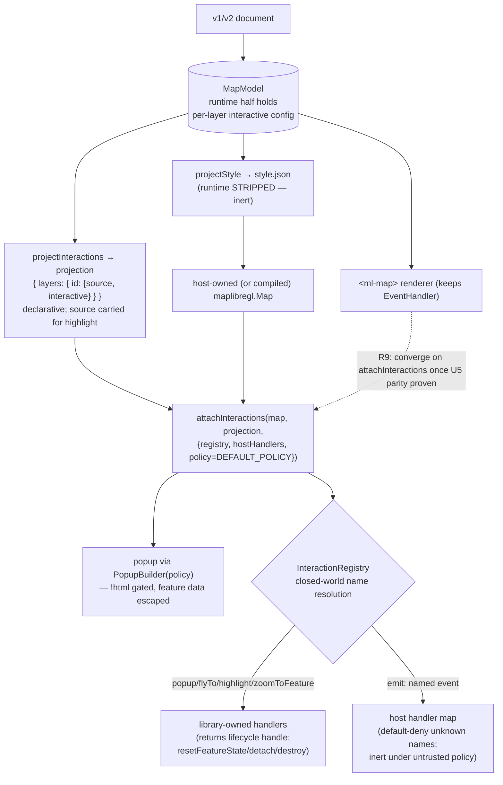

# Interactions as a Registry-Backed Module - Plan

## Goal Capsule

- **Objective:** Ship interactions (popup, highlight, zoom-to-feature, emit) as a registry-backed module with closed-world handler resolution, and prove they work end-to-end on a **compiled** map — the eject guarantee extended from rendering to interaction.
- **Product authority:** Mario. R7 of `docs/brainstorms/2026-07-24-library-direction-requirements.md`. Bead `ml-cbm` (children `ml-cbm.1` extraction + `ml-cbm.2` compiled-map proof).
- **Open blockers:** None. Builds on v0.5.0's model/emitter and the registry-shaped `renderer/interactions.ts` that 0.4.0 deliberately left barrel-private for exactly this extraction.

---

## Product Contract

### Summary

`renderer/interactions.ts` already holds popup, flyTo, and highlight as registry-shaped data (named interactions selected by config, not branches in an event handler) — kept out of the package barrel so this epic is a *move*, not a rewrite. This plan makes it a real module: a formal `InteractionRegistry` with closed-world, strict-mode name resolution; two new interactions (zoom-to-feature, emit); and the piece that makes it matter — a declarative **interactions manifest** projected from the model's runtime half so a host can attach interactions to a *compiled* `style.json` running in vanilla maplibre-gl. The whole surface honors the format law: the document carries no executable JavaScript, no DOM selectors, no user GLSL — only named interactions with declarative config.

### Problem Frame

The concrete consumer is **map-party**, this library's biggest adopter. It drives its *own* `maplibregl.Map`, calls `map.on(...)` directly, and today re-implements the renderer's interaction wiring by hand (a mirrored copy of the interaction code) — it uses no `<ml-map>` web component at all. That is the user this epic serves: a **host integrator** who owns the map instance and wants the library's declarative interactions without adopting the renderer. The library has no public entry point that gives them that today, so they fork the logic.

Interactions can never live in `style.json`: the emitter strips the runtime half (`FORBIDDEN_KEYS = ["runtime"]`), and nothing in the style spec expresses "open a popup on click." So a host with only a compiled style has a rendering map that is inert. The missing piece is a library entry point — `attachInteractions(map, interactions, options)` — that wires the registry's handlers onto a `maplibregl.Map` the host already owns, from the declarative interaction data the model already holds. That retires map-party's hand-mirrored renderer and, as a secondary benefit, lets a compiled `style.json` gain interactions in vanilla maplibre-gl.

That frames the epic. `ml-cbm.1` (extract the registry) is the mechanical half; `ml-cbm.2` (interactions on a compiled map) is the architectural half, and it turns on one entry point that does not exist yet: a standalone `attachInteractions` decoupled from `<ml-map>`, consuming the model's declarative interaction data. A *persisted, versioned* interactions manifest as a distinct emitted artifact is a separate, later concern (its only producer — a `mlym emit --interactions` sidecar — is deferred, and no shipping consumer loads a style-plus-sidecar pair yet); this epic ships the in-memory projection and the attach entry point, not a new file format.

The format law is the constraint that shapes every decision. Logic is never data in the document: an interaction is a *name* (`popup`, `zoomToFeature`, `emit`) the library resolves to library-owned code, configured by declarative fields the schema validates. `emit` is the pressure test — it hands control to the host, and it must do so without ever letting the document name a function, a selector, or a code string. It names an *event*; the host decides what that event does. Closed-world resolution (an unknown interaction name is denied, not invoked) is what makes "no smuggled handlers" a structural property rather than a hope.

### Key Decisions

**KTD1. A core submodule with a public barrel — not yet a separate npm package.** Extract `renderer/interactions.ts` into `packages/core/src/interactions/` with a registry and a public barrel exported from core. The epic permits "a registry-backed package *or* an extraction-ready core module"; the module is the right first step because interactions are tightly coupled to the model, the schemas, and the `maplibre-gl` peer dependency, and there is no consumer that needs them independently of core yet. A separate `@maplibre-yaml/interactions` package adds publishing, versioning, and peer-dep ceremony for no current gain. The barrel makes the later package split a move, not a rewrite — the same discipline 0.4.0 applied to get here.

**KTD2. Interactions reach a host-owned map through a standalone `attachInteractions`, not the style.** `projectInteractions(model)` produces an in-memory, declarative interactions projection — `{ layers: { [layerId]: { source, interactive } } }` — from the model's per-layer runtime halves. It is pure declarative data (the shapes the schema already validates), so it honors the format law and is host-agnostic. **Each entry carries the layer's `source` id** (read from `layer.spec.source`), because `highlight` writes `setFeatureState({ source, id })` and the source lives in the *style* half, not the interactive config — a projection of only `InteractiveConfig` cannot drive highlight. `attachInteractions(map, projection, options)` wires the registry's handlers onto a `maplibregl.Map` the host owns (or a bare compiled one), with no dependence on `<ml-map>`. This is what `ml-cbm.2` proves and what map-party adopts. A *persisted, versioned* manifest file (with a `version` field, emitted beside `style.json` by the CLI) is deliberately **out of scope** — deferred until a non-test consumer loads such a pair; this epic ships the projection function and the attach entry point. Routing the live `<ml-map>` renderer through the same path (one code path, live and ejected) is a *goal*, not a hard gate — see R9.

**KTD3. Closed-world resolution: a fixed built-in allowlist, plus a host handler map for `emit`, both default-deny — and the policy travels to the compiled path.** The `InteractionRegistry` resolves an interaction *name* against a fixed allowlist of library built-ins (`popup`, `flyTo`, `highlight`, `zoomToFeature`, `emit`). A name not on the allowlist is denied with a warning, never invoked — mirroring `ExtensionRegistry`'s default-deny posture. `emit` resolves one level further: the document names an *event*, and the host supplies a handler map (`{ [eventName]: handler }`) at `attachInteractions` time; an event with no registered handler is denied, not dispatched into the void. **`emit` is not the only policy-gated built-in.** The `popup` built-in renders `!html` markers, which the renderer gates today through `PopupBuilder(policy)` (`allowsHtml` decides live markup vs. escaped text; feature-property escaping via `escapeHtml`/`safeUrl` is unconditional). `attachInteractions` runs *outside* the renderer, so it must construct the popup's `showPopup` dependency through `PopupBuilder(policy)` itself — otherwise a compiled-map popup renders untrusted `!html` and feature data as live markup with no gate (an XSS hole on exactly the bare-`Map` path this epic adds). The `CapabilityPolicy` therefore gates two built-ins: `emit` (inert under untrusted) and `popup`'s `!html` (escaped under untrusted). **Fail-closed on an absent policy:** both `projectInteractions` and `attachInteractions` substitute `DEFAULT_POLICY` (`{ trust: "untrusted" }`, which the library already ships) when the host passes none, so a forgotten policy denies host-hooks and escapes `!html` rather than opening both.

**KTD4. `zoomToFeature` and `emit` are declarative-only.** `zoomToFeature` is a click interaction that fits the camera to the clicked feature's own bounds (`map.fitBounds` over the feature geometry) — distinct from `flyTo`, which flies to author-fixed coordinates. Config is declarative: `{ padding?, maxZoom?, duration? }`. `emit` is a click/hover interaction that dispatches a named event carrying a declarative payload — a projection of the clicked feature's properties selected by name, never an expression that executes. Config: `{ event: string, payload?: <declarative property projection> }`. Neither introduces a field that accepts code, a selector, or GLSL; format-law enforcement is a property of the schema surface, not a runtime check.

### Interaction pipeline



`style.json` and the projection are two views of one model. map-party (and any host that owns its `Map`) attaches interactions through `attachInteractions`; converging the live renderer onto the same path is a follow-up gated on the U5 parity result (R9), not a precondition for the compiled-map proof.

### Requirements

**Extraction (ml-cbm.1)**

- R1. `renderer/interactions.ts` moves to `packages/core/src/interactions/` as a registry-backed module with a public barrel exported from core. The existing `EventHandler` consumes it from the new location.
- R2. The move is behavior-preserving: every existing renderer/event-handler test passes unmodified.
- R3. An `InteractionRegistry` resolves an interaction *name* to a handler against a fixed built-in allowlist; an unknown name is denied with a warning (closed-world, default-deny).

**New interactions**

- R4. `zoomToFeature` (click): fits the camera to the clicked feature's own bounds; declarative config `{ padding?, maxZoom?, duration? }`.
- R5. `emit` (click/hover): dispatches a named event with a declarative property-projection payload; the host resolves the event name against a supplied handler map, default-deny on unknown names.
- R6. Both new interactions extend `InteractiveConfigSchema` with declarative-only fields — no code, selector, or GLSL field is introduced anywhere on the interaction surface.

**Host attachment (ml-cbm.2)**

- R7. `projectInteractions(model)` produces an in-memory, declarative interactions projection from the model's runtime half; each layer entry carries the layer's `source` id (from `layer.spec.source`) so `highlight`'s `setFeatureState` has a source to address.
- R8. `attachInteractions(map, projection, options)` wires the registry's handlers onto a `maplibregl.Map` the host owns (or a bare compiled one) — no dependence on `<ml-map>` or the renderer's internals — and returns a lifecycle handle (`{ resetFeatureState, detach, destroy }`) the renderer can drive.
- R9. **Goal, not gate:** converging the `<ml-map>` renderer onto the same `attachInteractions` path (one code path, live and ejected) is a follow-up, landed only once the U5 parity spike shows the renderer can adopt it without leaking renderer-only lifecycle into the host-agnostic path, and never at the cost of regressing the existing renderer suites.

**Policy / format law**

- R10. The `CapabilityPolicy` trust context gates the two host-reaching built-ins: under an untrusted context, `emit` is inert and `popup`'s `!html` markers render escaped (feature-property escaping is unconditional). `attachInteractions` constructs the popup sink through `PopupBuilder(policy)` so the gate applies on the compiled-map path exactly as in the renderer; an absent policy defaults to `DEFAULT_POLICY` (untrusted) — fail-closed.
- R11. A document cannot introduce an executable handler, DOM selector, or GLSL through any interaction field — enforced by the schema surface (no such field exists) and closed-world name resolution.
- R12. A host that owns its own `maplibregl.Map` (map-party's shape) can attach the library's declarative interactions via `attachInteractions` against its existing map and `map.on` lifecycle, retiring a hand-mirrored renderer copy.

### Acceptance Examples

- AE1. Extraction is invisible
  - **Covers R1, R2.**
  - **Given:** the interactions module moved to `packages/core/src/interactions/`.
  - **When:** the existing renderer and event-handler test suites run unmodified.
  - **Then:** they all pass — the move changed no behavior.

- AE2. Interactions fire on a compiled map
  - **Covers R7, R8, the ml-cbm.2 success criterion.**
  - **Given:** a document compiled to `style.json` + an interactions manifest, loaded into a bare `new maplibregl.Map({ style })` with `attachInteractions(map, manifest, …)`.
  - **When:** the user clicks a feature with a `popup`, hovers a feature with `highlight`, and clicks a feature with `zoomToFeature`.
  - **Then:** the popup opens, the feature highlights, and the camera fits the feature's bounds — with no `<ml-map>` element present.

- AE3. `emit` reaches the host, closed-world
  - **Covers R5, R10, R11.**
  - **Given:** a layer with `emit: { event: "select-parcel", payload: { id: <property projection> } }`, attached with a host handler map registering `select-parcel`.
  - **When:** the feature is clicked under a trusted policy, then under an untrusted policy, then with the event unregistered in the host map.
  - **Then:** trusted+registered fires the host handler with the projected payload; untrusted is inert; unregistered is denied with a warning — never a smuggled call.

- AE4. Unknown interaction name is denied
  - **Covers R3.**
  - **Given:** a projection naming an interaction not on the built-in allowlist.
  - **When:** `attachInteractions` processes it.
  - **Then:** it is dropped with a warning; no handler is invoked.

- AE5. Popup `!html` is trust-gated on the compiled-map path
  - **Covers R10 — the compiled-path XSS gate.**
  - **Given:** a popup whose content carries an `!html` marker and a feature property containing `<script>`, attached to a bare `maplibregl.Map` with no `<ml-map>`.
  - **When:** the feature is clicked under a trusted policy, under an untrusted policy, and with no policy supplied.
  - **Then:** trusted renders the `!html` as markup; untrusted and no-policy (DEFAULT_POLICY) render it escaped; the `<script>` feature property is escaped in all three — the renderer's `PopupBuilder(policy)` gate applies identically off the renderer.

- AE6. A bring-your-own-map host attaches interactions
  - **Covers R12 — the map-party consumer.**
  - **Given:** a host that constructed its own `maplibregl.Map` and added the layers itself (no `<ml-map>`, no compiled `style.json` from this library).
  - **When:** it calls `attachInteractions(map, projection, { registry, hostHandlers })` and later `handle.destroy()`.
  - **Then:** interactions fire against its map, and destroy detaches every listener with no leak — the entry point map-party adopts in place of its hand-mirrored renderer.

### Scope Boundaries

**Deferred to Follow-Up Work**

- Splitting interactions into a standalone `@maplibre-yaml/interactions` npm package — deferred until an independent consumer exists (KTD1); the barrel makes it a later move.
- Host-authored *custom* interaction types (a host registering a new interaction name beyond the built-in allowlist) — the registry is closed-world by decision; an open registration API is a separate, security-sensitive design.
- Emitting the interactions manifest from the `mlym emit` CLI as a second output file — the manifest projection ships in core; wiring it as a CLI artifact (a `--interactions` sidecar) is a small follow-up once the core shape is proven.

**Outside this work**

- Any change to what reaches `style.json`. Interactions stay in the runtime half; the emitter's strip is unchanged. If this plan finds itself adding interaction data to the compiled style, the eject boundary has been violated.
- The `=`-prefix expression DSL (`ml-3e9`) — `emit` payloads are declarative property projections, not expressions.

### Dependencies / Assumptions

- **map-party is the target consumer.** It depends on `@maplibre-yaml/core` (currently pinned at 0.2.0), drives its own `maplibregl.Map` and calls `map.on` directly, and maintains a hand-mirrored copy of the renderer's interaction logic. `attachInteractions` is the entry point that retires that copy. Validate the API shape against that integration (an existing `Map` + `map.on` lifecycle + a host handler map), not only a hermetic library-free demo. (map-party bumping to 0.6.0 to adopt it is its own follow-up; this epic ships the surface.)
- v0.5.0's model (`LayerModel.runtime` holds the per-layer interactive config; `layer.spec.source` holds the source id) and emitter (strips runtime) are on main, unchanged by this work.
- `maplibre-gl` stays a peer/external dependency; `attachInteractions` takes a `maplibregl.Map` instance rather than importing the library.
- The projection reuses the existing `InteractiveConfigSchema` shapes, so a schema change remains a type error at the interaction site. The popup gate reuses the renderer's `PopupBuilder`/`escapeHtml`/`safeUrl`/`POPUP_TAGS` and the `CapabilityPolicy`/`DEFAULT_POLICY` already in core — no new security primitive is authored.
- `fitBounds` over a feature geometry needs a bbox. Verified: no `@turf/*` is present in the repo, so the hand-rolled bounds helper (Point/LineString/Polygon/Multi*) is the path — not a conditional.

### Outstanding Questions

**Deferred to planning-time resolution during implementation**

- **The R9 renderer-convergence spike (do it before committing R9).** The real `EventHandler` couplings are *not* a style-change re-attach path (none exists in the code — no `setStyle`/`styledata` listener anywhere). They are: `resetFeatureState` wired to the live-data refresh callback, `detach`/`destroy`, `highlight`'s per-layer tracked-feature state, cursor handling, and the `onClick`/`onHover` callbacks that bubble `layer:click`/`layer:hover` to `<ml-map>` consumers. `attachInteractions` returns a handle exposing `resetFeatureState`/`detach`/`destroy` (plus optional click/hover callbacks); a compiled host simply never invokes the reset hook. Run U5's round-trip parity as a spike first: if the renderer can adopt the handle without dragging renderer-only concerns into the host-agnostic path, land R9; **if not, keep the two paths and ship the compiled-map proof anyway** — do not bend `attachInteractions` to renderer internals or regress the working renderer.
- **`emit` payload projection grammar.** The declarative payload selects feature properties by name. Settle the exact shape in U4 by reusing the existing `PopupContentSchema` property-projection vocabulary (which already selects properties declaratively) — do not invent a second grammar.
- **Where the trust-policy gate on `emit` lives.** Either `projectInteractions` drops `emit` blocks under an untrusted policy (fail-closed at projection), or `attachInteractions` refuses them at wire time. Prefer projection-time drop so an untrusted projection never even carries host-hook instructions; confirm in U4/U5. (The popup `!html` gate is *not* deferred — it is a hard requirement, R10, resolved at `attachInteractions` via `PopupBuilder(policy)`.)

### Sources / Research

- `packages/core/src/renderer/interactions.ts` — the registry-shaped source being moved; `Interaction`/`InteractionContext`/`InteractionDeps`/`InteractionRuntime`, `CLICK_INTERACTIONS` (popup, flyTo), `HOVER_INTERACTIONS` (highlight).
- `packages/core/src/renderer/event-handler.ts` — the `EventHandler` consumer; `attachLayer` reads `layer.interactive` and binds `map.on` listeners. The reference for what `attachInteractions` must reproduce.
- `packages/core/src/model/types.ts` — `LayerModel.runtime` holds the interactive config; the manifest projects from here.
- `packages/core/src/emitter/project.ts` — `FORBIDDEN_KEYS = ["runtime"]`, `assertClean`; proves the compiled style is interaction-free and the manifest is necessary.
- `packages/core/src/extensions/registry.ts` — the closed-world, default-deny registry pattern `InteractionRegistry` mirrors.
- `packages/core/src/capabilities.ts` — `CapabilityPolicy`, trust context; the gate for `emit`.
- `packages/core/src/schemas/layer.schema.ts` — `InteractiveConfigSchema`, `PopupContentSchema`; extended for `zoomToFeature`/`emit`, and the declarative-projection precedent for `emit` payloads.
- `examples/verification/emitter/eject.html`, `e2e/v2-parser.spec.ts` — the demo-as-test pattern AE2's browser proof mirrors.

---

## Planning Contract

### Key Technical Decisions

Carried from the Product Contract (KTD1–KTD4). No additional planning-level decisions; the four determine the architecture.

**Product Contract preservation:** N/A — direct planning, no upstream brainstorm.

---

## Output Structure

```
packages/core/src/interactions/
  index.ts            # public barrel: registry, built-ins, attachInteractions, projectInteractions
  registry.ts         # InteractionRegistry — closed-world name resolution
  built-ins.ts        # popup, flyTo, highlight, zoomToFeature, emit (moved + new)
  geometry-bounds.ts  # feature-bbox helper for zoomToFeature (U3; no turf dep)
  attach.ts           # attachInteractions(map, projection, options) + lifecycle handle
  manifest.ts         # projectInteractions(model, policy) + the projection type
  types.ts            # Interaction, InteractionContext, InteractionDeps, InteractionRuntime (moved)
```

Per-unit `Files:` sections are authoritative; this tree is the intended shape.

---

## Implementation Units

### U1. Move the interactions module (behavior-preserving)

- **Goal:** `renderer/interactions.ts` becomes `packages/core/src/interactions/` with a public barrel, consumed by `EventHandler` from the new location; no behavior changes.
- **Requirements:** R1, R2.
- **Dependencies:** none.
- **Files:** `packages/core/src/interactions/types.ts`, `packages/core/src/interactions/built-ins.ts`, `packages/core/src/interactions/index.ts` (new); `packages/core/src/renderer/event-handler.ts`, `packages/core/src/renderer/layer-manager.ts` (import path swap); `packages/core/src/index.ts` (export the barrel); delete `packages/core/src/renderer/interactions.ts`.
- **Approach:** Split the current 230-line file: the type surface (`Interaction`, `InteractionContext`, `InteractionDeps`, `InteractionRuntime`) into `types.ts`; the interaction data (`CLICK_INTERACTIONS`, `HOVER_INTERACTIONS`, `HOVER_FEATURE_STATE_KEY`) into `built-ins.ts`. The barrel re-exports what `EventHandler` needs. Swap the two consumers' imports. Export the barrel from core (it was deliberately barrel-private; this epic makes it public). No logic changes — this is the move KTD1 describes.
- **Execution note:** Characterization-first — run the existing `event-handler`/renderer suites before touching anything to capture the green baseline, then move, and confirm the same suites pass unmodified. The suites are the behavior contract; do not edit them.
- **Patterns to follow:** the model module (`packages/core/src/model/`) — a submodule with a public barrel exported from core.
- **Test scenarios:**
  - Covers AE1. The existing `event-handler` and renderer test suites pass unmodified after the move.
  - The barrel exports resolve (a smoke import test that `import { ... } from the interactions barrel` type-checks and yields the registry surface).
  - `grep` confirms no lingering imports of the old `renderer/interactions` path.
- **Verification:** existing suites green unmodified; core builds; the old path is gone and nothing imports it.

### U2. The InteractionRegistry (closed-world, strict-mode resolution)

- **Goal:** A formal registry resolves an interaction name to a handler against a fixed built-in allowlist; unknown names are denied with a warning.
- **Requirements:** R3, R11.
- **Dependencies:** U1.
- **Files:** `packages/core/src/interactions/registry.ts` (new), `packages/core/src/interactions/index.ts`, `packages/core/tests/interactions/registry.test.ts` (new).
- **Approach:** Today the built-ins are plain arrays selected by config presence. Formalize an `InteractionRegistry` that holds the built-ins keyed by name and resolves a name → `Interaction` (or denial). The allowlist is the fixed set of library built-ins; resolution is default-deny — an unrecognized name returns a denial with a warning rather than throwing or silently passing. Mirror `ExtensionRegistry`'s instance-not-singleton shape and its warning-on-drop discipline. Keep dispatch order semantics (`popup` before `flyTo`) — order is behavior, encoded in the registry's built-in ordering, not a branch.
- **Patterns to follow:** `packages/core/src/extensions/registry.ts` — `register`/`resolve`, default-deny, warning accumulation, instance not module-global.
- **Test scenarios:**
  - Covers AE4. A name not on the allowlist resolves to a denial with a warning; no handler runs.
  - Each built-in name resolves to its handler.
  - Click dispatch order is preserved (popup resolves/runs before flyTo).
  - The registry is an instance (two registries don't share state) — mirrors the extension-registry decision.
  - A config with no interaction keys yields no handlers (presence, not name, still gates *enablement*; the registry gates *resolution*).
- **Verification:** registry tests green; `EventHandler` rewired to resolve through the registry still passes the U1 characterization suites.

### U3. zoomToFeature interaction

- **Goal:** A click interaction that fits the camera to the clicked feature's own bounds.
- **Requirements:** R4, R6.
- **Dependencies:** U2.
- **Files:** `packages/core/src/interactions/built-ins.ts`, `packages/core/src/schemas/layer.schema.ts` (extend `InteractiveConfigSchema.click`), `packages/core/src/interactions/geometry-bounds.ts` (new helper, unless a dep is already present), `packages/core/tests/interactions/zoom-to-feature.test.ts` (new).
- **Approach:** Add `zoomToFeature: { padding?, maxZoom?, duration? }` (all optional) to the click config schema. The interaction computes the clicked feature's bbox from its geometry and calls `map.fitBounds(bbox, options)`. Distinct from `flyTo` (author-fixed coords). Prefer a hand-rolled bbox helper covering Point/LineString/Polygon/Multi* (walk coordinates, min/max lng/lat) over adding `@turf/bbox` — verify no turf dep exists first; if one does, use it. Register the built-in through U2's registry.
- **Patterns to follow:** the existing `flyTo` built-in (config-derived-from-schema type, `ctx.map.flyTo(options)` shape) — `zoomToFeature` is its sibling.
- **Test scenarios:**
  - Covers AE2 (the zoom-to-feature leg). Clicking a polygon feature fits the camera to its bounds (assert `fitBounds` called with the geometry's bbox + config).
  - Bbox correctness per geometry type: Point (degenerate bbox → still fits with maxZoom), LineString, Polygon, and a Multi* variant.
  - Config passthrough: `padding`/`maxZoom`/`duration` reach `fitBounds`.
  - A feature with missing/empty geometry is a no-op, not a crash (error path).
  - Schema: `zoomToFeature` accepts only the declarative fields; an unexpected code-shaped field is an unknown-key warning (R6/R11).
- **Verification:** zoom-to-feature tests green; the schema change is a type error at the built-in if a field drifts.

### U4. emit interaction (host-hook seam)

- **Goal:** A click/hover interaction that dispatches a named event with a declarative payload, resolved closed-world against a host handler map and gated by trust policy.
- **Requirements:** R5, R6, R10, R11.
- **Dependencies:** U2.
- **Files:** `packages/core/src/interactions/built-ins.ts`, `packages/core/src/schemas/layer.schema.ts` (add `emit` to click/hover config), `packages/core/src/interactions/attach.ts` (host handler map plumbing — the type lands here even though wiring completes in U5), `packages/core/src/capabilities.ts` (the `emit`/host-hook gate predicate), `packages/core/tests/interactions/emit.test.ts` (new).
- **Approach:** Add `emit: { event: string, payload?: <declarative property projection> }` to the interaction schema. The payload projection **reuses the popup content-item vocabulary** (`PopupContentSchema` already selects feature properties declaratively — do not invent a second projection grammar; settle the exact reuse per the Outstanding Question). On the triggering event, the interaction builds the payload from the clicked feature's properties and dispatches the named event to the host: the host supplies a handler map at attach time, and an unregistered event name is denied with a warning (default-deny, KTD3). The `CapabilityPolicy` gates it: under an untrusted trust context `emit` is inert. **Hover semantics:** the hover path is driven by `mousemove` (not `mouseenter`), so a hover `emit` must dedupe to fire once per entered feature — mirror `highlight`'s per-feature tracking (`current?.featureId === featureId` guard); without it a hover `emit` dispatches the host event on every pointer move. If per-feature hover tracking is more than this unit warrants, restrict `emit` to `click` for the first cut and defer hover-emit. No field on `emit` accepts code, a selector, or GLSL. This unit lands the schema, the built-in's dispatch/deny logic, and the trust-gate *predicate*; the projection-time drop and the end-to-end untrusted-inert proof land in U5 (which owns `projectInteractions`/`attachInteractions`).
- **Execution note:** Write the closed-world + trust-gate tests first — the security properties (unregistered denied, gate predicate denies under untrusted, no smuggled call) are the point of this unit, and test-first pins them before the wiring exists to fudge them.
- **Patterns to follow:** `PopupContentSchema` for the declarative payload projection; `capabilities.ts` `allowsHtml`/`allowsOrigin` for the gate-predicate shape; `ExtensionRegistry`'s drop-with-warning for the unregistered-event path.
- **Test scenarios:**
  - Registered event + trusted policy at the dispatch layer → the built-in resolves and would dispatch (the host-map wiring completes in U5; here assert the built-in's resolve + gate-predicate result, not the end-to-end manifest drop).
  - Registered-but-different event name, and unregistered event name → denied with a warning, no dispatch.
  - The trust-gate predicate returns inert under an untrusted policy and active under trusted (the end-to-end untrusted-inert assertion, AE3, lives in U5 where projection drops the block).
  - Hover `emit` dedupes to one dispatch per entered feature (or is restricted to click, if deferred) — not one per `mousemove`.
  - Payload projection: named feature properties reach the payload; a projection referencing a missing property yields a defined-absent value, not a throw.
  - Schema: `emit` accepts only `{ event, payload? }` declarative shapes; a function/string-code field is rejected/unknown-key (R6/R11). `event` is required; an `emit` with no `event` is a schema error.
- **Verification:** emit schema + dispatch + gate-predicate tests green; the end-to-end AE3 (projection drops `emit` under untrusted) is verified in U5.

### U5. projectInteractions + attachInteractions (the compiled-map + host-integrator entry point)

- **Goal:** Project the declarative interactions data from the model and attach it to a host-owned or compiled `maplibregl.Map`, with the popup trust-gate and a lifecycle handle; run the renderer-convergence spike (R9) but land R9 only if it's clean.
- **Requirements:** R7, R8, R10, R12; R9 spike.
- **Dependencies:** U2, U3, U4.
- **Files:** `packages/core/src/interactions/manifest.ts` (new — `projectInteractions` + the projection type), `packages/core/src/interactions/attach.ts` (from U4 — add `attachInteractions` + the lifecycle handle), `packages/core/src/interactions/index.ts`, `packages/core/tests/interactions/manifest.test.ts`, `packages/core/tests/interactions/attach.test.ts` (new). R9 spike only (if it lands): `packages/core/src/renderer/event-handler.ts` / `packages/core/src/components/ml-map.ts`.
- **Approach:** `projectInteractions(model, policy = DEFAULT_POLICY)` walks the model's layers into `{ layers: { [layerId]: { source, interactive } } }` — pure declarative data, no handlers, **carrying each layer's `source` id** (from `layer.spec.source`) so `highlight` can address `setFeatureState`. Under an untrusted policy it drops `emit` blocks (fail-closed). `attachInteractions(map, projection, { registry, hostHandlers?, policy? })` (policy defaults to `DEFAULT_POLICY`) iterates the projection, resolves each interaction through the registry, and binds `map.on` listeners — reproducing `EventHandler.attachLayer`'s binding but from the projection and against any `Map`, no `<ml-map>` dependency. **Popup is gated here:** construct the popup sink through `PopupBuilder(policy)` so `!html` and feature escaping apply exactly as in the renderer (R10 — the compiled-path XSS gate). `attachInteractions` returns a lifecycle handle `{ resetFeatureState, detach, destroy }` (the real couplings — see the corrected Outstanding Question — not a mythical style-change re-attach). **R9 is a spike, not a mandate:** run the round-trip parity check (below); route the renderer through `attachInteractions` only if it adopts the handle cleanly, otherwise keep `EventHandler` and file R9 as a follow-up — never regress the renderer suites.
- **Execution note:** The attach entry point is the linchpin (the ml-cbm.2 crux and map-party's adoption surface). Prove parity early: `model → projectInteractions → attachInteractions` binds equivalent listeners to what `EventHandler` wires for the same model — the interaction analogue of the model-purity check, and the R9 go/no-go signal.
- **Patterns to follow:** `packages/core/src/emitter/project.ts` (`projectStyle` walks the model — `projectInteractions` is its runtime-half sibling); `EventHandler.attachLayer` for the binding logic; `renderer/popup-builder.ts` for the `PopupBuilder(policy)` construction the popup sink reuses.
- **Test scenarios:**
  - Covers AE2. A projection attached to a bare `Map` (no `<ml-map>`) wires popup/highlight/zoomToFeature; firing the events invokes the right handlers — including `highlight` writing `setFeatureState` against the projected `source` id.
  - Covers AE5. Under an untrusted (and under a defaulted-absent) policy, an `!html` popup renders escaped on the bare `Map` via `PopupBuilder(policy)`; a `<script>` feature property is escaped in all cases.
  - Covers AE3. `projectInteractions` under an untrusted policy omits `emit` blocks (fail-closed); under trusted with a registered host handler, attach dispatches the projected payload.
  - Covers AE6. `attachInteractions` against a host-constructed `Map`, then `handle.destroy()`, detaches every listener with no leak.
  - `projectInteractions` produces declarative data only — no functions; a layer with no interactions yields no entry; the `source` id is present on every entry that has a `highlight`.
  - Round-trip parity (R9 go/no-go): the attach path and `EventHandler` bind equivalent listeners for the same model, and the handle exposes `resetFeatureState`/`detach`/`destroy`.
  - A projection naming an unknown interaction is denied with a warning during attach (AE4 at the attach layer).
- **Verification:** projection + attach tests green including the popup-escaping and highlight-source legs; if R9 landed, the renderer routed through `attachInteractions` still passes the U1 characterization suites; if R9 deferred, that is recorded and the renderer is untouched.

### U6. Browser demo: interactions on a compiled map (the event-handling proof)

- **Goal:** A runnable page that renders a compiled `style.json` in vanilla maplibre-gl, attaches interactions from the manifest, and fires them — the ml-cbm.2 success criterion, doubling as the user demo.
- **Requirements:** R7, R8 (end to end); the ml-cbm.2 success criterion.
- **Dependencies:** U5.
- **Files:** `examples/verification/interactions/compiled-interactions.html` (new), `e2e/interactions.spec.ts` (new).
- **Approach:** Author a document with all four interaction kinds (popup with an `!html` marker, highlight, zoomToFeature, emit). Prove it two ways on one page: **(a) the compiled-map leg** — `projectStyle → style.json` rendered in a plain `new maplibregl.Map({ style })`, no `<ml-map>`, with `attachInteractions(map, projectInteractions(model), { registry, hostHandlers })`; **(b) the map-party-shaped host leg** — a `maplibregl.Map` the demo constructs and adds layers to itself (the bring-your-own-map integration, AE6), with the same `attachInteractions` call. The Playwright spec drives the interactions and asserts: popup opens on click, feature highlights on hover (via the projected `source`), camera fits on zoomToFeature click, the host handler receives the `emit` payload under trusted policy. Plus the security + closed-world proofs: an `!html` popup renders escaped under an untrusted policy (AE5), `emit` is inert under untrusted, an unknown interaction name warns and binds nothing (AE4), and `handle.destroy()` leaves no listeners. Hermetic, wired into `verify:browser`, mirroring the v0.5.0/v0.6.0 demo-as-test pattern.
- **Execution note:** This is the epic's headline proof and the user-facing demo — interactions on a map the library did not render. It is AE2 + AE3 + AE4 + AE5 + AE6 as one runnable page.
- **Patterns to follow:** `examples/verification/emitter/eject.html` (compile-then-render-in-vanilla-maplibre), `e2e/v2-parser.spec.ts` (hermetic guard, assertion shape, `verify:browser` wiring).
- **Test scenarios:**
  - Covers AE2. On the compiled map: click → popup; hover → highlight; click → camera fits the feature.
  - Covers AE6. On a host-constructed map (no compiled `style.json` from this library): the same interactions fire; `destroy()` detaches cleanly.
  - Covers AE5. An `!html` popup value renders escaped under an untrusted policy; a `<script>` feature property is escaped.
  - Covers AE3. `emit` under trusted+registered fires the host handler with the projected payload; under untrusted it does nothing.
  - Covers AE4. An unknown interaction name logs a warning and binds no handler; console is otherwise clean; hermetic guard passes.
- **Verification:** `pnpm verify:browser` green including the new spec; interactions work both on a bare compiled `style.json` and on a host-owned map — with the popup trust-gate holding on both.

---

## Risks & Dependencies

**The popup trust-gate must travel to the compiled path — this is the real security risk (U5, R10).** `attachInteractions` runs outside the renderer, and the popup `!html` gate lives in the renderer's `PopupBuilder(policy)`. If the compiled-path popup sink is wired without the policy, a bare-`Map` popup renders untrusted `!html` and feature data as live markup — an XSS hole on exactly the surface this epic adds. `emit` gets attention for reaching host code, but it has defense-in-depth (the host must register the event *and* the doc must be trusted); the popup `!html` leg has no secondary gate, so it is the load-bearing security requirement. Test it first (AE5), and default an absent policy to `DEFAULT_POLICY` (untrusted) so a forgotten policy fails closed.

**`attachInteractions` must stand alone — but the couplings are not what they first look like (U5, R9).** The risk is that interactions-on-a-host-map need renderer internals. But the real `EventHandler` couplings are `resetFeatureState`-on-data-refresh, `detach`/`destroy`, highlight's tracked-feature state, cursor, and the `onClick`/`onHover` callbacks — *not* a style-change re-attach path (none exists in the code). Mitigate by having `attachInteractions` return a lifecycle handle (`resetFeatureState`/`detach`/`destroy`) a compiled host simply doesn't fully use, and prove parity at U5 as the R9 go/no-go. **R9 (routing the live renderer through the path) is a follow-up, not a U5 gate** — three review lenses flagged that forcing the working renderer through an unproven path to serve "one code path" risks regressing the one component that already works; if parity is clean, land it, otherwise keep two paths and ship the compiled-map proof. The compiled-map success criterion (R7/R8/U6) does not depend on R9.

**`emit`'s contract is partly open — keep it downstream of the mechanical work.** `emit` is the epic's only host-reaching seam, and two of its decisions (payload grammar, gate location) are genuine Outstanding Questions. That is fine for the plan, but it means the format-law guarantee gates on resolving them mid-build. The extraction (U1) and `zoomToFeature` (U3) carry no such risk and can land first; `emit` and the attach wiring (U4/U5) are where the security design gets settled, test-first.

**`fitBounds` bbox helper.** U3 needs feature bounds. Verified no `@turf/*` is present, so the hand-rolled walk over Point/Line/Polygon/Multi coordinates is the path — a few lines, no new dependency.

---

## Verification Contract

| Gate | Command | Applies to |
|---|---|---|
| Full gate | `pnpm presubmit` | Every unit |
| Extraction unregressed | `pnpm --filter @maplibre-yaml/core test -- tests/renderer/` | U1, and U5 if R9 lands — must pass unmodified |
| Registry + interactions | `pnpm --filter @maplibre-yaml/core test -- tests/interactions/` | U2, U3, U4, U5 |
| Projection + attach (incl. popup gate, highlight source) | `pnpm --filter @maplibre-yaml/core test -- tests/interactions/manifest.test.ts tests/interactions/attach.test.ts` | U5 — the ml-cbm.2 crux + the R10 XSS gate |
| Browser (demo = test) | `pnpm verify:browser` | U6 |

`pnpm presubmit` routes through the box-wide test lane — one at a time; a load-guard abort is an environment condition, wait rather than retry.

---

## Definition of Done

- All six units land with `pnpm presubmit` green.
- Interactions live in `packages/core/src/interactions/` as a registry-backed module with a public barrel; the extraction passed the existing renderer suites unmodified (R1, R2, AE1).
- The `InteractionRegistry` resolves built-in names closed-world and denies unknown names with a warning (R3, AE4).
- `zoomToFeature` and `emit` work, declaratively — no interaction field accepts code, a selector, or GLSL (R4, R5, R6, R11).
- `emit` is closed-world and trust-gated: unregistered events denied, untrusted context inert (projection drops the block), payload declarative (R5, R10, AE3).
- **The popup `!html` gate holds on the compiled path:** an untrusted (or absent-defaulted) policy renders `!html` escaped on a bare `Map` via `PopupBuilder(policy)`, feature data escaped unconditionally (R10, AE5) — no XSS regression off the renderer.
- A compiled `style.json` + the interactions projection, attached with `attachInteractions` to a vanilla `maplibregl.Map`, fires popup/highlight/zoomToFeature/emit with no `<ml-map>` present — the `highlight` `setFeatureState` addressing the projected `source` id — proven by the U6 browser test (R7, R8, AE2; the ml-cbm.2 success criterion).
- A host that owns its own `Map` attaches the same interactions and cleans up via `handle.destroy()` (R12, AE6) — map-party's adoption surface.
- R9 (renderer converged onto `attachInteractions`) landed **only if** the U5 parity spike was clean; otherwise it is filed as a follow-up and the renderer is untouched and unregressed.
- Nothing new reaches `style.json`; the emitter's runtime strip is unchanged.
- Beads close: `ml-cbm.1`, `ml-cbm.2`, `ml-cbm`. File follow-ups for: the CLI `--interactions` sidecar / persisted versioned manifest (Scope Boundaries), and R9 if the parity spike deferred it.
