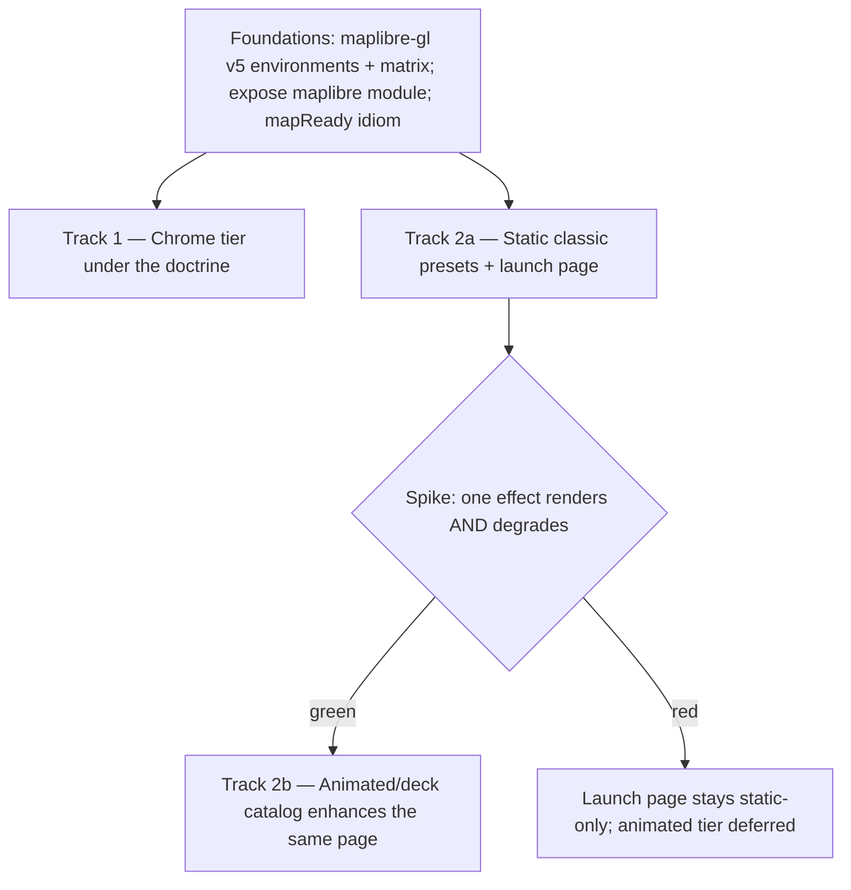
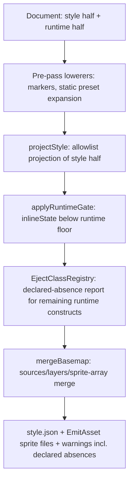

# maplibre-yaml 0.7 — The Eject Doctrine Release - Plan

## Goal Capsule

- **Objective:** Ship 0.7 as two tracks under one law — every construct in the format declares its eject behavior. Track 1: the chrome tier (the ring mapparty currently hand-rolls). Track 2: the Mapzen-classics effects ladder, static presets first, animated/deck versions gated on the U12 spike.
- **Product authority:** Mario (design-practices). The effects track is a recorded conviction bet; the chrome track is demand-backed by mapparty's built workarounds.
- **Authority hierarchy:** Product Contract (below) > Planning Contract KTDs > per-unit Approach. Repo conventions (CLAUDE.md: presubmit gate, changesets, demos-as-regression-tests) bind every unit.
- **Stop conditions:** U12 spike red, inconclusive, or past its budget → U13 does not ship (AE4). The spike budget is fixed and recorded in ml-rzm at kickoff (sessions/days, before work starts); an inconclusive verdict counts as red for 0.7. A change that would alter Product Contract scope → surface to Mario, don't improvise.
- **Execution profile:** units land as separate PRs in dependency order; each published-surface unit carries its own changeset; each demo-bearing unit ships a browser twin.
- **Product Contract preservation:** unchanged, except Outstanding Questions — the six "deferred to planning" items are resolved in place in the Planning Contract (KTD1–KTD9) below; the traction-signal question remains open (post-launch, non-blocking).

---

## Product Contract

### Summary

0.7 makes fallback-where-honest a format-wide doctrine and delivers it through two tracks: a chrome tier (markers, images, hover popup, params UI, slots) that ejects honestly where an honest style.json form exists, and an effects ladder that ships pure-spec Mapzen-classic presets onto a public launch page — each beside its ejected output — with animated/deck versions added behind the spike gate. A foundations phase (maplibre-gl v5 environments, exposing core's maplibre module) precedes both tracks.

### Problem Frame

The 139-example gallery census proved the library's identity: MapLibre parity with honest ejection (46/49 pure-YAML examples live, four silent-renderer bugs found and fixed by making contracts loud). But the census also exposed the seams. Everything *around* the map — markers, annotation chrome, parameter UI, panels — has no format surface, so mapparty builds it bespoke, which is both the strongest observable demand signal in the ecosystem and a standing violation-in-spirit of mapparty's own law that the app never gains what the format cannot express. Meanwhile the eject contract is fragmented: the style layer ejects, effects were designed to eject via mandatory fallbacks, but the experience layer silently vanishes from emitted style.json — a three-class system nobody chose. Finally, the Tangram-heritage effects vision (docs/brainstorms/effects/, ~1,350 unrun lines) remains a belief without a market test: Mario's conviction that Mapzen-class expressiveness has an audience has never met a user, and hatch dogfooding found two foundations blockers (the library's own environments pin maplibre-gl v4, keeping `global-state` undemonstrable; `addProtocol` is unreachable because core does not export its maplibre-gl module) that would sabotage any effects work started today.

### Key Decisions

- **Fallback-where-honest becomes format-wide doctrine.** Every construct declares its eject class; constructs with an honest style.json representation must provide it (markers → symbol layers + sprites; parameterized state → inlined defaults), and truly interactive chrome declares absence explicitly instead of vanishing silently. This extends the effects `fallback()` mandate to the whole format and replaces the undeclared three-class system.
- **Chrome is the spine; effects are the gated bet.** Chrome has observable demand (mapparty's bespoke workarounds — time already spent); the effects tier is a recorded conviction bet with no filed demand, so it is structured to produce a public market test (the launch page) at minimum cost even if the animated tier never ships in 0.7.
- **Deck means the curated effects catalog, not general layer types.** Per the prior art's ADR: named, parameterized effects with deck as an invisible backend — the YAML never says "deck" — and mandatory fallbacks. General deck layer types (arcs, trips, hexagons) stay deferred until demand shows.
- **The effects ladder ships fallbacks first, as product.** Static classic presets (pure style-spec: crosshatch via generated sprite + fill-pattern, Tron via fill-extrusion ramps, flow via dash rhythm, Walkabout as plain YAML) ship to the launch page before any runtime effect exists — the prior art prices this at ~85% of the look for ~10% of the effort — and animated/deck versions progressively enhance the same page as the spike gate opens.
- **Foundations precede both tracks.** maplibre-gl v5 in the library's own environments plus the CI matrix (core's peer range already allows ^5; the pins are dev/docs/e2e), and exposure of core's maplibre-gl module — both tracks depend on these, and the state-driven params UI is impossible without the first.

### Actors

- A1. **Library-consuming developer building a full map product** — today forced to hand-roll everything beyond the style layer; mapparty is the first and reference instance.
- A2. **YAML author** — the docs-gallery audience; authors documents by hand and expects declared, validated behavior.
- A3. **Power-user ejector** — runs `mlym emit` and leaves with style.json; secondary persona whose experience the doctrine is designed to make trustworthy.
- A4. **mapparty end-user** — touches effects only through product UI (picker over `paramsSchema`); a consumer of 0.7's output via mapparty, not a direct user of the format in this release.

### Requirements

**Foundations**

- R1. The library's own environments (docs site, e2e vendor, dev deps) run maplibre-gl v5, with a CI matrix covering the supported peer range, so v5-gated features (`global-state` ≥ 5.6) are tested and demonstrable.
- R2. Core exposes its bundled maplibre-gl module to consumers (at minimum `addProtocol` reach), so protocol plugins work from `<ml-map>` documents.
- R3. `<ml-map>` offers a readiness idiom (promise-returning `mapReady()` or equivalent) replacing the null-guard boilerplate in every hatch snippet.

**Eject doctrine**

- R4. Every format construct has a declared eject class (ejects / ejects-via-fallback / declared absence), documented per construct.
- R5. Chrome constructs with an honest style.json representation eject to it — markers to symbol layers with sprite assets, parameterized state to inlined defaults — while interactive-only chrome ejects to declared absence, never silent omission.
- R6. The docs gallery surfaces each feature's eject class, and `mlym emit` reports declared absences rather than dropping them silently.
- R7. A sprite-generation pipeline (deterministic asset → project sprite sheet) exists as shared infrastructure, serving marker icons and static pattern presets alike.

**Chrome tier**

- R8. Markers and standalone annotations are authorable in YAML (position, icon, optional popup content), ejecting per R5.
- R9. An `images:` surface loads named images for symbol layers and patterns.
- R10. Hover popups join click popups as a built-in interaction.
- R11. A parameter/toggle UI tier renders from `parameters:` metadata and drives `global-state` at runtime (consuming `toggleable:` for layer visibility), inlining defaults on eject.
- R12. `<ml-map>` gains slot-based chrome extension points, and the Astro components consume them instead of their hand-rolled duplicates.

**Effects ladder**

- R13. The Mapzen-classic static presets ship as pure style-spec YAML (crosshatch, Tron silhouette, flow rhythm, Walkabout), requiring no runtime.
- R14. A public launch page shows each classic running beside its ejected output, serving as the recorded market test for the expressiveness belief.
- R15. The spike — one effect proven to render live and degrade to spec-valid style.json — gates all animated/deck work.
- R16. Behind the gate, the animated/deck catalog (hatch-fill, flow-lines, tron-buildings, day/night lighting) ships with mandatory `fallback()`, a defined performance budget, and lazy-loaded deck as a package-scoped peer.
- R17. Effect YAML never names a backend; backend choice is a property of the registered effect.

### Acceptance Examples

- AE1. **Covers R5, R7, R13.** Given a document with a marker and a crosshatch preset, when the author runs `mlym emit --with-fallbacks`, then the output is spec-valid style.json containing a symbol layer plus sprite assets for the marker and a fill-pattern layer plus sprite for the hatch, with no runtime keys remaining.
- AE2. **Covers R1, R11.** Given a document with `parameters:` and a `global-state` filter, when rendered on a maplibre-gl ≥ 5.6 runtime, then the generated control drives the filter live; when ejected, the emitted style carries the defaults inlined.
- AE3. **Covers R14.** Given the launch page, when a visitor opens any classic, then the live version and its ejected output render side by side from the same document.
- AE4. **Covers R15.** Given the spike has not passed, when 0.7 ships, then the launch page and static presets are live and the animated tier is absent — with no dead schema surface advertising it.

### Success Criteria

- mapparty replaces at least one bespoke chrome element with the library's chrome tier.
- The gallery's gap badges flip to shipped for the chrome set (markers, images, hover popup, params UI), and every gallery page displays its eject class.
- The launch page is public with at least four classics beside their ejected outputs.
- Animated effects (if gated in) meet the KTD7 performance budget on the CI harness.

### Scope Boundaries

**Deferred for later**

- General deck layer types (arc, hexagon, trips, scatterplot) — until demand shows.
- The terrain / globe / sky authoring cluster from the census — stays in the ledger.
- mapparty's effects-picker product UI — consumes 0.7's output; built in mapparty's repo on its own schedule.
- Any animated effect that misses the gate or budget — lands in 0.8 on the same launch page.

**Outside this product's identity**

- Arbitrary user GLSL (standing law: curated catalog only).
- Label/text effects (not portable; standing exclusion).
- Running or importing Tangram itself (heritage is authoring ideas, not runtime or converter).

### Dependencies / Assumptions

- **Assumption (recorded conviction):** there is a market for Mapzen-class expressiveness; no observed demand exists yet, and the launch page is the designated test.
- **Verified:** core's peer range already allows maplibre-gl ^5, so R1 is an environment-and-matrix change, not a peer-range break. (Correction from doc review: not all v4 pins are environment-side — core's published `dependencies` also pins maplibre-gl `^4.1.0`, contradicting the peer-dep architecture; U1 removes it.)
- The effects corpus (docs/brainstorms/effects/) is unrun hypothesis; contract shapes there are inputs, not settled design — KTD5–KTD7 settle them.
- `global-state` remains JS-only and ≥ 5.6 at runtime; the `inlineState` emitter policy is the cross-renderer answer.
- The deck sub-tier requires the deck × maplibre-gl compatibility facts in KTD2 to hold at implementation time; re-verify versions when U12 starts.

### Outstanding Questions

- **Open (post-launch, non-blocking):** what traction signal on the launch page validates the expressiveness belief. Owned by Mario after R14 ships; not a 0.7 gate.
- **Open (from doc review, 2026-09-27):** what instrumentation, if any, the launch-page market test carries (download counts, visit tally, nothing) — a privacy/product call for Mario; without a sensor the traction-signal question above has no data source. Affects U11.

### Sources / Research

- plans/feat-maplibre-examples-gallery.md — the 139-example census verdicts and the Wave 3 friction log (F1/F2 foundations blockers; hatch ergonomics findings).
- docs/brainstorms/2026-07-15-tangram-style-replication.md — ADR: erasability test, package split, Tangram options considered and rejected.
- docs/brainstorms/2026-07-14-proposal-interactions.md — effects + deck + interactions proposal; §5 deck backend, §9 risks.
- docs/brainstorms/effects/ — the unrun effect implementations (types contract, flow-lines, hatch-fill, tron-buildings) with fallback() shapes.
- docs/brainstorms/2026-07-24-library-direction-requirements.md — the demand-evidence warning and validation-tier demotion of effects.
- Beads: ml-7ya (this checkpoint), ml-4qy / ml-rzm (effects gate), ml-tfd.1 (v5 matrix), ml-chh.2–.11 (census gaps), ml-l4y (chrome slots), ml-092 (carried open questions).
- External (2026-09-27): maplibre-gl 5.24.0 is the final v5 (v6.0.0 2026-07-22, ESM-only, WebGL2-required; v5→v6 guide at maplibre.org/maplibre-gl-js/docs/guides/v5-to-v6-migration-guide). `map.setGlobalStateProperty`/`getGlobalState` since 5.6.0; layout props via state 5.7.0; visibility via state 5.15.0. deck.gl 9.4.0 forked `@deck.gl/maplibre` (`MapLibreOverlay`, peer `^4.5.1 || ^5 || ^6`, interleaved needs WebGL2, one overlay per map, no terrain draping, globe text/icon culling issues). spreet 0.13.1 is a Rust CLI, no npm wrapper. @maplibre/maplibre-gl-style-spec 26.4.4 current (allowlists generated from 23.3); `color-relief` runtime since gl-js 5.6.0, `hillshade-method` 5.5.0, `fill-extrusion-rounded-corner-distance` spec 26.2.0 / gl-js 6.2.0 (v6-only).

---

## Planning Contract

### Key Technical Decisions

- KTD1. **Foundations target maplibre-gl 5.24.0 (final v5), not v6; core's peer range stays `^3 || ^4 || ^5`.** 5.x keeps the UMD e2e vendor path and delivers everything 0.7 demonstrates (global-state 5.6+, color-relief 5.6, hillshade-method 5.5, deck support). v5→v4 breakage relevant to us is minimal (WebGL context options moved into `canvasContextAttributes`; `map.on()` returns `Subscription` — no chained `.on()` in repo). The v6 environment migration (ESM-only dist, `setData` signature change, typed paint/layout setters, `setMissingStyleImageResolver`) is Deferred to Follow-Up Work with those breakpoints recorded; the peer-range widening to `^6` lands there, in the same PR that fixes the v6 call sites and adds a v6 matrix leg, so the advertised range never exceeds the tested range.
- KTD2. **The effects backend is deck-primary via `@deck.gl/maplibre` 9.4 `MapLibreOverlay`, interleaved; raw-GL only if the spike proves deck cannot express a required effect.** Catalog-first (Product Contract) means the backend we validate is the backend we ship; the prior art's two-codepath cost is paid only on demonstrated need. Constraints carried: one overlay per map, `beforeId` from the compiler's placement resolution, `mercatorOnly` posture until globe issues clear, no terrain draping.
- KTD3. **Sprite assembly is in-Node (sharp compositing + hand-built sprite index JSON), not spreet; sharp is a `@maplibre-yaml/cli` dependency, keeping core dependency-free.** spreet is a Rust binary with no npm wrapper; shelling out breaks `mlym emit`'s pure-Node portability. Our generated assets (marker pins, hatch tiles) are simple deterministic rasters; sharp is already in-tree (docs). Emit `sprite` as the array form `[{id,url}...]` merging basemap + document sprites, with a collision warning mirroring the existing sources/layers rules. Prefixing rule: the basemap keeps the `default` sprite id; document-generated assets live under a fixed `mlym` sprite id; lowered layers reference icons as `mlym:<name>` — so lowered references always resolve and never shadow basemap icons.
- KTD4. **Markers lower via a pre-pass (`lowerMarkers`), not inside `projectStyle`.** `projectStyle` is a projection of `model.style` only; markers live in the runtime half. A CLI/emit pre-pass lowers `runtime.markers` into synthesized style sources/layers + sprite assets and pushes the `lossy` warning, keeping the projection's allowlist discipline intact. `EmitResult` gains `assets?: EmitAsset[]`; `packages/cli` writes them beside the style (its `--out` handling already mkdirs).
- KTD5. **Eject classes live in a third registry following the house pattern** (instance-based, `Map`-backed, register-throws-on-duplicate, closed-world) — same skeleton as `ExtensionRegistry`/`InteractionRegistry`, payload `{ class: "ejects"|"fallback"|"declared-absence", eject?(ctx): {layers, sources, assets, warnings} }`. `mlym emit` reports declared absences as `contract` warnings naming the construct; docs/gallery read the same registry for badges.
- KTD6. **Effect params are flat** alongside `layer:`/`type:` (matching all three corpus effect headers); `layer` and `type` are reserved keys, the remainder is the params object validated by the effect's `paramsSchema`. Sprite naming for generated assets: readable param-derived prefix + 8-char content hash (`fx-hatch-45-8-a1b2c3d4`) — debuggable and collision-proof. `--with-fallbacks` drops `runtime.lighting` with one `contract` warning (scene-global, no per-layer fallback owner); a fallback layer inherits its effect's `placements[]` entry so `beforeId` ordering survives eject.
- KTD7. **Performance budget (the bar the corpus never set):** an animated effect must sustain ≥ 80% of the mean frame rate of the identical map *without* the effect, measured over 5-second rAF samples in the same run on the same runner, against its launch-page demo dataset (≤ 10,000 features). The budget is a ratio because the CI Chromium runner renders on SwiftShader software GL, where an absolute fps bar mostly measures the runner, not the effect; absolute numbers from real-GPU developer hardware are recorded in the spike bead (ml-rzm) as the human-judgment input. Additionally, an effect must not call `triggerRepaint` when its animated params are static (hatch-fill precedent). The budget is a browser-test assertion in U12's harness, reused by every U13 effect. Misses the budget → the effect defers per Scope Boundaries.
- KTD8. **Hover popup reuses the ml-fn9 per-trigger registry precedent**: a second `popup` entry in `HOVER_INTERACTIONS` with per-feature dedupe (mirroring hover-emit), a new `hidePopup` dep implemented in both interaction hosts, and a popup-options argument (`closeButton: false, closeOnClick: false` for hover) threaded through `showPopup`.
- KTD9. **Slots are light-DOM named containers, not shadow slots.** `<ml-map>` is light-DOM; `renderMap()`'s `innerHTML = ""` wipe is replaced with targeted removal of the map container so author children survive; named children (`[slot="legend"]` etc.) are adopted into positioned overlay containers created beside the map div. `components/styles.ts`'s `ml-map > div` full-size rule narrows to the map container class first, and its hidden-script rule gains `text/yaml` (existing gap).
- KTD10. **One overlay-chrome layout contract for everything rendered over the map.** Legend, params panel (U8), and author slots (U9) all register into the same positioning system: four corner containers (`top-left|top-right|bottom-left|bottom-right`); legend defaults `top-left`, params panel defaults `top-right`; multiple occupants of one corner stack in registration order; corner containers are `pointer-events: none` with interactive children opting back in. Every future chrome piece registers here instead of inventing its own placement.

### High-Level Technical Design

The eject pipeline after this release — the doctrine's mechanical spine (release-phase sequencing is the Product Contract diagram):

Params UI data flow (first reader of `parameters:`): join `model.runtime.parameters[key]` (presentation metadata) with `model.style.state[key].default` (value) on the state key; controls write through `map.setGlobalStateProperty(key, value)`; `toggleable:` layers render as visibility toggles writing through `setLayerVisibility`. On eject, `applyRuntimeGate` already inlines defaults — the UI adds no new eject surface.

### Sequencing

Four phases; units land as separate PRs in dependency order, per the dependency table (which is authoritative). P0 gates only the v5-dependent units (U2, U8, U12); U3, U4, and U7 are phase-independent and can land opportunistically at any point. P1 (doctrine + assets) precedes the chrome constructs that eject through it; P2 chrome units are mutually independent once P1 lands; P3 climbs the ladder with U13 strictly gated on U12. The U12 spike starts as soon as U2 lands — in parallel with P1/P2 work — so the gate verdict is recorded before the launch page finishes, not after everything else.

### Deferred to Follow-Up Work

- maplibre-gl v6 environment migration: ESM-only dist (e2e vendor rework — the ESM shim reason disappears, the UMD path breaks), `GeoJSONSource.setData` signature change (renderer call sites), typed `set{Paint,Layout}Property` (generic renderer may need casts), `styleimagemissing` → `setMissingStyleImageResolver`, `zoomLevelsToOverscale` default change (qRF-based tests). Core's peer-range widening to `^6` ships here, in the same PR as the fixes and a v6 matrix leg — never before.
- Style-spec allowlist follow-ups: regen lands in U1; `fill-extrusion-rounded-corner-distance` and the two v6-gated gallery pages remain deferred until the v6 migration.
- spreet integration for user-supplied icon directories (KTD3 covers only emitter-generated assets).
- Adjacent cleanups noticed in research, not in scope: `Map.astro`/`Scrollytelling.astro` duplication beyond FullPageMap; `MutationObserver` readiness hacks in Astro components beyond what U9 touches.

---

## System-Wide Impact

Public-surface deltas downstream consumers (mapparty first) see:

- New export subpath on core (the maplibre-gl re-export, U2) and `mapReady()` on `<ml-map>` — additive, minor-version.
- `EmitResult` widens with `assets?` (U4) — additive for programmatic emit consumers; `mlym emit --out` starts writing sibling files, a CLI behavior change worth a changeset callout.
- Emitted `sprite` switches to array form when document assets exist (U4) — consumers post-processing emitted styles must accept both forms. The array form is maplibre-specific (not Mapbox-portable); the emit docs note it.
- `SOURCE_RUNTIME_KEYS`/`LAYER_RUNTIME_KEYS` and the root-key set grow (`markers:`, `images:`) — public constants; mapparty's `x-map-party` validation reads these.
- Core's peer range is unchanged in 0.7 (`^3 || ^4 || ^5`); the `^6` widening ships with the deferred v6 migration so the advertised range never exceeds the tested one. U1 does remove maplibre-gl from core's published `dependencies` (currently pinned `^4.1.0` alongside the peer declaration) — consumers stop risking a nested duplicate v4 copy; changeset callout.
- FullPageMap behavior changes from dead chrome to working chrome (U9) — visually additive, but consumers who styled around the broken buttons will see live ones.

---

## Risks & Dependencies

- **deck × maplibre version coupling** — `@deck.gl/maplibre` pinned `~9.4`; the U1 CI matrix plus U12's harness are the tripwire; `mercatorOnly` posture sidesteps the known globe/terrain seams.
- **Spike red** (R15) — contained by design: U10/U11 ship regardless (AE4); U13 defers whole; no schema surface leaks.
- **sharp platform binaries** — cli-scoped dependency (KTD3); CI uses prebuilt binaries; emit-without-sharp path returns asset descriptors instead of files.
- **External demo endpoints** (demotiles, USGS, openfreemap, terrestris) — live-sweep-only exposure; hermetic twins are unaffected; sweep failures name the endpoint (established practice).
- **v6 ecosystem drift during the release** — the v6 environment migration (including the peer-range widening) is a queued follow-up with its breakpoints enumerated, so drift converts to scheduled work, not surprise; until then v6 hosts are explicitly unsupported rather than silently broken.
- **Sequencing capacity** — 13 units, single maintainer + agents; the phase structure keeps every prefix of the PR order a shippable release (P0 alone is a valid 0.7.0-alpha).

---

## Implementation Units

| U-ID | Title | Phase | Key files | Depends on |
|---|---|---|---|---|
| U1 | maplibre-gl 5.24 environments + CI matrix + spec regen | P0 | docs/package.json, packages/core/package.json, e2e/server.mjs, .github/workflows/ci.yml, packages/core/src/parser/spec-keys.generated.ts | — |
| U2 | Expose maplibre module + mapReady() + protocol proof | P0 | packages/core/src/index.ts, packages/core/package.json (exports), packages/core/src/components/ml-map.ts | U1 |
| U3 | Eject-class registry + declared-absence reporting + gallery badges | P1 | packages/core/src/emitter/, packages/core/src/eject/ (new), docs gallery index | — |
| U4 | Sprite/asset pipeline (EmitResult.assets + sharp assembler) | P1 | packages/core/src/emitter/, packages/cli/src/commands/emit.ts | U3 |
| U5 | `markers:` construct + eject lowering | P2 | schemas, model, renderer (new markers manager), emitter pre-pass | U3, U4 |
| U6 | `images:` construct | P2 | schemas, model, renderer, emitter sprite merge | U4 |
| U7 | Hover popup built-in | P2 | packages/core/src/interactions/, schemas/layer.schema.ts | — |
| U8 | Params/toggle panel (first `parameters:` reader) | P2 | packages/core/src/renderer/ (params-builder, new), model/normalize.ts | U1 |
| U9 | `<ml-map>` slots + Astro chrome restoration | P2 | packages/core/src/components/, packages/astro/src/components/FullPageMap.astro | U3 |
| U10 | Static Mapzen-classic presets | P3 | docs/public/configs/gallery/, examples/gallery/ | U4 |
| U11 | Launch page (live-beside-ejected viewer) | P3 | docs site (new section + component) | U10 |
| U12 | Deck spike: one effect renders AND degrades, with perf harness | P3 | spike branch/package scaffold, e2e perf harness | U1, U2 |
| U13 | Gated: animated effects catalog (`@maplibre-yaml/effects`, `effects-deck`) | P3 | new packages, runtime.effects schema | U12 green, U3, U4, U10, U11 |

### U1. maplibre-gl 5.24 environments + CI matrix + spec regen

- **Goal:** the library's own dev/docs/e2e environments run maplibre-gl 5.24.0; CI matrixes the peer range; the #94 allowlists regenerate from style-spec 26.4.4; core's peer range stays `^3 || ^4 || ^5`, and maplibre-gl moves out of core's published `dependencies` (currently pinned `^4.1.0` there) into devDependencies — the manifest finally matches the peer-dep architecture.
- **Requirements:** R1. Advances AE2's runtime precondition.
- **Dependencies:** none.
- **Files:** docs/package.json, packages/core/package.json, packages/astro/package.json, examples/astro/minimal/package.json (align), e2e/server.mjs (vendor resolution unchanged — v5 keeps UMD), packages/core/scripts/generate-spec-keys.mjs run → packages/core/src/parser/spec-keys.generated.ts, .github/workflows/ci.yml (matrix job per ml-tfd.1), packages/core/tests/parser/spec-keys.test.ts (drift test forces the regen).
- **Approach:** bump devDeps to 5.24.0; audit the two v5 breakpoints (`canvasContextAttributes` — config passthrough docs note; `map.on()` Subscription — repo has no chained `.on()`); add a CI matrix dimension running core tests + browser-verification against maplibre-gl 4.x and 5.24; regen allowlists (KTD1); note spec-26 gotchas (`ValidationError.severity`, global-state-in-constructor) are spec-package-internal and don't touch our generated key sets. The dependencies→devDependencies move gets its own changeset line (consumer-observable: no more nested duplicate maplibre-gl installs).
- **Execution note:** smoke-first — the full e2e + gallery suites against 5.24 are the proof; expect the 5.5.0 hillshade-appearance change to show in hillshade twins if any assert pixels (none do today).
- **Test scenarios:** spec-keys drift test passes only after regen; full `verify:browser` green on 5.24; matrix job green on v4; a doc using `["global-state", k]` in a filter renders without console errors on 5.24 (new twin, seeds U8).
- **Verification:** presubmit + both browser suites green on 5.24 locally and in the new matrix.

### U2. Expose maplibre module + `mapReady()` + protocol proof

- **Goal:** consumers can reach the maplibre-gl instance core bundles (`addProtocol` first), and `<ml-map>` offers `mapReady(): Promise<Map>`.
- **Requirements:** R2, R3.
- **Dependencies:** U1.
- **Files:** packages/core/src/index.ts + package.json `exports` (new subpath, e.g. `@maplibre-yaml/core/maplibre` re-exporting the module), packages/core/src/components/ml-map.ts (`mapReady()` resolving on `load`, rejecting on `error`), packages/core/tests/components/ml-map.test.ts, docs/public/gallery-js/ + new pmtiles gallery page, e2e twin.
- **Approach:** a subpath re-export keeps the register bundle's instance and the consumer's import identical (same module graph). The subpath must export the interop-resolved namespace via the `maplibre-interop.ts` pattern, not `export * from "maplibre-gl"` — the repo already documents the exact Node-ESM default-export regression that breaks. `mapReady()` returns the existing promise-or-resolved-map, replacing null-guards in gallery-js snippets (update them).
- **Test scenarios:** import from the subpath and `addProtocol` a stub scheme — a source with that scheme loads in a browser twin; `mapReady()` resolves after `ml-map:load` and rejects on config error; the pmtiles docs page (census escape-hatch F2 unblock) renders live; a Node-ESM smoke test imports the subpath under `node` conditions and reaches `addProtocol` (interop regression guard).
- **Verification:** gallery hatch suite green including the new pmtiles twin (hermetic via stub protocol); docs page passes the live sweep.

### U3. Eject-class registry + declared-absence reporting + gallery badges

- **Goal:** every format construct has a registered eject class; `mlym emit` reports declared absences; the gallery displays eject classes.
- **Requirements:** R4, R6, R5 (declared-absence half).
- **Dependencies:** none (lands before or parallel with U1).
- **Files:** packages/core/src/eject/registry.ts (new, KTD5), registrations for existing constructs (interactions, legend, controls, state, refresh/stream, x-*), packages/core/src/emitter/project.ts (emit path consults registry for absence reporting), packages/core/tests/eject/, docs/src/content/docs/examples/gallery/index.mdx (badge column), docs page documenting the three classes per construct.
- **Approach:** registry follows the `ExtensionRegistry` skeleton; existing emit `contract` warnings become registry-driven so the construct list and the warnings can't drift; unregistered construct reaching emit = loud error (renderer/schema contract lesson).
- **Test scenarios:** every current runtime-half construct has a registration (exhaustiveness test against `LAYER_RUNTIME_KEYS`/`SOURCE_RUNTIME_KEYS` + root runtime keys); emit of a doc with interactions + legend lists both as declared absences with paths; an unregistered synthetic key makes emit throw.
- **Verification:** presubmit; `mlym emit` output on a kitchen-sink fixture snapshot-matches the declared-absence report.

### U4. Sprite/asset pipeline

- **Goal:** the emitter can produce deterministic raster assets merged into a project sprite sheet; the CLI writes them beside the style.
- **Requirements:** R7. Advances AE1.
- **Dependencies:** U3 (warning conventions).
- **Files:** packages/core/src/emitter/assets.ts (new: asset descriptors + sprite index builder — no sharp, per KTD3), packages/core/src/emitter/project.ts + index.ts (`EmitResult.assets`), basemap.ts (sprite-array merge + collision warning, KTD3), packages/cli/src/lib/rasterize.ts (new: sharp compositing, @1x/@2x) + packages/cli/src/commands/emit.ts (asset write), packages/core/tests/emitter/assets.test.ts (descriptor/index), packages/cli/tests/rasterize.test.ts (PNG determinism).
- **Approach:** KTD3/KTD6 — in-Node assembly; naming `fx-<kind>-<params>-<hash8>`; document sprite entries merge with basemap sprite via array form, never shadowing (the current document-wins overwrite is the bug to fix here).
- **Test scenarios:** same params → identical decoded RGBA pixels + byte-identical sprite-index JSON (determinism — decoded comparison, not PNG bytes, which are libvips/platform-fragile; sharp pinned exact in cli to keep the encoder stable); basemap-with-sprite + document assets → array-form sprite containing both, collision on same id warns; CLI `--out` writes style + assets in one directory; sharp absent in a non-cli embedding → `EmitResult.assets` carries descriptors and the caller renders them (core emits descriptors; cli rasterizes, per KTD3).
- **Verification:** presubmit; an emitted style + assets served statically renders the pattern in a browser twin.

### U5. `markers:` construct + eject lowering

- **Goal:** top-level `markers:` renders as DOM markers under `<ml-map>` and ejects to symbol layers + sprite assets.
- **Requirements:** R8, R5 (honest-ejection half). Covers AE1's marker half.
- **Dependencies:** U3, U4.
- **Files:** packages/core/src/schemas/map.schema.ts + map-v2.schema.ts (runtime half), model/types.ts + normalize.ts + read-v2.ts (root is enumerated — all three edits per the repo scan), packages/core/src/renderer/markers-manager.ts (new; maplibregl.Marker lifecycle, popup via existing PopupBuilder), packages/core/src/emitter/lower-markers.ts (new pre-pass, KTD4), ml-map wiring via denormalizeOptions. Tests: packages/core/tests/renderer/markers-manager.test.ts, packages/core/tests/emitter/lower-markers.test.ts, e2e/gallery.spec.ts additions; gallery pages (add-a-default-marker, display-a-popup, attach-a-popup-to-a-marker-instance) + twins.
- **Approach:** schema `markers: [{ at: [lng,lat], icon?, color?, size?, popup?: PopupContent }]`; v1/v2 parity per the AE2-deep-equal constraint; lowering synthesizes one GeoJSON source + symbol layer + per-icon sprite asset, placement appended on top.
- **Test scenarios:** marker renders at position with default pin; popup opens on click through the allowlisted builder; v1 and v2 documents normalize to deep-equal models; emit produces symbol layer + asset (AE1); marker removal on `destroy()` leaves no DOM; a marker icon URL that fails to load warns once and falls back to the default pin (U6's warn-once pattern), never a blank marker.
- **Verification:** three census gap badges flip; gallery + live sweep green.

### U6. `images:` construct

- **Goal:** named images load for symbol layers and patterns; on eject they merge into the sprite.
- **Requirements:** R9.
- **Dependencies:** U4.
- **Files:** schemas (style half — `images: { name: url | {url, sdf?, pixelRatio?} }`), model (style-half field, v1+v2), packages/core/src/renderer/ (load via `map.loadImage`/`addImage` before layer add; missing-image warning), emitter (fetch-at-emit into sprite assets — network step lives beside `resolveBasemap`, the one networked stage). Tests: packages/core/tests/renderer/images.test.ts, packages/core/tests/emitter/assets.test.ts additions; gallery pages (add-an-icon-to-the-map graduates; fallback-image, pattern pages upgrade), twins with local image URLs.
- **Test scenarios:** symbol layer using a declared image renders it; unknown image name warns once, doesn't kill the document; emit inlines fetched images as sprite entries (AE1 pattern analog); hermetic twin loads from localhost.
- **Verification:** census `images:` badge flips; suites green.

### U7. Hover popup built-in

- **Goal:** `hover: { popup: ... }` shows a per-feature-deduped popup, closing on leave.
- **Requirements:** R10.
- **Dependencies:** none (post-ml-fn9 registry already supports it).
- **Files:** packages/core/src/schemas/layer.schema.ts (both the ZodType annotation and the z.object — lockstep edit), packages/core/src/interactions/built-ins.ts (HOVER_INTERACTIONS entry, KTD8), types.ts (`hidePopup` dep + `showPopup` options arg), attach.ts + renderer/event-handler.ts (both hosts implement `hidePopup`; mouseleave dismiss). Tests: packages/core/tests/interactions/hover-popup.test.ts (new), attach.test.ts + event-handler.test.ts additions; gallery page display-a-popup-on-hover + twin.
- **Approach:** mirror hover-emit's `create:` factory dedupe verbatim; fall back to lngLat keying when features lack ids (unlike highlight — warn-once, don't require ids); hover popups get `{closeButton:false, closeOnClick:false}`. Coexistence: a click pins its popup and suppresses the hover popup on that feature until the pinned popup is dismissed (preview-vs-pin). Touch: hover popups don't fire on touch input — tap maps to the click behavior, so hover is never the sole path to content.
- **Test scenarios:** popup appears once per entered feature, not per mousemove; closes on mouseleave and on `clearLayer`; id-less source still works via lngLat dedupe with one warning; with both hover and click popups on one layer, click pins and hover is suppressed on that feature until dismissal; simulated touch tap opens the click popup and never the hover one.
- **Verification:** census hover-popup badge flips; interactions suite + twins green.

### U8. Params/toggle panel

- **Goal:** the first reader of `parameters:` — a rendered control panel driving `global-state`, plus layer toggles consuming `toggleable:`.
- **Requirements:** R11, R5 (inlined-defaults half). Covers AE2.
- **Dependencies:** U1 (5.6+ runtime in environments).
- **Files:** packages/core/src/renderer/params-builder.ts (new; mirrors LegendBuilder + createLegendContainer pattern, with `paramsBuilt` guard), model/normalize.ts `denormalizeOptions` (+ params), map-renderer.ts (attach in load handler; container on host element, not the map div — the legend-container placement note from research), ml-map styles, schemas unchanged (already plumbed). Tests: packages/core/tests/renderer/params-builder.test.ts (new), e2e/gallery.spec.ts behavioral additions; gallery pages (filter-layer-symbols-using-global-state, create-a-time-slider, filter/toggle pages graduate from escape-hatch to E) + twins.
- **Approach:** join `parameters[key]` metadata with `state[key].default` (research: no default in parameters by design); honored `type` vocabulary v1: `range`, `select` (from `values`), `toggle`; unrecognized types degrade to a labeled read-only row; writes via `map.setGlobalStateProperty`; `toggleable:` layers listed as checkboxes writing `setLayerVisibility`. Eject unchanged — `applyRuntimeGate` already inlines (AE2's second half is a regression test, not new code). Runtime floor: feature-detect `map.setGlobalStateProperty` — on runtimes below 5.6 the panel degrades to a declared-absence notice with one warning instead of dead controls (visibility-via-state needs 5.15; the panel treats missing APIs uniformly). Placement per KTD10 (defaults `top-right`, registers into the shared corner system).
- **Test scenarios:** slider writes state and the filter's rendered count changes (behavioral twin); select and toggle types render and write; unrecognized type degrades without error; toggle hides/shows layer; ejected doc inlines defaults (existing gate asserted end-to-end); panel absent when neither parameters nor toggleable layers exist; on a runtime without `setGlobalStateProperty` the panel renders the declared-absence notice and warns once (unit-level stub).
- **Verification:** AE2 twin green on the 5.24 matrix leg (the twin is 5.24-leg-only — the v4 leg asserts the degraded notice instead); three census escape-hatch pages re-badge to pure-YAML.

### U9. `<ml-map>` slots + Astro chrome restoration

- **Goal:** named chrome extension points on `<ml-map>`; FullPageMap consumes core chrome instead of its dead hand-rolled copy.
- **Requirements:** R12.
- **Dependencies:** U3 (declared-absence class for slotted chrome).
- **Files:** packages/core/src/components/ml-map.ts (KTD9: targeted teardown replacing `innerHTML=""`, child adoption into positioned containers), components/styles.ts (rule narrowing + text/yaml hide fix), packages/astro/src/components/FullPageMap.astro (delete ~270 lines of dead controls/legend markup+script+CSS; route through core controls/legend/slots; fix `.map` → `getMap()`). Tests: packages/core/tests/components/ml-map.test.ts slot additions, packages/astro/tests/components/container-render.test.ts additions; docs page for slots.
- **Approach:** restoration framing — the hand-rolled chrome never ran (dead `.map` read); replace rather than preserve. Slot names v1: `top-left|top-right|bottom-left|bottom-right` positioned containers + `legend` override, all registered through KTD10's shared layout contract (same corner system as legend and params panel; same-corner occupants stack). `handleError` currently does its own wholesale `innerHTML` wipe — it moves to the same targeted replacement so an error card never destroys author slot children. Author children survive `reload()`.
- **Test scenarios:** a child `[slot="top-right"]` renders positioned and survives reload; yaml script child no longer wiped (regression for the current behavior); FullPageMap zoom/reset buttons actually work (restored behavior, container-API + browser test); legend override slot replaces built-in legend; slot children survive an error-then-reload cycle (handleError path); legend + params panel + a slot in one corner stack instead of overlapping (KTD10).
- **Verification:** astro suite + container tests green; example-astro-minimal smoke shows working FullPageMap controls.

### U10. Static Mapzen-classic presets

- **Goal:** crosshatch, Tron-silhouette, flow-rhythm, and Walkabout as pure style-spec YAML documents, gallery-shipped.
- **Requirements:** R13. Covers AE1's hatch half.
- **Dependencies:** U4 (hatch pattern sprite via `images:`/assets).
- **Files:** docs/public/configs/gallery/ + docs pages (new "classics" group), examples/gallery/ twins, one generated hatch SVG→sprite asset fixture.
- **Approach:** presets are documents, not library code — crosshatch = generated hatch tile + `fill-pattern` (+ optional wash layer, `idSuffix` precedent); Tron = fill-extrusion ramp (per the corpus fallback shapes); flow = `line-dasharray` rhythm; Walkabout = terrain-free hillshade + palette (the census pages already prove the ingredients).
- **Test scenarios:** each preset validates strict, renders in a hermetic twin, and its emitted style renders identically (static = its own fallback — assert emit output has zero runtime keys and zero lossy warnings).
- **Verification:** live sweep + hermetic suites green; four presets shipped.

### U11. Launch page

- **Goal:** a public docs-site section showing each classic live beside its ejected output, from the same document.
- **Requirements:** R14. Covers AE3.
- **Dependencies:** U10.
- **Files:** docs site: new section (e.g. docs/src/content/docs/classics/ or a dedicated landing route), a side-by-side viewer component (live `<ml-map>` + an ejected pane running vanilla maplibre-gl fed the `mlym emit` output produced at build time — `<ml-map>` parses map documents, not style.json, and vanilla is also the stronger honesty claim: the ejected output runs with zero library code), docs build hook to run emit during build, live-sweep coverage.
- **Approach:** build-time emit (agent-assets hook precedent in docs/astro.config.mjs) guarantees the ejected pane is genuinely the emitted artifact, not a hand-copy; page copy carries the doctrine story and the "modify me" invitation (configs downloadable). Panes camera-sync bidirectionally (the maplibre-gl-compare pattern); below a mobile breakpoint the panes stack vertically with sync retained.
- **Test scenarios:** both panes render per classic (live sweep extension); the ejected pane's style.json is byte-identical to fresh `mlym emit` output (build-time freshness test); panning one pane moves the other (camera sync); a narrow viewport stacks the panes without losing sync; page links each document for download.
- **Verification:** AE3 demonstrated; sweep green.

### U12. Deck spike: render + degrade + perf harness

- **Goal:** the R15 gate — one effect (hatch-fill first; flow-lines if hatch proves trivial) implemented on `MapLibreOverlay` interleaved, proven to render, meet KTD7's budget, and degrade to the U10 static preset.
- **Requirements:** R15, R17. Covers AE4's gate semantics.
- **Dependencies:** U1, U2.
- **Files:** spike scaffold under packages/ (throwaway allowed; graduation to U13 packages only on green), e2e/perf harness (rAF sampler asserting KTD7), a spike twin page.
- **Approach:** prove the four contract points from the prior art on the deck path: effect renders interleaved with `beforeId`; params drive uniforms; absence of the runtime yields the static preset (same document, emit path); budget met on the demo dataset. Record spike verdict + numbers in the bead (ml-rzm), including real-GPU absolute fps from developer hardware (KTD7's human-judgment input) — the plan's stop condition reads from it. Pre-decided branch: if interleaved rendering fails but overlaid works, overlaid ships as a documented honest fallback (placement loss surfaces as a `lossy` warning) with interleaved remaining the target; the bead records which mode each effect uses.
- **Execution note:** prove-first throughout — the spike exists to produce evidence, not shippable code; keep it honest about failures.
- **Test scenarios:** the perf harness itself (sampler shows a known-heavy synthetic falling well below the same-run no-effect baseline and a light one staying within it — harness validity); spike effect sustains ≥ 80% of the no-effect baseline fps on demo data (KTD7); an effect with static animated params never calls `triggerRepaint` (KTD7's static clause); overlay teardown leaks no rAF (idle after destroy); document with effect emits the static fallback with a `lossy` warning.
- **Verification:** green/red verdict recorded; green → U13 unblocks; red → AE4 posture holds and U13 defers.

### U13. Gated: animated effects catalog

- **Goal:** `@maplibre-yaml/effects` (contract + registry + fallback discipline) and `@maplibre-yaml/effects-deck` (deck-backed catalog: hatch-fill, flow-lines, tron-buildings, day/night lighting), consumed via `runtime.effects` + `runtime.lighting`, enhancing the U11 page.
- **Requirements:** R16, R17. Completes AE4's green arm.
- **Dependencies:** U12 green, U3, U4, U10, U11.
- **Files:** two new packages (workspace + changesets + peer wiring: deck peer-scoped to effects-deck, lazy dynamic import), packages/core schema additions (`runtime.effects`, `runtime.lighting` — added only in this unit, honoring AE4's no-dead-surface rule), registry registrations with KTD5 eject classes (fallback class), launch-page upgrades, per-effect fallback visual-regression twins, KTD7 budget tests per effect.
- **Approach:** PR-scale unit — split into per-effect PRs at execution time (contract package first, then one effect per PR); every effect lands with `fallback()` (registration throws otherwise, per the corpus contract), its budget test, and its launch-page pane upgrade. Day/night is the lighting showcase (`getEffects()` + document-level `runtime.lighting` wins).
- **Test scenarios:** per effect — renders interleaved below labels; params validate via its zod `paramsSchema` (flat, KTD6); fallback output matches its U10 preset structurally; budget test passes; emit with `--strict` fails on the effect (lossy) and `--with-fallbacks` substitutes; registry refuses an effect without `fallback()`. Package-level — a document without effects never loads the deck chunk (bundle assertion).
- **Verification:** launch page shows live-animated beside static-ejected for each shipped effect; all suites + budget tests green; changesets minor for the two new packages.

---

## Verification Contract

| Gate | Command | Applies to |
|---|---|---|
| Presubmit (build, typecheck, lint, test, snippet validation) | `pnpm presubmit` | every unit |
| Hermetic browser suites (demos-as-regression-tests) | `pnpm verify:browser` | every demo-bearing unit (U2, U5–U13) |
| Live docs-config sweep | `pnpm verify:docs-gallery` (server via `pnpm verify:serve`) | units that touch gallery/launch pages (U2, U5–U8, U10, U11, U13) |
| Version matrix | CI matrix job (U1) on maplibre-gl 4.x + 5.24 | U1 onward, every PR |
| Performance budget | U12's rAF harness, KTD7 thresholds | U12, each U13 effect |
| Astro behavioral tests | `pnpm --filter @maplibre-yaml/astro test` (container suite) | U9 |
| Release hygiene | changeset present for every published-surface unit; release via changesets, never manual publish | every unit |

---

## Definition of Done

- All units U1–U11 shipped and green under the Verification Contract; U12 verdict recorded; U13 shipped only on green (AE4 otherwise).
- Product Contract Success Criteria met where this repo controls them: gallery badges flipped for markers/images/hover-popup/params + eject classes displayed; launch page public with ≥4 classics beside ejected outputs. The mapparty swap (≥1 bespoke chrome element replaced) moves to a post-release validation checklist — it gates on another repo's schedule, so it is tracked via a cross-referenced mapparty bead tied to U5/U9 rather than held against 0.7's DoD.
- Every construct in the format has a registered eject class and appears in the doctrine documentation page (R4 exhaustiveness test green).
- No dead schema surface: any gated-out feature has no advertising schema fields (AE4).
- Cleanup: spike scaffolds either graduated into U13 packages or deleted; no abandoned experimental code in the tree; beads updated (gap beads closed as their units land; ml-rzm carries the spike verdict).

---

## Amendment A1 (2026-10-04): post-spike scope, ratified by Mario

**Why:** U12 ran (ml-rzm, draft PR #114, branch `spike/07-u12-deck-hatch`) and reshaped the effects track. The maintainer then widened the gallery close-out. Every change below is a maintainer decision from the 2026-10-04 session. This amendment **supersedes** the clauses it names. Everything else in the plan stands.

### Evidence from U12, summarised
- **Session 1's target was wrong.** It proved a flat 2D hatch fill. The Mapzen crosshatch is tonal hatching on extruded buildings, where stroke density follows light per face. The spike was retargeted to a port of Tangram's own style: tangram-sandbox `styles/crosshatch.yaml` plus the tangrams/blocks hatch filter, both MIT.
- **Three backends were built and measured.**
  - **Route 1: deck.gl.** Optimised, it converged on route 2's geometry with deck wrapped around it.
  - **Route 2: MapLibre custom layer, no deck.** It reads MapLibre's already-loaded tile bytes, builds tile-clipped meshes in a worker, and draws cached ancestors while tiles build.
  - **Route 3: screen-space post-process.**
- **Real hardware:** on the maintainer's M2 Air, route 2 is the fastest once mesh building moved to the worker; deck was smooth, and route 3 is rejected for this look.
- **Software GL (CI):** route 2 is 0.62× the static preset; on a GPU at normal size it's about 0.9×.
- **Blueprint:** a second effect built on route 2's backend proved the extension story; it is a metre-scaled grid per face.

### Decisions (Mario, 2026-10-04)
- **D-A1. Backend = route 2.** The MapLibre custom-layer backend replaces deck.gl. *Supersedes KTD2.* deck.gl leaves the 0.7 dependency set, and R16's "lazy-loaded deck as a package-scoped peer" is void. R17 stands: effect YAML never names a backend.
- **D-A2. Re-baselined performance gate.** The ≥ 0.8× budget is measured on real GPUs: the maintainer's M2, plus one recorded reference machine. CI's SwiftShader run becomes a **regression tripwire**: it fails if an effect's ratio drops more than 10% below its last recorded value. *Supersedes KTD7's "measured on the CI harness" and the Success Criteria line "meet the KTD7 budget on the CI harness".* The "no `triggerRepaint` when static" clause stands.
- **D-A3. Experimental public effects API.** `@maplibre-yaml/effects` ships `registerEffect()` publicly, marked **experimental** (it may change in minors). Built-ins are written against the same public API.
  - *This relaxes the Product Contract's standing law "Arbitrary user GLSL (curated catalog only)".* Page JavaScript may register shader effects. **Documents still never carry GLSL**: they reference registered effects by name.
  - Shader blocks inside YAML (Tangram-style) remain out of scope, as a separate future trust decision.
- **D-A4. 0.7's effects are `tonal-hatch` (the crosshatch) and `blueprint`.** Both are written as public-API effects. *Supersedes R16's catalog* (hatch-fill, flow-lines, tron-buildings, day/night); those move to 0.8+.
- **D-A5. Classics = crosshatch and blueprint, with the launch page.**
  - *Supersedes R13's four-classic list and the Success Criteria's "≥ 4 classics".* Tron, flow-rhythm and Walkabout move to 0.8.
  - U10 is rebuilt from the spike's real crosshatch static preset; draft #112's flat polygon hatch is discarded.
  - The launch page (R14/U11) shows both classics, each live beside its ejected fallback, enhanced by the effect when U13 is present.
- **D-A6. Gallery close-out is in 0.7.** *Supersedes Scope Boundaries' "terrain / globe / sky deferred".* It has four tracks:
  - (a) the cheap gaps
  - (b) the terrain / sky / globe trio as map-level authoring
  - (c) pages for the escape-hatch examples that only have a badge
  - (d) a rescore of the out-of-scope examples against the new effects backend

### Units, revised and added
| Unit | Status / change | Depends on |
|---|---|---|
| U9 | PR #113, awaiting merge | — |
| **U10′** | Rebuild classics as static presets: `crosshatch` (Tangram textures baked: earth/landuse/water, building fallback) and `blueprint` (drafting-grid ground). Includes: ml-gjf (`*-pattern` expressions); a `light:` root key (static building shading is otherwise un-tunable); self-hosted serif italic glyphs for crosshatch labels; and the bake scripts as a reproducible tool (`mlym bake` is a candidate, at minimum a documented script). Gallery "classics" group with hermetic twins. | U4, U6 |
| **U11** | Launch page: crosshatch and blueprint, live beside ejected (build-time emit), camera sync. It progressively upgrades to the effect when `@maplibre-yaml/effects` is loaded. | U10′ (static); U13′ (effects) |
| U12 | **Done.** Verdict recorded in ml-rzm. The spike branch stays unmerged; code graduates into U13′. | — |
| **U13′** | `@maplibre-yaml/effects`, experimental. Contents: the effect contract and registry; `registerEffect`; `backends.extrusions` (route 2: worker meshes, ancestor fallback, context-loss recovery, heights from the layer's own `fill-extrusion-height`/`base` expressions rather than OpenMapTiles field names, the tile-seam fix by unclipped-wall texture coordinates, and world-metre `EffectInput`); the built-ins `tonal-hatch` and `blueprint`; the core schema `effect:` key (v1 + v2, validated against registered `params` when the package is loaded, otherwise passthrough with the eject lossy warning); emit lowering; `<ml-map>` auto-attach; and docs. Mercator only: under globe projection, effects declare absence and the static layer renders. Isolate the MapLibre-internals dependency (tile manager + raw tile bytes) behind one adapter, pin the matrix, and file an upstream request for a public hook. | U12 |
| **U14** | Cheap gallery gaps: fit-to-data initial camera (ml-chh.9), the `color-relief` layer type (ml-chh.8), display-a-popup (popup at a coordinate without a layer). Badges flip. | — |
| **U15** | 3D trio as map-level authoring: `terrain:` (ml-chh.5; reverses the declared non-goal), `sky:` (ml-chh.7), `projection:`/globe (ml-chh.6). All three eject to their style.json equivalents. Gallery pages for the 6 examples. | — |
| **U16** | Escape-hatch pages for the badge-only examples (about 30), using U9 slots for page chrome where it teaches better (absorbs ml-7fb). | U9 |
| **U17** | Rescore the out-of-scope examples (about 35) against the custom-layer effects backend; update the census and file beads for anything newly reachable. Analysis only. | U13′ (design) |
| **U18** | Census refresh and ml-chh close-out: final counts, ml-chh.11 (curated-key refresh) and ml-chh.14 (final 3 pure-YAML pages), with the triage doc updated. | U14–U17 |

### Definition of Done, amended
U1–U11, U13′ and U14–U18 shipped and green. KTD7 is met per D-A2 (real GPU, with the CI tripwire armed). The launch page is live with both classics. The census is refreshed. The spike branch is closed unmerged, with its code graduated. All other DoD clauses stand.

## Amendment A2 (2026-10-04): maplibre-gl v6 and the attribution XSS advisory, ratified by Mario

- **D-A7. maplibre-gl v6 support moves into 0.7** as unit **U19** (ml-vw4.9). *Supersedes the Deferred-to-Follow-Up "v6 environment migration" and KTD1's "core's peer range stays ^3 || ^4 || ^5" for 0.7.*
  - **Why:** v6 is npm `latest`, and it's the only line patched for GHSA-jrc7-96c5-q579 (critical XSS sanitizer bypass in `DOM.sanitize`, fixed in ≥ 6.4.1).
  - The peer range widens to include `^6.4.1` in the same PR as the v6 call-site fixes and a v6 CI matrix leg, so the advertised range never exceeds the tested range.
  - Docs install pins move to v6.
  - The U13′ effects backend's MapLibre-internals adapter must pass on v6.
- **D-A8. Library-side attribution sanitizing, shipped as a 0.6.x maintenance patch and in 0.7** (ml-rfk, under ml-2l7).
  - The exposure: maplibre's AttributionControl is the only caller of the vulnerable sanitizer, and documents forward `attribution:` text to it. Untrusted documents therefore reach it on every currently supported version.
  - The fix: maplibre-yaml sanitizes document attribution itself (plain text + safe `<a href>`), at runtime and in emit.
