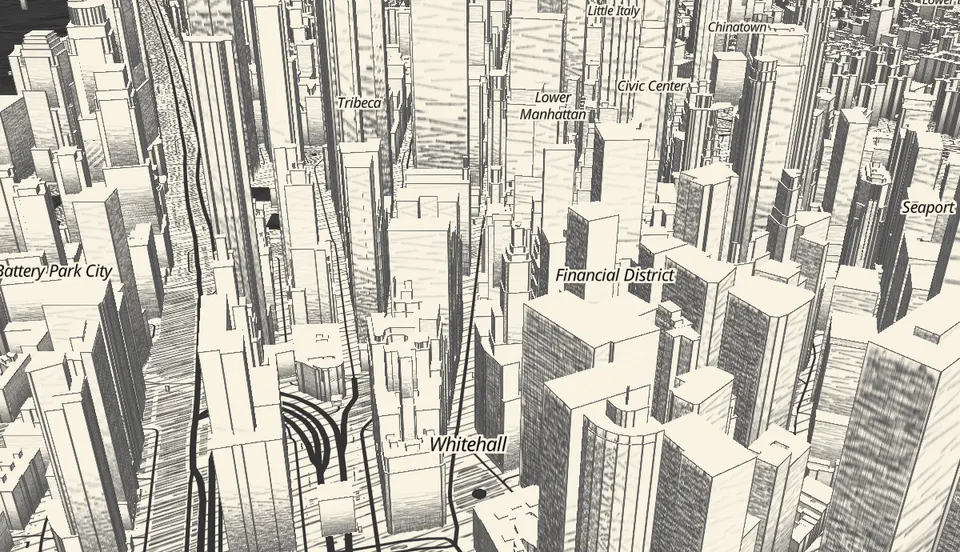
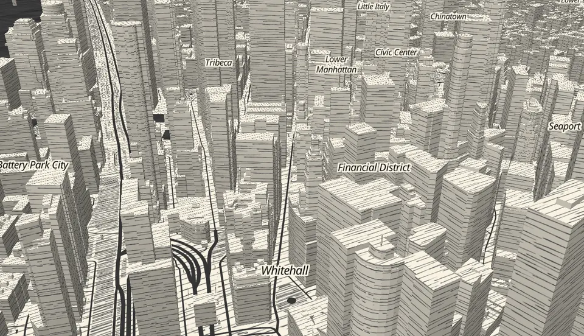
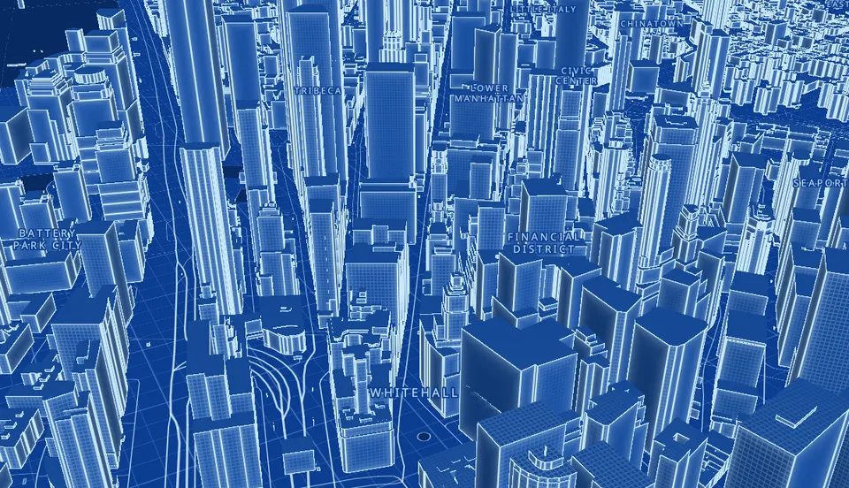
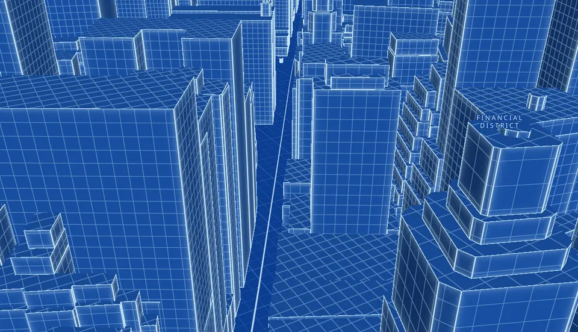

:::caution[Experimental]
`@maplibre-yaml/effects` and the `effect:` layer key are **experimental** in
0.7. The `registerEffect()` contract, the `EffectInput` struct, and the
built-ins' params may change in a minor release. Pin the package version if
you depend on them.
:::

An **effect** is a named, parameterized shader that *enhances* an ordinary
layer. The document names it; page JavaScript registers it; documents never
carry GLSL. The layer the effect sits on stays a complete static layer, and
that layer **is** the effect's fallback:

- without the effects package, the layer renders as authored;
- where an effect cannot run (globe projection, 3D terrain, no WebGL2,
  maplibre-gl 4), it declares absence — one console warning — and the layer
  renders as authored;
- on `mlym emit`, the layer ships as authored, with one `lossy` warning per
  effect ([export classes](/guides/export-classes/)).

0.7 ships one backend — `extrusions`, shader effects on `fill-extrusion`
layers — and two built-in effects written against the same public API as
any third-party one:

| Effect | What it draws |
| --- | --- |
| `tonal-hatch` | The Mapzen/Tangram crosshatch: pen-stroke **density** follows light per face — lit faces go to paper, shaded faces to dense ink — with a noisy paper margin and inked wall outlines. |
| `blueprint` | A drafting grid whose lines sit a fixed number of **metres** apart on every face (they never stretch), faint shading, glowing edges. |







<small>Map data © OpenStreetMap contributors (ODbL), © OpenMapTiles, via OpenFreeMap. The crosshatch look follows Tangram's crosshatch style (tangrams/tangram-sandbox, @patriciogv, MIT).</small>

## Authoring `effect:` in YAML

Put `effect:` on a `fill-extrusion` layer: `type` names the effect, every
other key is a param.

```yaml
type: map
id: crosshatch
config:
  center: [-74.0118, 40.7075]
  zoom: 15.9
  pitch: 60
  bearing: 29
  mapStyle: "https://demotiles.maplibre.org/style.json"
images:
  building-hatch: { url: "https://example.com/hatch/building.png", pixelRatio: 4 }
  # the 3x3 tonal atlas tonal-hatch samples (Tangram's hatch.png)
  hatch-atlas: { url: "https://example.com/hatch/hatch-atlas.png" }
sources:
  omt:
    type: vector
    url: "https://tiles.openfreemap.org/planet"
layers:
  - id: buildings
    type: fill-extrusion
    source: omt
    source-layer: building
    minzoom: 13
    paint:
      # the static fallback: one pen hatch on every face
      fill-extrusion-pattern: building-hatch
      fill-extrusion-height: ["coalesce", ["get", "render_height"], 10]
      fill-extrusion-base: ["coalesce", ["get", "render_min_height"], 0]
    effect:
      type: tonal-hatch
      gain: 0.72
```

In [format v2](/guides/format-v2/) the block lives in the layer's
`runtime:` — an effect never compiles to `style.json`:

```yaml no-validate
layers:
  - id: buildings
    type: fill-extrusion
    # ...
    runtime:
      effect: { type: tonal-hatch, gain: 0.72 }
```

**Heights come from the layer, not from the effect.** The backend evaluates
the static layer's own `filter`, `fill-extrusion-height` and
`fill-extrusion-base` with MapLibre's expression evaluator — any source
schema works, zoom ramps included (evaluated exactly as MapLibre does, at
the tile's zoom and the next, blended per frame). Effect and fallback always
stand at the same height.

### Loading the package

```js
import "@maplibre-yaml/core/register";
import "@maplibre-yaml/effects/register"; // built-ins + the <ml-map> hook
```

That is all: every `<ml-map>` whose document has `effect:` layers
validates their params (bad params are positioned parse errors, like the
rest of the format) and attaches the effects once the map loads, detaching
them on reload and removal. Order does not matter — an `<ml-map>` that
loaded first attaches as soon as the package registers. A document without
effects costs nothing: core never imports the effects package.

From a CDN with an import map:

```html
<script type="importmap">
  { "imports": { "maplibre-gl": "https://unpkg.com/maplibre-gl@6/dist/maplibre-gl.mjs" } }
</script>
<script type="module">
  import "https://unpkg.com/@maplibre-yaml/core/register.js";
  import "https://unpkg.com/@maplibre-yaml/effects/register.js";
</script>
```

The backend builds tile meshes in a module worker,
`extrusions-worker.js`, loaded from beside the effects bundle (bundlers that
understand `new Worker(new URL(…, import.meta.url))` — Vite, webpack 5 —
emit it for you).

### Built-in params

**`tonal-hatch`**

| Param | Default | Meaning |
| --- | --- | --- |
| `ink` | `#4d4d4e` | Stroke and outline color |
| `paper` | `#f9f3e3` | Unhatched paper color |
| `atlas` | `hatch-atlas` | Name of the 3×3 tonal atlas in the document's `images:` (Tangram's `hatch.png`, tangrams/blocks, MIT) |
| `gain` | `0.72` | Exposure before the tonal lookup |
| `outline` | `0.85` | Wall-outline ink strength, 0–1 |
| `exaggerate` | `false` | Apply Tangram's zoom-dependent height exaggeration `max(1, 0.5 + (1 − zoom/20)·5)` on top of the layer's heights. Off by default: the crosshatch classic already encodes that curve in its static `fill-extrusion-height`, which the effect honours. |

**`blueprint`**

| Param | Default | Meaning |
| --- | --- | --- |
| `line` | `#cfeeff` | Grid and edge color |
| `ground` | `#1a56b0` | Face color |
| `grid` | `4` | Metres between grid lines |
| `gain` | `0.72` | Shading exposure |

Unknown params are errors (typo protection).

## Export to style.json

`effect:` is a construct that **exports with a fallback** (`layer.effect` in the
[export-class registry](/guides/export-classes/)):

```bash
mlym emit crosshatch.yaml --strict            # refuses: 1 lossy (layers.buildings.effect)
mlym emit crosshatch.yaml --out dist/ --sprite-base https://example.com/dist
# lossy layers.buildings.effect: effect "tonal-hatch" on `buildings` — Effects are
#   runtime shaders with no style.json form; the emitted style carries the
#   layer's own static style (its fallback) instead …
```

The emitted style carries the static layer (here, its hatch pattern) and no
`effect` key. An effect may refine its export through `fallback()` — adjust
the layer, or return `null` to drop it — when emitting programmatically
with the package loaded; `mlym emit` does not load the package and always
ships the layer as authored (the built-ins' fallbacks are the identity, so
both agree for them).

The exported style plus the effects package re-creates the live map in
vanilla maplibre-gl:

```js
import "@maplibre-yaml/effects/register";
import { attachEffects } from "@maplibre-yaml/effects";

const map = new maplibregl.Map({ container: "map", style: "./style.json" });
map.on("load", () => {
  const fx = attachEffects(map, [{ layerId: "buildings", effect: { type: "tonal-hatch" } }]);
  // fx.detach() restores the static layer
});
```

## Writing your own: `registerEffect()`

Effects are registered by page JavaScript. Here is `blueprint` itself — the
built-in uses exactly this public API:

```ts
import { registerEffect, backends, z } from "@maplibre-yaml/effects";

registerEffect({
  type: "blueprint",                 // what documents write: effect: { type: blueprint }
  backend: backends.extrusions,      // documents never name a backend
  params: z.object({                 // flat params, validated at parse time
    line: z.string().regex(/^#[0-9a-f]{6}$/i).default("#cfeeff"),
    ground: z.string().regex(/^#[0-9a-f]{6}$/i).default("#1a56b0"),
    grid: z.number().positive().default(4),
    gain: z.number().min(0).default(0.72),
  }).strict(),
  // uniform types are inferred: number → float, hex color → vec3,
  // boolean → bool, [a, b(, c(, d))] → vec2/3/4
  uniforms: (p) => ({ u_line: p.line, u_ground: p.ground, u_grid: p.grid, u_gain: p.gain }),
  fragment: `
    float gridLine(vec2 p) {
      vec2 w = max(fwidth(p), vec2(1e-5));
      vec2 g = abs(fract(p - 0.5) - 0.5) / w;
      return 1.0 - clamp(min(g.x, g.y), 0.0, 1.0);
    }
    vec4 effect_color(EffectInput i) {
      // the face's own frame in metres: roofs (x, y), walls (along, up)
      vec2 q = i.isRoof
        ? i.world.xy
        : vec2(dot(i.world.xy, normalize(vec2(-i.normal.y, i.normal.x))), i.world.z);
      q /= u_grid;
      float density = max(length(fwidth(q.x)), length(fwidth(q.y)));
      float g = gridLine(q) * (1.0 - smoothstep(0.12, 0.35, density));
      float wall = i.isRoof ? 0.0 : 1.0;
      float px = fx_edge_px(i.uv, true);
      float edge = wall * (1.0 - smoothstep(0.5, 1.6, px));
      float glow = wall * exp(-px * 0.18) * 0.35;
      vec3 c = u_ground * (0.55 + 0.45 * clamp(u_gain * i.diffuse, 0.0, 1.0));
      c = mix(c, u_line, glow);
      return vec4(mix(c, u_line, max(g * 0.45, edge * 0.95)), 1.0);
    }
  `,
  fallback: (_params, layer) => layer,   // export: ship the static layer (null = doesn't export)
  animated: false,                       // never repaints on its own
});
```



Register before your documents parse (so their params validate) — or any
time before they load; `registerEffect()` hooks the package into
`<ml-map>` on its own, the built-ins need the `/register` import.

### The contract

| Field | Required | Meaning |
| --- | --- | --- |
| `type` | yes | Kebab-case name documents use. Registering a name twice throws. |
| `backend` | yes | `backends.extrusions` (the only backend in 0.7). |
| `params` | yes | A zod schema for the flat params. Give every optional param a `.default()`. |
| `fragment` | yes | GLSL ES 3.00 defining `vec4 effect_color(EffectInput i)` (plus your helpers). Return premultiplied RGBA. Compile errors report lines in *your* string. |
| `fallback` | yes | `(params, layer) => layer \| null` — the export lowering. Registration throws without it. |
| `uniforms` | no | `(params) => ({ u_name: value })`. Names starting `gl_`, `fx_`, `u_fx_` are reserved. |
| `textures` | no | `(params) => ({ u_sampler: "image-name" })` — names from the document's `images:` (or a URL, or decoded pixels). Mipmapped, repeating. |
| `animated` | no | `true` when the shader reads `i.time`: the map then repaints every frame while the effect is attached. Default `false` — an idle map stays idle. |
| `heightScale` | no | `(zoom, params) => number`, multiplied onto the layer's heights (tonal-hatch's `exaggerate`). |

### `EffectInput`

```glsl
struct EffectInput {
  vec2  uv;        // walls: (along the whole wall, up) in 0..1; roofs: (0.5, 0.5)
  vec2  faceSize;  // walls: (length, height) in metres as drawn; roofs: (0, 0)
  vec3  normal;    // outward unit normal: x east, y north, z up
  float diffuse;   // two fixed lights (Tangram's crosshatch lights), ~0..1.2
  float height;    // metres above the ground, as drawn
  bool  isRoof;
  vec2  screen;    // gl_FragCoord.xy, device pixels, y up
  float time;      // seconds since attach (advances only when animated)
  vec3  world;     // metres from the effect's anchor: x east, y north, z up
};
```

`uv.x` runs over the **whole** wall even where a tile edge cuts it: walls
the vector-tile generator cut at a tile's buffer are stitched across tiles,
so a texture never jumps at a tile seam. `world` is anchored near the map
centre (snapped to a 1 km grid), so a world-space pattern whose period
divides 1 km stays put.

### Helpers

| Function | Returns |
| --- | --- |
| `float fx_tonal(sampler2D atlas, vec2 uv, float brightness)` | Ink coverage (0 paper – 1 ink) from a 3×3 atlas of nine pen densities, blended between the two nearest tones; mip level from the minor derivative axis so strokes don't smear on long faces. |
| `float fx_outline(vec2 uv, float widthPx)` | 1 on an anti-aliased face outline (left, right, top) about `widthPx` wide. |
| `float fx_edge_px(vec2 uv, bool bottom)` | Distance in pixels to the nearest face edge. |
| `float fx_noise(vec2 p)` | Smooth value noise in 0..1. |

## Limits of the `extrusions` backend

- **Mercator only.** Under globe projection (or with 3D terrain on) the
  effect declares absence and the static layer renders; it comes back when
  the map returns to mercator.
- **maplibre-gl 5 or 6, WebGL2.** On maplibre-gl 4 every effect declares absence.
- **Vector tiles (MVT) or GeoJSON sources.** The backend draws from the tile
  bytes MapLibre already loaded — no second fetch, exactly MapLibre's tile
  selection — through two MapLibre internals (`style.tileManagers`,
  `tile.latestRawTileData`), isolated in one adapter and feature-checked: if
  a MapLibre release removes them, effects declare absence rather than
  break. A request for a public hook is drafted for maplibre-gl-js.
- The layer's paint/filter are read once at attach; re-attach after
  changing them.
- **Performance:** the budget is a ratio to the same map's static layer,
  judged on real GPUs. On an integrated laptop GPU (Intel UHD 630,
  lower Manhattan, rotating camera) `tonal-hatch` holds about 0.8× of the
  static preset's frame rate (≈170 vs 205 fps at 1200×800) and `blueprint`
  about 0.65× of its much cheaper flat-colour fallback (≈205 vs 320 fps).
  Meshes are built in a worker and uploaded under a frame budget, so pans
  and zooms don't stutter, and an idle map schedules nothing. CI runs a
  software-GL regression tripwire against a recorded ratio.

## Try it

The demo page in the repository renders both classics live, with an
effect on/off switch and a tour:

```bash
pnpm --filter @maplibre-yaml/core build && pnpm --filter @maplibre-yaml/effects build
pnpm verify:serve
# open http://localhost:4174/examples/verification/effects/index.html
```
